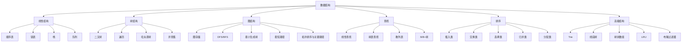

# 数据结构课程知识图谱示意

```mermaid
graph TD
    A[数据结构] --> B[线性结构]
    A --> C[树结构]
    A --> D[图结构]
    A --> E[查找]
    A --> F[排序]
    A --> G[高级结构]

    B --> B1[顺序表]
    B --> B2[链表]
    B --> B3[栈]
    B --> B4[队列]

    C --> C1[二叉树]
    C --> C2[遍历]
    C --> C3[哈夫曼树]
    C --> C4[并查集]

    D --> D1[图存储]
    D --> D2[DFS/BFS]
    D --> D3[最小生成树]
    D --> D4[最短路径]
    D --> D5[拓扑排序与关键路径]

    E --> E1[线性查找]
    E --> E2[树表查找]
    E --> E3[散列表]
    E --> E4[B/B+树]

    F --> F1[插入类]
    F --> F2[交换类]
    F --> F3[选择类]
    F --> F4[归并类]
    F --> F5[分配类]

    G --> G1[Trie]
    G --> G2[线段树]
    G --> G3[树状数组]
    G --> G4[LRU]
    G --> G5[布隆过滤器]
```
