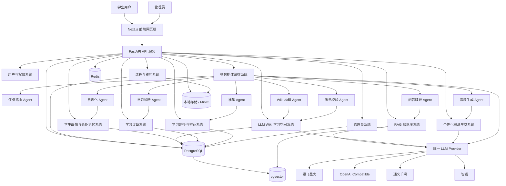
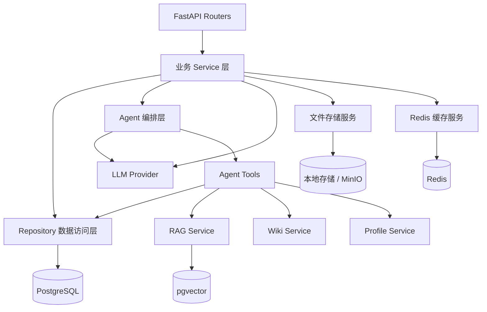
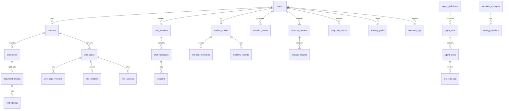
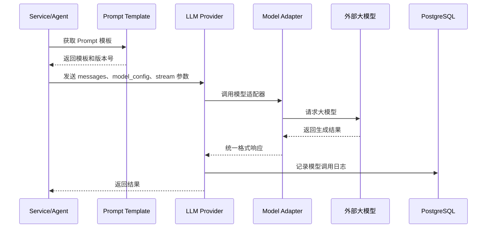
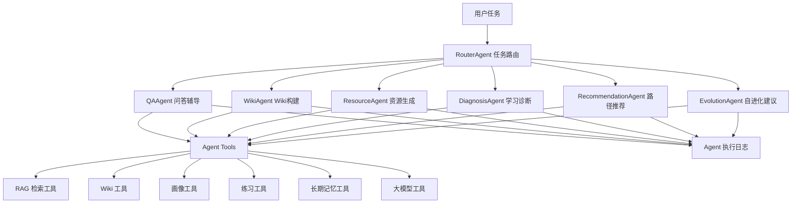
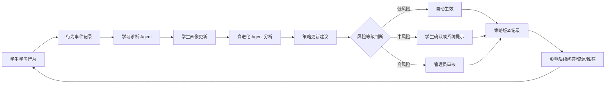
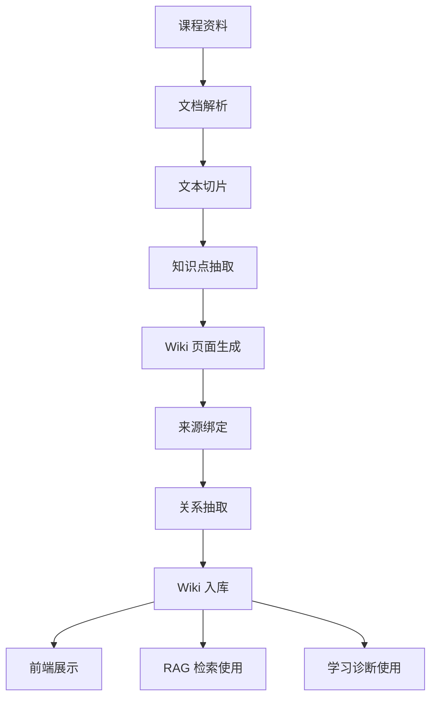
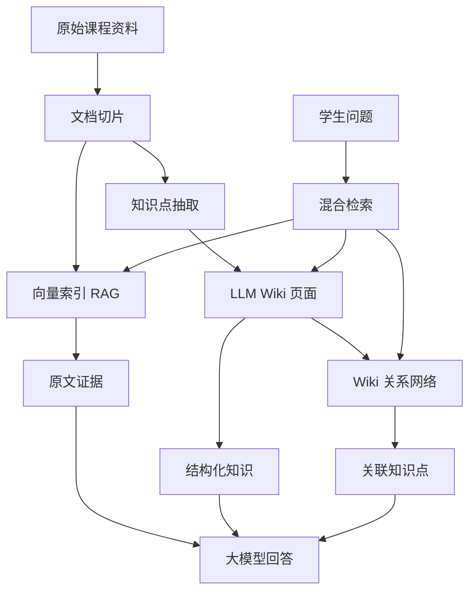
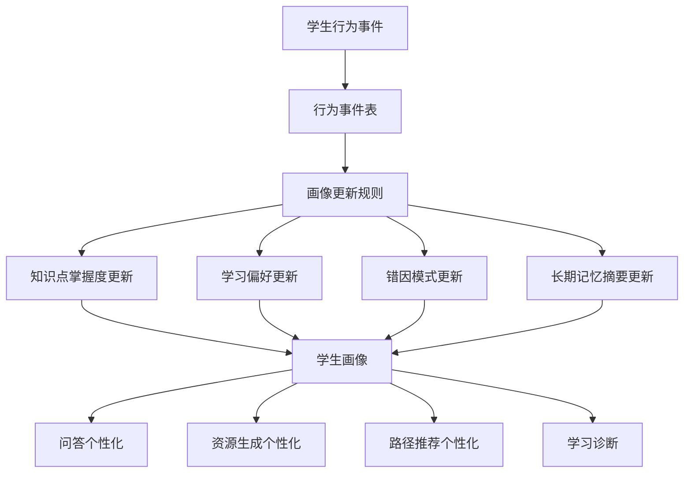

# 06_系统架构设计.md

# 智学工坊系统架构设计

项目名称：**智学工坊——基于自进化学习智能体与 LLM Wiki 的个性化资源生成学习空间**

技术路线：**Next.js 前端 + FastAPI 后端 + PostgreSQL/pgvector + Redis + 统一 LLM Provider + 自研轻量多智能体编排 + Docker Compose 部署**

架构定位：  
本项目不做复杂微服务，采用**模块化单体后端 + 清晰分层 + 可扩展智能体编排**的方式实现。这样既适合比赛落地，也方便后续 Codex 分阶段开发。

---

# 1. 总体架构说明

系统整体分为 6 层：

1. **前端交互层**  
   使用 Next.js + TypeScript + Tailwind CSS + shadcn/ui 构建学生学习端和管理员后台。

2. **后端 API 层**  
   使用 FastAPI 提供 REST API、SSE 流式问答接口、文件上传接口、管理员接口。

3. **业务服务层**  
   实现用户权限、课程资料、LLM Wiki、RAG、学生画像、学习诊断、资源生成、推荐、自进化策略等核心业务。

4. **智能体编排层**  
   自研轻量 Agent Orchestrator，负责根据任务调用不同 Agent，包括问答 Agent、Wiki Agent、诊断 Agent、推荐 Agent、自进化 Agent 等。

5. **AI 能力层**  
   通过统一 LLM Provider 适配讯飞星火、OpenAI、通义千问、智谱等模型，同时提供 Embedding、Rerank、Prompt 管理能力。

6. **数据存储层**  
   PostgreSQL 存储业务数据，pgvector 存储向量，Redis 存储缓存和任务状态，本地存储或 MinIO 存储上传文件。

总体架构主线：

```text
学生上传课程资料
  → 文档解析与切片
  → 向量化进入 RAG 知识库
  → 抽取知识点生成 LLM Wiki
  → 学生问答 / 练习 / 生成资源
  → 学习诊断更新学生画像
  → 自进化 Agent 生成策略建议
  → 推荐个性化学习路径和资源
```

---

# 2. Mermaid 系统架构图



---

# 3. 前端架构

## 3.1 前端技术栈

| 技术 | 用途 |
|---|---|
| Next.js | 前端框架，负责页面路由、SSR/CSR 混合渲染 |
| TypeScript | 保证前端类型安全 |
| Tailwind CSS | 快速构建统一样式 |
| shadcn/ui | 提供高质量基础 UI 组件 |
| Framer Motion | 页面动效、卡片动效、AI 生成状态动效 |
| Recharts | 学习仪表盘、掌握度、趋势图可视化 |
| Zustand / React Context | 前端轻量状态管理 |
| fetch / axios | 调用后端 API |
| EventSource / fetch stream | 支持大模型流式输出 |

## 3.2 前端页面分区

```text
前端页面
├── 公开页面
│   ├── 登录页
│   └── 注册页
│
├── 学生学习端
│   ├── 学生首页
│   ├── 我的课程空间
│   ├── 课程详情页
│   ├── 资料上传页
│   ├── 智能问答页
│   ├── LLM Wiki 页面
│   ├── 知识图谱页
│   ├── 个性化资源生成页
│   ├── 题库练习页
│   ├── 学习诊断页
│   ├── 学习路径页
│   └── 学生画像页
│
└── 管理员后台
    ├── 用户管理
    ├── 模型配置
    ├── Prompt 模板管理
    ├── Agent 运行日志
    ├── 文件解析日志
    ├── 演示数据管理
    └── 系统配置
```

## 3.3 前端核心组件

```text
components/
├── layout/
│   ├── StudentLayout.tsx
│   ├── AdminLayout.tsx
│   └── Sidebar.tsx
│
├── course/
│   ├── CourseCard.tsx
│   ├── CourseList.tsx
│   └── CourseHeader.tsx
│
├── document/
│   ├── FileUploader.tsx
│   ├── ParseStatusBadge.tsx
│   └── DocumentList.tsx
│
├── chat/
│   ├── ChatWindow.tsx
│   ├── ChatInput.tsx
│   ├── StreamingMessage.tsx
│   └── CitationCard.tsx
│
├── wiki/
│   ├── WikiPageView.tsx
│   ├── WikiRelationGraph.tsx
│   ├── WikiVersionPanel.tsx
│   └── WikiSourcePanel.tsx
│
├── dashboard/
│   ├── MasteryChart.tsx
│   ├── WeaknessList.tsx
│   ├── LearningTrendChart.tsx
│   └── RecommendCard.tsx
│
├── agent/
│   ├── AgentRunTimeline.tsx
│   ├── AgentStepCard.tsx
│   └── ToolCallViewer.tsx
│
└── common/
    ├── PageHeader.tsx
    ├── EmptyState.tsx
    ├── LoadingState.tsx
    └── ErrorState.tsx
```

---

# 4. 后端架构

## 4.1 后端分层

后端采用 FastAPI 模块化单体架构。

```text
API Router 层
    ↓
Service 业务服务层
    ↓
Agent 智能体编排层 / LLM 服务层
    ↓
Repository 数据访问层
    ↓
PostgreSQL / pgvector / Redis / 文件存储
```

## 4.2 后端核心模块

| 模块 | 职责 |
|---|---|
| auth | 登录、注册、JWT、权限控制 |
| users | 用户信息、角色管理 |
| courses | 课程空间管理 |
| documents | 文件上传、解析、切片 |
| rag | 向量检索、上下文组装、引用来源 |
| wiki | Wiki 页面、版本、关系、来源 |
| chat | 会话、消息、流式问答 |
| resources | 个性化资源生成 |
| exercises | 题目生成、答题、批改、错题 |
| profiles | 学生画像、长期记忆 |
| diagnosis | 掌握度计算、薄弱点识别 |
| recommendations | 学习路径、资源推荐 |
| agents | Agent 注册、调度、执行日志 |
| evolution | 自进化策略、版本、回滚 |
| admin | 管理员后台接口 |
| llm | 统一 LLM Provider |
| storage | 本地存储 / MinIO 适配 |
| common | 配置、异常、响应结构、工具函数 |

## 4.3 后端服务关系



---

# 5. 数据库架构

## 5.1 数据库选型

使用 PostgreSQL 作为主数据库，使用 pgvector 存储向量。

原因：

1. 比赛项目部署简单；
2. 业务数据和向量数据可以放在同一个数据库中；
3. 降低额外引入 Milvus、Weaviate 等独立向量数据库的复杂度；
4. 方便 Docker Compose 一键部署；
5. SQLAlchemy 支持良好。

## 5.2 核心表分组

```text
数据库表
├── 用户权限类
│   ├── users
│   ├── roles
│   └── user_roles
│
├── 课程资料类
│   ├── courses
│   ├── documents
│   ├── document_chunks
│   └── document_parse_jobs
│
├── 向量检索类
│   ├── embeddings
│   ├── retrieval_logs
│   └── citations
│
├── LLM Wiki 类
│   ├── wiki_pages
│   ├── wiki_page_versions
│   ├── wiki_relations
│   └── wiki_sources
│
├── 智能问答类
│   ├── chat_sessions
│   ├── chat_messages
│   └── message_feedback
│
├── 资源生成类
│   ├── generated_resources
│   └── resource_feedback
│
├── 练习与诊断类
│   ├── questions
│   ├── exercise_records
│   ├── mistake_records
│   ├── mastery_records
│   └── diagnosis_reports
│
├── 学生画像类
│   ├── student_profiles
│   ├── learning_preferences
│   ├── learning_memories
│   └── behavior_events
│
├── 推荐系统类
│   ├── learning_paths
│   ├── learning_path_nodes
│   └── recommendation_records
│
├── Agent 类
│   ├── agent_definitions
│   ├── agent_runs
│   ├── agent_steps
│   └── tool_call_logs
│
├── 自进化类
│   ├── evolution_strategies
│   ├── evolution_logs
│   └── strategy_versions
│
└── 管理员配置类
    ├── model_configs
    ├── prompt_templates
    ├── prompt_versions
    ├── system_configs
    └── admin_logs
```

## 5.3 核心实体关系



---

# 6. 大模型服务架构

## 6.1 统一 LLM Provider

系统不在业务代码中直接调用某个模型厂商，而是设计统一接口。

```text
业务服务 / Agent
    ↓
LLM Provider
    ↓
模型适配器
    ├── OpenAI Compatible Adapter
    ├── 讯飞星火 Adapter
    ├── 通义千问 Adapter
    ├── 智谱 Adapter
    └── 本地模型 Adapter
```

## 6.2 LLM Provider 职责

| 职责 | 说明 |
|---|---|
| chat | 普通对话生成 |
| stream_chat | 流式生成 |
| embedding | 文本向量化 |
| rerank | 检索结果重排序，增强版可做 |
| prompt_render | 根据模板渲染 Prompt |
| model_config | 读取管理员配置的模型参数 |
| call_log | 记录模型调用日志 |
| fallback | 主模型失败后切换备用模型 |

## 6.3 大模型调用流程



---

# 7. 多智能体架构

## 7.1 多智能体设计原则

本项目不做复杂自治 Agent，而做**任务型轻量多智能体编排**。

也就是说：

- Agent 有明确职责；
- Agent 有固定输入输出；
- Agent 通过工具访问系统能力；
- Agent 执行过程可记录；
- Agent 不允许随意修改系统代码；
- Agent 不直接越权操作数据库；
- 所有关键更新通过 Service 层完成。

## 7.2 Agent 列表

| Agent | 职责 | MVP 是否需要 |
|---|---|---|
| RouterAgent | 判断任务类型，分配 Agent | 是 |
| DocumentAgent | 文档解析、切片、结构识别 | 是 |
| WikiAgent | 生成和更新 Wiki 页面 | 是 |
| QAAgent | 基于 RAG 和 Wiki 回答问题 | 是 |
| ResourceAgent | 生成讲解、总结、题目、卡片 | 是 |
| DiagnosisAgent | 进行学习诊断和错因分析 | 是 |
| RecommendationAgent | 推荐学习路径和资源 | 是 |
| EvolutionAgent | 生成自进化策略建议 | 是 |
| QualityCheckAgent | 校验生成内容质量 | 增强版 |
| GraphAgent | 维护知识图谱关系 | 增强版 |

## 7.3 Agent 编排结构



## 7.4 Agent 输入输出规范

每个 Agent 统一使用类似结构：

```json
{
  "agent_name": "QAAgent",
  "task_type": "course_qa",
  "user_id": "u_001",
  "course_id": "c_001",
  "input": {
    "question": "递归为什么和栈有关？"
  },
  "context": {
    "retrieved_chunks": [],
    "wiki_pages": [],
    "student_profile": {}
  },
  "output": {
    "answer": "",
    "citations": [],
    "related_knowledge_points": []
  },
  "logs": {
    "started_at": "",
    "finished_at": "",
    "status": "success"
  }
}
```

---

# 8. 自进化学习闭环架构

## 8.1 自进化边界

系统中的“自进化”不等于自动改代码。  
本项目中的自进化只发生在以下对象上：

1. 学生画像；
2. 知识点掌握度；
3. 学习偏好；
4. 问答解释风格；
5. 资源生成策略；
6. 学习路径推荐策略；
7. Prompt 参数配置；
8. Wiki 补全建议。

禁止自动修改：

- 后端代码；
- 前端代码；
- 数据库结构；
- 权限规则；
- 系统部署配置。

## 8.2 自进化闭环



## 8.3 自进化策略示例

| 触发条件 | 策略变化 | 影响 |
|---|---|---|
| 学生连续 3 次答错递归题 | 递归相关回答优先使用调用栈图示 | 智能问答、资源生成 |
| 学生多次点踩长篇回答 | 降低默认回答长度 | 智能问答 |
| 学生收藏代码示例多 | 增强代码示例比例 | 资源生成 |
| 学生在图相关知识点薄弱 | 推荐前置知识“栈、队列、树遍历” | 学习路径 |
| 学生复习任务经常逾期 | 提高复习提醒优先级 | 推荐系统 |

---

# 9. LLM Wiki 架构

## 9.1 LLM Wiki 定位

LLM Wiki 是系统的**结构化学习知识空间**，不是普通笔记列表。

它的作用：

1. 将课程资料整理成知识点页面；
2. 将 AI 回答、学生笔记、错题总结沉淀到页面；
3. 维护知识点之间的关系；
4. 支持来源追溯和版本管理；
5. 为问答、推荐、诊断提供结构化上下文。

## 9.2 Wiki 页面结构

```text
WikiPage
├── 知识点名称
├── 所属课程
├── 所属章节
├── 一句话解释
├── 核心概念
├── 前置知识
├── 关键公式 / 代码
├── 典型例题
├── 常见错误
├── 关联知识点
├── 来源引用
├── 学生个人笔记
├── AI 补充内容
├── 掌握度
└── 版本历史
```

## 9.3 Wiki 构建流程



---

# 10. RAG 与 LLM Wiki 的关系

RAG 和 LLM Wiki 不是二选一，而是上下层关系。

## 10.1 RAG 负责“查资料”

RAG 面向原始资料和文本切片，解决：

- 用户问题和原始资料的匹配；
- 引用来源；
- 减少幻觉；
- 从课程资料中找证据。

## 10.2 LLM Wiki 负责“沉淀知识”

LLM Wiki 面向知识点页面，解决：

- 课程知识结构化；
- 知识点关系管理；
- 学生长期学习资产沉淀；
- AI 生成内容复用；
- 个性化学习空间建设。

## 10.3 组合方式



## 10.4 检索策略

MVP 阶段：

```text
用户问题
  → 向量检索 document_chunks
  → 检索相关 wiki_pages
  → 合并上下文
  → 大模型生成回答
  → 返回引用来源
```

增强版阶段：

```text
用户问题
  → 向量检索
  → Wiki 页面检索
  → 知识图谱邻居扩展
  → 重排序
  → 上下文压缩
  → 大模型生成
  → 质量校验
```

---

# 11. 学生画像与长期记忆架构

## 11.1 学生画像组成

```text
学生画像
├── 基础信息
│   ├── 年级
│   ├── 专业
│   └── 学习目标
│
├── 学习状态
│   ├── 课程学习进度
│   ├── 知识点掌握度
│   ├── 薄弱知识点
│   └── 待复习知识点
│
├── 行为特征
│   ├── 提问频率
│   ├── 追问次数
│   ├── 练习完成率
│   └── 资源收藏行为
│
├── 错因模式
│   ├── 概念混淆
│   ├── 步骤遗漏
│   ├── 代码实现错误
│   └── 迁移应用困难
│
├── 学习偏好
│   ├── 解释长度
│   ├── 资源形式
│   ├── 示例偏好
│   └── 学习时间偏好
│
└── 长期记忆
    ├── 稳定偏好
    ├── 长期薄弱点
    ├── 常见错误
    └── 策略更新历史
```

## 11.2 学生画像更新流程



## 11.3 长期记忆设计原则

1. 不保存无意义聊天内容。
2. 只保存对学习个性化有价值的信息。
3. 学生可以查看长期记忆。
4. 学生可以删除长期记忆。
5. 长期记忆需要记录来源事件。
6. 长期记忆不直接覆盖事实，使用版本更新。

---

# 12. 典型调用链路

## 12.1 文件上传与知识库构建链路

```text
学生上传文件
  → FastAPI 接收文件
  → 文件存储到本地 / MinIO
  → documents 表记录文件
  → 文档解析任务启动
  → 提取文本
  → 文本切片
  → 生成 Embedding
  → 写入 document_chunks + embeddings
  → 知识点抽取 Agent 执行
  → WikiAgent 生成 Wiki 页面
  → 写入 wiki_pages / wiki_sources / wiki_relations
  → 前端显示解析完成
```

## 12.2 智能问答链路

```text
学生提问
  → chat API 接收问题
  → RouterAgent 判断为课程问答
  → RAG Service 检索 document_chunks
  → Wiki Service 检索 wiki_pages
  → Profile Service 读取学生画像
  → QAAgent 组装上下文
  → LLM Provider 流式生成回答
  → Citation Service 绑定引用来源
  → 前端流式展示
  → 保存 chat_messages
  → 记录 behavior_events
  → 触发画像轻量更新
```

## 12.3 个性化资源生成链路

```text
学生选择知识点和资源类型
  → Resource API 接收请求
  → 读取 Wiki 页面
  → 读取学生画像
  → 读取掌握度和错题记录
  → ResourceAgent 生成资源
  → QualityCheckAgent 检查内容
  → 保存 generated_resources
  → 可选保存到 Wiki 页面
  → 记录资源反馈
```

## 12.4 学习诊断链路

```text
学生完成练习
  → 提交答案
  → 自动批改 / LLM 批改
  → 生成错因标签
  → 更新 exercise_records
  → 更新 mistake_records
  → DiagnosisAgent 计算掌握度
  → 更新 mastery_records
  → 生成 diagnosis_report
  → RecommendationAgent 生成下一步路径
```

## 12.5 自进化策略链路

```text
系统检测到学习行为变化
  → 读取 behavior_events
  → 读取 mastery_records
  → 读取 feedback 数据
  → EvolutionAgent 分析是否需要策略调整
  → 生成 evolution_strategy
  → 判断风险等级
  → 自动生效 / 管理员确认
  → 写入 strategy_versions
  → 后续问答、资源生成、推荐使用新策略
```

---

# 13. 项目目录结构

## 13.1 总体目录

```text
zhixue-workshop/
├── frontend/                         # Next.js 前端
├── backend/                          # FastAPI 后端
├── data/                             # 初始课程知识库和演示数据
├── docs/                             # 项目文档
├── scripts/                          # 初始化、部署、数据导入脚本
├── docker-compose.yml                # Docker Compose 编排
├── .env.example                      # 环境变量示例
├── README.md                         # 项目总说明
└── LICENSE
```

## 13.2 前端目录

```text
frontend/
├── app/
│   ├── login/
│   ├── register/
│   ├── student/
│   │   ├── dashboard/
│   │   ├── courses/
│   │   ├── chat/
│   │   ├── wiki/
│   │   ├── resources/
│   │   ├── exercises/
│   │   ├── diagnosis/
│   │   ├── paths/
│   │   └── profile/
│   └── admin/
│       ├── users/
│       ├── models/
│       ├── prompts/
│       ├── agents/
│       ├── logs/
│       └── demo-data/
│
├── components/
│   ├── common/
│   ├── layout/
│   ├── course/
│   ├── document/
│   ├── chat/
│   ├── wiki/
│   ├── dashboard/
│   ├── agent/
│   └── admin/
│
├── lib/
│   ├── api.ts
│   ├── auth.ts
│   ├── utils.ts
│   └── stream.ts
│
├── hooks/
├── stores/
├── types/
├── styles/
├── public/
├── tailwind.config.ts
├── next.config.js
└── package.json
```

## 13.3 后端目录

```text
backend/
├── app/
│   ├── main.py                       # FastAPI 入口
│   ├── core/
│   │   ├── config.py                 # 配置管理
│   │   ├── security.py               # JWT、密码加密
│   │   ├── exceptions.py             # 统一异常
│   │   └── response.py               # 统一响应结构
│   │
│   ├── db/
│   │   ├── session.py                # 数据库连接
│   │   ├── base.py
│   │   └── migrations/
│   │
│   ├── models/                       # SQLAlchemy 模型
│   ├── schemas/                      # Pydantic DTO
│   ├── repositories/                 # 数据访问层
│   ├── services/                     # 业务服务层
│   │   ├── auth_service.py
│   │   ├── course_service.py
│   │   ├── document_service.py
│   │   ├── rag_service.py
│   │   ├── wiki_service.py
│   │   ├── chat_service.py
│   │   ├── resource_service.py
│   │   ├── exercise_service.py
│   │   ├── diagnosis_service.py
│   │   ├── recommendation_service.py
│   │   ├── profile_service.py
│   │   └── evolution_service.py
│   │
│   ├── api/
│   │   ├── v1/
│   │   │   ├── auth.py
│   │   │   ├── users.py
│   │   │   ├── courses.py
│   │   │   ├── documents.py
│   │   │   ├── rag.py
│   │   │   ├── wiki.py
│   │   │   ├── chat.py
│   │   │   ├── resources.py
│   │   │   ├── exercises.py
│   │   │   ├── diagnosis.py
│   │   │   ├── recommendations.py
│   │   │   ├── profiles.py
│   │   │   ├── agents.py
│   │   │   ├── evolution.py
│   │   │   └── admin.py
│   │   └── router.py
│   │
│   ├── agents/
│   │   ├── orchestrator.py
│   │   ├── base_agent.py
│   │   ├── router_agent.py
│   │   ├── document_agent.py
│   │   ├── wiki_agent.py
│   │   ├── qa_agent.py
│   │   ├── resource_agent.py
│   │   ├── diagnosis_agent.py
│   │   ├── recommendation_agent.py
│   │   ├── evolution_agent.py
│   │   └── quality_check_agent.py
│   │
│   ├── llm/
│   │   ├── provider.py
│   │   ├── adapters/
│   │   │   ├── openai_adapter.py
│   │   │   ├── spark_adapter.py
│   │   │   ├── qwen_adapter.py
│   │   │   └── zhipu_adapter.py
│   │   ├── embedding.py
│   │   └── prompt_renderer.py
│   │
│   ├── rag/
│   │   ├── chunking.py
│   │   ├── retriever.py
│   │   ├── context_builder.py
│   │   └── citation.py
│   │
│   ├── storage/
│   │   ├── base.py
│   │   ├── local_storage.py
│   │   └── minio_storage.py
│   │
│   ├── workers/
│   │   ├── document_parse_worker.py
│   │   ├── embedding_worker.py
│   │   └── wiki_build_worker.py
│   │
│   └── utils/
│
├── tests/
├── alembic/
├── requirements.txt
└── Dockerfile
```

## 13.4 初始课程知识库目录

```text
data/
└── seed_knowledge/
    └── data_structure/
        ├── 00_课程说明/
        ├── 01_绪论/
        ├── 02_线性表/
        ├── 03_栈和队列/
        ├── 04_串/
        ├── 05_树与二叉树/
        ├── 06_图/
        ├── 07_查找/
        ├── 08_排序/
        ├── 09_实验任务/
        ├── 10_题库/
        ├── 11_知识图谱/
        ├── 12_常见错误/
        └── 13_演示学生数据/
```

---

# 14. 技术选型理由

| 技术 | 选择理由 |
|---|---|
| Next.js | 适合构建现代 Web 应用，页面组织清晰，生态成熟 |
| TypeScript | 降低前端类型错误，便于多人协作和 Codex 生成代码 |
| Tailwind CSS | 快速实现统一 UI 风格 |
| shadcn/ui | 组件质量高，适合比赛项目快速搭建美观界面 |
| Framer Motion | 增强 AI 交互、卡片切换、加载状态的表现力 |
| Recharts | 快速实现学习仪表盘可视化 |
| FastAPI | Python 生态友好，适合 AI 应用，接口开发快 |
| SQLAlchemy | ORM 成熟，适合 PostgreSQL 数据建模 |
| PostgreSQL | 稳定可靠，适合业务数据存储 |
| pgvector | 直接在 PostgreSQL 中支持向量检索，降低部署复杂度 |
| Redis | 用于缓存、任务状态、限流、会话辅助 |
| 本地存储 / MinIO | MVP 用本地存储，增强版切换 MinIO |
| 统一 LLM Provider | 避免业务代码绑定某一家模型厂商 |
| 自研轻量 Agent | 比 LangGraph 等复杂框架更可控，适合比赛落地 |
| Docker Compose | 方便本地部署、答辩演示和团队协作 |

---

# 15. 风险与规避方案

| 风险 | 表现 | 规避方案 |
|---|---|---|
| 系统范围过大 | 功能太多，无法按时完成 | MVP 只跑通“资料 → Wiki → 问答 → 练习 → 诊断 → 推荐”主线 |
| 多智能体概念堆砌 | 只有多个 Prompt，没有实际协作 | 每个 Agent 都要有输入、输出、工具、日志和页面展示 |
| 自进化不可控 | 评委担心系统自动乱改 | 明确自进化不改代码，只更新画像、策略和 Prompt 参数 |
| LLM Wiki 质量不稳定 | 页面重复、内容不准、来源缺失 | 固定 Wiki 模板，强制绑定来源，增加版本记录 |
| RAG 检索不准 | 回答引用不相关 | 使用课程过滤、知识点过滤、Wiki 辅助检索 |
| 文档解析失败 | PDF、DOCX 格式复杂 | MVP 优先支持文本型资料，失败时给出明确状态 |
| 大模型接口不稳定 | 答辩时模型调用失败 | 支持模型配置、备用模型、演示数据缓存 |
| 向量检索部署复杂 | 额外向量库成本高 | 使用 pgvector，和 PostgreSQL 一起部署 |
| 数据权限风险 | 学生访问他人数据 | 所有查询必须带 user_id 过滤 |
| 前端页面过多 | 开发时间不足 | 先做学生核心页面，再做管理员后台 |
| 推荐算法过复杂 | 难以实现和解释 | MVP 用规则 + 掌握度 + 知识图谱关系 |
| Agent 执行不可调试 | 出错难定位 | 记录 agent_runs、agent_steps、tool_call_logs |
| 比赛演示不稳定 | 现场网络或模型失败 | 准备演示课程、演示账号、缓存回答、Docker 本地部署 |

---

# 16. Codex 分阶段实现建议

## 第一阶段：基础框架

目标：项目能启动，用户能登录。

```text
1. 搭建 Next.js 前端项目
2. 搭建 FastAPI 后端项目
3. 配置 PostgreSQL + Redis + Docker Compose
4. 实现用户注册、登录、JWT 鉴权
5. 实现学生端和管理员端基础布局
```

## 第二阶段：课程资料与 RAG

目标：学生能上传资料并基于资料问答。

```text
1. 实现课程空间
2. 实现文件上传
3. 实现文档解析
4. 实现文本切片
5. 实现 Embedding 和 pgvector 入库
6. 实现 RAG 检索
7. 实现流式智能问答
```

## 第三阶段：LLM Wiki

目标：系统能从资料生成知识点页面。

```text
1. 设计 wiki_pages 表
2. 实现知识点抽取
3. 实现 Wiki 页面生成
4. 实现来源追溯
5. 实现 Wiki 页面查看
6. 实现 Wiki 页面版本记录
```

## 第四阶段：资源生成与练习诊断

目标：形成学习闭环。

```text
1. 实现个性化讲解生成
2. 实现总结和例题生成
3. 实现练习题生成
4. 实现答题提交和批改
5. 实现错因分析
6. 实现掌握度更新
7. 实现学习诊断报告
```

## 第五阶段：学生画像与自进化

目标：体现项目创新点。

```text
1. 实现行为事件记录
2. 实现学生画像表
3. 实现长期记忆摘要
4. 实现策略更新建议
5. 实现策略版本记录
6. 实现推荐理由展示
```

## 第六阶段：多智能体可视化与管理员后台

目标：增强答辩效果。

```text
1. 实现 Agent Orchestrator
2. 实现 Agent 执行日志
3. 实现 Agent 调用链展示
4. 实现模型配置后台
5. 实现 Prompt 模板管理
6. 实现演示数据初始化
```

---

# 17. 最终架构结论

本项目推荐采用：

> **模块化单体后端 + 统一 LLM Provider + pgvector 检索 + LLM Wiki 知识空间 + 轻量多智能体编排 + 学生画像自进化闭环。**

这套架构的优点是：

1. 比微服务更容易落地；
2. 比普通 RAG 系统更有创新；
3. 比纯 Agent 系统更可控；
4. 比普通学习系统更符合 A3 赛题；
5. 适合 Codex 分阶段生成代码；
6. 适合比赛答辩展示完整闭环。

核心演示主线应固定为：

```text
学生上传《数据结构》课程资料
→ 系统构建 RAG 知识库
→ 自动生成 LLM Wiki 知识点页面
→ 学生进行课程问答
→ 系统生成个性化讲解和练习
→ 学生答题触发学习诊断
→ 系统更新学生画像
→ 自进化 Agent 调整学习策略
→ 推荐下一步学习路径
```

这条主线足够清晰，也能覆盖项目的核心创新点。
