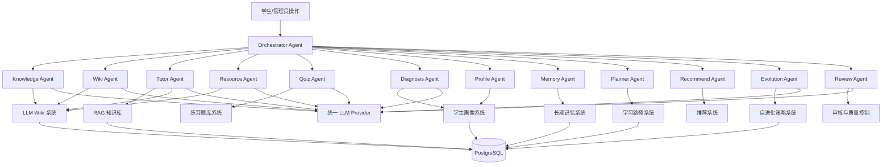
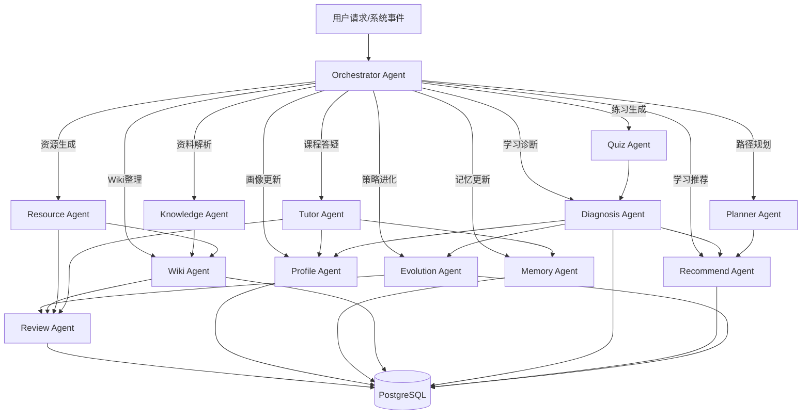
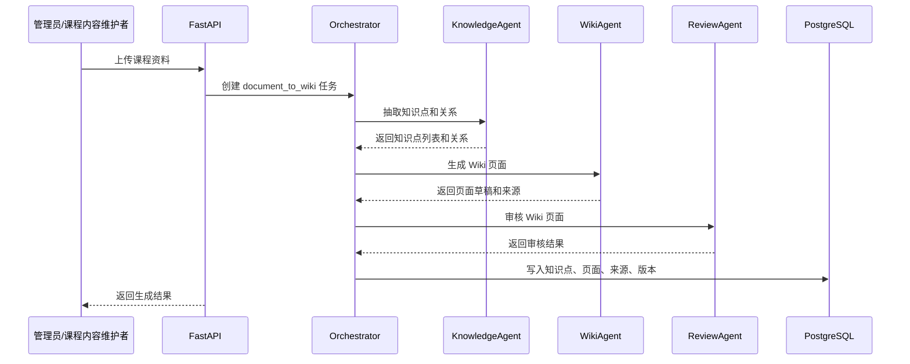
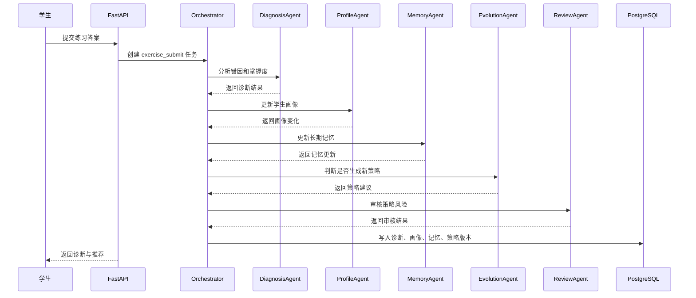

# 智学工坊：多智能体架构设计

文档版本：V1.0  
适用位置：`docs/多智能体架构设计.md`  
适用对象：后端开发、Agent 编排开发、Prompt 工程、数据库设计、前端展示、比赛答辩材料整理  
项目名称：智学工坊——基于自进化学习智能体与 LLM Wiki 的个性化资源生成学习空间

---

# 1. 设计目标

智学工坊的多智能体系统不是为了堆叠概念，而是为了把复杂学习任务拆分为多个可开发、可测试、可记录、可协作的任务型 Agent。

本系统采用 **轻量多智能体编排架构**，由 Orchestrator Agent 统一调度，其他 Agent 按职责完成学生画像、学习记忆、知识解析、Wiki 整理、答疑、资源生成、练习生成、诊断、推荐、自进化策略和审核等任务。

## 1.1 核心目标

1. 将学习闭环拆分为多个清晰 Agent；
2. 每个 Agent 都能实现为后端 Python 类；
3. 每个 Agent 有明确输入、输出、工具、数据库访问范围；
4. Agent 执行过程可记录、可追踪、可展示；
5. Agent 不直接越权修改核心数据，所有写操作通过 Service 层完成；
6. MVP 阶段先实现工作流式 Agent，增强版再实现复杂协作和可视化。

## 1.2 设计原则

| 原则 | 说明 |
|---|---|
| 任务型 Agent | 每个 Agent 负责明确任务，不做泛化自治 |
| 编排集中 | Orchestrator 负责路由、调度、日志和结果聚合 |
| 数据受控 | Agent 不直接绕过 Service 层写数据库 |
| 可解释 | 每次 Agent 执行都记录输入、输出、依据和耗时 |
| 可降级 | 大模型失败时返回可控提示或使用规则兜底 |
| 可扩展 | 新增 Agent 不影响核心业务模块 |
| 比赛可展示 | 前端可展示 Agent 调用链和每步结果 |

---

# 2. Agent 总览

## 2.1 Agent 列表

| 编号 | Agent | 中文名称 | 核心职责 |
|---|---|---|---|
| A01 | Orchestrator Agent | 编排智能体 | 任务路由、Agent 调度、上下文组装、结果聚合、日志记录 |
| A02 | Profile Agent | 学生画像智能体 | 构建和更新学生画像、学习偏好、薄弱知识点 |
| A03 | Memory Agent | 学习记忆智能体 | 提炼长期学习记忆、合并记忆、维护记忆证据 |
| A04 | Wiki Agent | 学习空间整理智能体 | 生成、更新、补全 LLM Wiki 页面 |
| A05 | Knowledge Agent | 知识解析智能体 | 从课程资料中抽取知识点、章节、关系和结构 |
| A06 | Planner Agent | 学习路径规划智能体 | 根据知识图谱和学生状态生成学习路径 |
| A07 | Resource Agent | 资源生成智能体 | 生成个性化讲解、总结、例题、复习卡片 |
| A08 | Quiz Agent | 练习生成智能体 | 生成练习题、变式题、测验题 |
| A09 | Tutor Agent | 答疑智能体 | 基于 RAG、Wiki、画像进行个性化答疑 |
| A10 | Diagnosis Agent | 学习诊断智能体 | 分析掌握度、错因、薄弱点、学习状态 |
| A11 | Recommend Agent | 推荐智能体 | 推荐知识点、资源、复习任务、练习 |
| A12 | Evolution Agent | 自进化策略智能体 | 生成学习策略、Prompt 参数、推荐策略更新建议 |
| A13 | Review Agent | 审核智能体 | 校验生成内容、策略风险、来源完整性和幻觉风险 |

## 2.2 Agent 与核心系统关系



---

# 3. Agent 通用代码接口设计

所有 Agent 建议继承统一基类，便于记录日志、统一异常处理、统一输入输出。

## 3.1 BaseAgent 抽象类

```python
from abc import ABC, abstractmethod
from typing import Any, Dict

class AgentContext:
    def __init__(
        self,
        user_id: str | None = None,
        course_id: str | None = None,
        task_type: str | None = None,
        input_data: Dict[str, Any] | None = None,
        runtime: Dict[str, Any] | None = None,
    ):
        self.user_id = user_id
        self.course_id = course_id
        self.task_type = task_type
        self.input_data = input_data or {}
        self.runtime = runtime or {}

class AgentResult:
    def __init__(
        self,
        success: bool,
        data: Dict[str, Any] | None = None,
        message: str | None = None,
        evidence: list | None = None,
        next_actions: list | None = None,
    ):
        self.success = success
        self.data = data or {}
        self.message = message
        self.evidence = evidence or []
        self.next_actions = next_actions or []

class BaseAgent(ABC):
    name: str = "BaseAgent"
    description: str = ""

    def __init__(self, llm_provider, tools, logger):
        self.llm_provider = llm_provider
        self.tools = tools
        self.logger = logger

    @abstractmethod
    async def run(self, context: AgentContext) -> AgentResult:
        pass
```

## 3.2 Orchestrator 调用规范

```python
class OrchestratorAgent(BaseAgent):
    name = "OrchestratorAgent"

    async def run(self, context: AgentContext) -> AgentResult:
        task_plan = await self.route_task(context)
        results = []

        for step in task_plan["steps"]:
            agent = self.tools.agent_registry.get(step["agent"])
            result = await agent.run(context)
            results.append({
                "agent": agent.name,
                "result": result.data,
                "success": result.success
            })

            if not result.success and step.get("required", True):
                break

        return AgentResult(
            success=True,
            data={"steps": results}
        )
```

---

# 4. 每个 Agent 的详细设计

---

# 4.1 Orchestrator Agent 编排智能体

## 4.1.1 职责

Orchestrator Agent 是多智能体系统的入口，负责判断用户任务类型，并调度其他 Agent 完成任务。

主要职责：

1. 接收用户请求或系统事件；
2. 判断任务类型；
3. 选择需要调用的 Agent；
4. 组装上下文；
5. 控制串行或并行执行顺序；
6. 聚合多个 Agent 的结果；
7. 记录 Agent 调用链；
8. 处理失败降级；
9. 返回最终结果给业务服务或前端。

## 4.1.2 输入数据

| 输入 | 说明 |
|---|---|
| user_id | 当前用户 ID |
| course_id | 当前课程 ID |
| task_type | 任务类型 |
| user_input | 用户输入内容 |
| document_id | 文档 ID，可选 |
| knowledge_id | 知识点 ID，可选 |
| context | 已知上下文 |
| request_source | 请求来源，如 chat/wiki/resource/admin |

## 4.1.3 输出结果

| 输出 | 说明 |
|---|---|
| task_plan | Agent 执行计划 |
| agent_results | 每个 Agent 的执行结果 |
| final_output | 聚合后的最终输出 |
| execution_trace | 调用链日志 |
| next_actions | 建议后续动作 |

## 4.1.4 Prompt 模板

```text
你是智学工坊的任务编排智能体。请根据用户请求判断任务类型，并选择合适的智能体执行。

可用智能体：
- KnowledgeAgent：解析课程资料、抽取知识点
- WikiAgent：生成和更新 LLM Wiki
- TutorAgent：课程答疑
- ResourceAgent：生成学习资源
- QuizAgent：生成练习题
- DiagnosisAgent：学习诊断
- PlannerAgent：学习路径规划
- RecommendAgent：学习推荐
- ProfileAgent：学生画像更新
- MemoryAgent：长期记忆更新
- EvolutionAgent：策略自进化
- ReviewAgent：内容审核和质量校验

用户请求：
{user_input}

当前上下文：
{context}

请输出 JSON：
{
  "task_type": "",
  "steps": [
    {
      "agent": "",
      "reason": "",
      "required": true
    }
  ],
  "expected_output": ""
}
```

## 4.1.5 访问数据库表

| 表 | 权限 |
|---|---|
| agent_runs | 写入 |
| agent_steps | 写入 |
| tool_call_logs | 写入 |
| users | 读取 |
| courses | 读取 |
| system_configs | 读取 |

## 4.1.6 可调用工具

1. AgentRegistry；
2. ContextBuilder；
3. AgentLogService；
4. TaskRouter；
5. ErrorHandler；
6. LLM Provider。

## 4.1.7 是否更新学生画像

否。  
Orchestrator 只调度，不直接更新画像。

## 4.1.8 是否更新 LLM Wiki

否。  
Orchestrator 不直接更新 Wiki。

## 4.1.9 是否参与自进化

间接参与。  
它负责触发 Evolution Agent，但不生成策略。

---

# 4.2 Profile Agent 学生画像智能体

## 4.2.1 职责

Profile Agent 负责分析学生学习行为，并更新学生画像。

主要职责：

1. 读取学生行为事件；
2. 分析学习偏好；
3. 分析薄弱知识点；
4. 分析常见错误模式；
5. 更新知识点掌握度摘要；
6. 更新解释风格偏好；
7. 生成画像变更说明；
8. 为答疑、资源生成、推荐提供画像上下文。

## 4.2.2 输入数据

| 输入 | 说明 |
|---|---|
| user_id | 学生 ID |
| course_id | 课程 ID |
| behavior_events | 学习行为事件 |
| mastery_records | 掌握度记录 |
| mistake_records | 错题记录 |
| feedback_records | 点赞、点踩、收藏等反馈 |
| existing_profile | 当前画像 |

## 4.2.3 输出结果

| 输出 | 说明 |
|---|---|
| updated_profile | 更新后的学生画像 |
| changed_fields | 发生变化的字段 |
| weak_points | 薄弱知识点 |
| preference_summary | 学习偏好摘要 |
| evidence | 更新依据 |
| confidence | 置信度 |

## 4.2.4 Prompt 模板

```text
你是智学工坊的学生画像智能体。请根据学生最近的学习行为、答题记录、错题记录和反馈，更新学生画像。

当前学生画像：
{existing_profile}

最近学习行为：
{behavior_events}

掌握度记录：
{mastery_records}

错题记录：
{mistake_records}

反馈记录：
{feedback_records}

请输出 JSON：
{
  "profile_summary": "学生当前学习状态摘要",
  "weak_points": [
    {
      "knowledge_id": "",
      "knowledge_name": "",
      "reason": "",
      "confidence": 0.0
    }
  ],
  "learning_preferences": {
    "answer_length": "",
    "explanation_style": "",
    "resource_type_preference": [],
    "example_preference": []
  },
  "error_patterns": [
    {
      "pattern": "",
      "evidence": "",
      "suggestion": ""
    }
  ],
  "changed_fields": [],
  "evidence": []
}
```

## 4.2.5 访问数据库表

| 表 | 权限 |
|---|---|
| student_profiles | 读取 / 写入 |
| behavior_events | 读取 |
| mastery_records | 读取 |
| mistake_records | 读取 |
| message_feedback | 读取 |
| resource_feedback | 读取 |
| learning_memories | 读取 |

## 4.2.6 可调用工具

1. ProfileReadTool；
2. ProfileUpdateTool；
3. BehaviorQueryTool；
4. MasteryQueryTool；
5. MistakeQueryTool；
6. LLMTool；
7. EvidenceBuilder。

## 4.2.7 是否更新学生画像

是。  
它是学生画像更新的主要 Agent。

## 4.2.8 是否更新 LLM Wiki

否。  
但可向 Wiki Agent 提供薄弱点和错因信息。

## 4.2.9 是否参与自进化

是。  
它为 Evolution Agent 提供画像基础数据。

---

# 4.3 Memory Agent 学习记忆智能体

## 4.3.1 职责

Memory Agent 负责将短期学习行为提炼为长期学习记忆。

主要职责：

1. 从学习行为中提取长期有效信息；
2. 合并相似记忆；
3. 维护记忆置信度；
4. 删除过期或无效记忆；
5. 为答疑和资源生成提供长期记忆上下文。

## 4.3.2 输入数据

| 输入 | 说明 |
|---|---|
| user_id | 学生 ID |
| course_id | 课程 ID |
| behavior_events | 学习行为 |
| chat_history | 问答历史 |
| mistake_records | 错题记录 |
| profile_summary | 学生画像摘要 |
| existing_memories | 已有长期记忆 |

## 4.3.3 输出结果

| 输出 | 说明 |
|---|---|
| new_memories | 新增长期记忆 |
| merged_memories | 合并后的记忆 |
| archived_memories | 归档记忆 |
| memory_summary | 记忆摘要 |
| evidence | 记忆依据 |

## 4.3.4 Prompt 模板

```text
你是智学工坊的学习记忆智能体。请从学生近期学习行为中提炼长期有价值的学习记忆。

已有长期记忆：
{existing_memories}

近期学习行为：
{behavior_events}

问答历史摘要：
{chat_history}

错题记录：
{mistake_records}

请只保留对未来个性化学习有长期价值的信息，不要保存无意义闲聊。

请输出 JSON：
{
  "new_memories": [
    {
      "memory_type": "",
      "content": "",
      "evidence": [],
      "confidence": 0.0
    }
  ],
  "merge_suggestions": [
    {
      "old_memory_id": "",
      "merged_content": "",
      "reason": ""
    }
  ],
  "archive_suggestions": [
    {
      "memory_id": "",
      "reason": ""
    }
  ]
}
```

## 4.3.5 访问数据库表

| 表 | 权限 |
|---|---|
| learning_memories | 读取 / 写入 |
| behavior_events | 读取 |
| chat_messages | 读取 |
| mistake_records | 读取 |
| student_profiles | 读取 |

## 4.3.6 可调用工具

1. MemoryReadTool；
2. MemoryWriteTool；
3. MemoryMergeTool；
4. BehaviorQueryTool；
5. ChatHistoryTool；
6. LLMTool。

## 4.3.7 是否更新学生画像

间接更新。  
它更新长期记忆，Profile Agent 可读取记忆更新画像。

## 4.3.8 是否更新 LLM Wiki

否。

## 4.3.9 是否参与自进化

是。  
长期记忆是自进化策略的重要依据。

---

# 4.4 Wiki Agent 学习空间整理智能体

## 4.4.1 职责

Wiki Agent 负责生成、更新、补全和整理 LLM Wiki 学习空间。

主要职责：

1. 根据课程资料生成 Wiki 页面；
2. 根据问答结果更新 Wiki；
3. 根据生成资源更新 Wiki；
4. 根据错题和诊断结果更新知识点页面；
5. 为页面生成摘要；
6. 维护页面结构；
7. 生成页面补全建议；
8. 绑定来源追溯。

## 4.4.2 输入数据

| 输入 | 说明 |
|---|---|
| course_id | 课程 ID |
| user_id | 学生 ID |
| knowledge_points | 知识点列表 |
| document_chunks | 文档切片 |
| chat_message | 问答内容，可选 |
| generated_resource | 生成资源，可选 |
| diagnosis_result | 诊断结果，可选 |
| existing_wiki_page | 现有页面，可选 |

## 4.4.3 输出结果

| 输出 | 说明 |
|---|---|
| wiki_page | Wiki 页面 |
| page_sections | 页面结构化小节 |
| wiki_sources | 来源引用 |
| wiki_relations | 页面关系 |
| version_record | 页面版本 |
| suggestions | 页面补全建议 |

## 4.4.4 Prompt 模板

```text
你是智学工坊的 LLM Wiki 学习空间整理智能体。请根据输入资料生成或更新结构化 Wiki 页面。

页面类型：
{page_type}

知识点信息：
{knowledge_point}

课程资料片段：
{document_chunks}

已有 Wiki 内容：
{existing_wiki_page}

学生画像：
{student_profile}

请按照以下结构输出：
{
  "title": "",
  "summary": "",
  "sections": {
    "one_sentence": "",
    "learning_goal": "",
    "prerequisites": [],
    "core_concepts": [],
    "key_formula_or_code": "",
    "examples": [],
    "common_errors": [],
    "related_points": [],
    "personal_notes_suggestion": ""
  },
  "sources": [
    {
      "chunk_id": "",
      "quote_text": "",
      "section_key": ""
    }
  ],
  "relations": [
    {
      "target_knowledge_name": "",
      "relation_type": "",
      "reason": ""
    }
  ],
  "quality_notes": []
}
```

## 4.4.5 访问数据库表

| 表 | 权限 |
|---|---|
| wiki_pages | 读取 / 写入 |
| wiki_page_versions | 写入 |
| wiki_sources | 写入 |
| wiki_relations | 读取 / 写入 |
| document_chunks | 读取 |
| knowledge_points | 读取 |
| generated_resources | 读取 |
| diagnosis_reports | 读取 |
| mistake_records | 读取 |

## 4.4.6 可调用工具

1. WikiReadTool；
2. WikiWriteTool；
3. WikiVersionTool；
4. WikiSourceTool；
5. WikiRelationTool；
6. DocumentChunkTool；
7. LLMTool；
8. CitationBuilder。

## 4.4.7 是否更新学生画像

否。  
但 Wiki 使用行为可被 Profile Agent 读取。

## 4.4.8 是否更新 LLM Wiki

是。  
它是 LLM Wiki 更新的核心 Agent。

## 4.4.9 是否参与自进化

是。  
它接收 Evolution Agent 的 Wiki 结构优化建议，也提供 Wiki 使用情况作为自进化依据。

---

# 4.5 Knowledge Agent 知识解析智能体

## 4.5.1 职责

Knowledge Agent 负责从课程资料中抽取课程结构、章节、知识点和知识关系。

主要职责：

1. 分析课程资料结构；
2. 抽取章节目录；
3. 抽取知识点；
4. 判断知识点难度和重要程度；
5. 抽取前置、包含、易混、应用等关系；
6. 生成知识点列表；
7. 为 Wiki Agent 提供结构化输入；
8. 为 RAG 和学习路径提供知识结构。

## 4.5.2 输入数据

| 输入 | 说明 |
|---|---|
| course_id | 课程 ID |
| document_id | 文档 ID |
| document_text | 文档文本 |
| document_chunks | 文档切片 |
| course_outline | 课程大纲，可选 |

## 4.5.3 输出结果

| 输出 | 说明 |
|---|---|
| chapters | 章节列表 |
| knowledge_points | 知识点列表 |
| knowledge_relations | 知识点关系 |
| difficulty_labels | 难度标签 |
| importance_labels | 重要度标签 |
| extraction_report | 抽取报告 |

## 4.5.4 Prompt 模板

```text
你是智学工坊的课程知识解析智能体。请从课程资料中抽取章节、知识点和知识点关系。

课程名称：
{course_name}

课程资料：
{document_text}

请输出 JSON：
{
  "chapters": [
    {
      "chapter_title": "",
      "chapter_summary": "",
      "order_index": 1
    }
  ],
  "knowledge_points": [
    {
      "name": "",
      "chapter": "",
      "description": "",
      "difficulty": "easy|medium|hard",
      "importance": "low|medium|high"
    }
  ],
  "relations": [
    {
      "source": "",
      "target": "",
      "relation_type": "prerequisite|contains|similar|confused_with|supports|applied_to|next",
      "reason": ""
    }
  ]
}
```

## 4.5.5 访问数据库表

| 表 | 权限 |
|---|---|
| documents | 读取 |
| document_chunks | 读取 |
| knowledge_points | 写入 |
| wiki_relations | 写入 |
| courses | 读取 |

## 4.5.6 可调用工具

1. DocumentReadTool；
2. ChunkReadTool；
3. KnowledgePointWriteTool；
4. RelationWriteTool；
5. LLMTool；
6. TextStructureParser。

## 4.5.7 是否更新学生画像

否。

## 4.5.8 是否更新 LLM Wiki

间接更新。  
它生成知识点和关系，Wiki Agent 根据结果生成页面。

## 4.5.9 是否参与自进化

间接参与。  
它提供知识结构，自进化推荐和诊断依赖这些结构。

---

# 4.6 Planner Agent 学习路径规划智能体

## 4.6.1 职责

Planner Agent 根据课程知识结构、学生画像和学习目标生成个性化学习路径。

主要职责：

1. 读取知识点关系；
2. 读取学生掌握度；
3. 识别前置知识缺口；
4. 生成学习路径；
5. 将路径拆成学习节点；
6. 为每个节点生成学习任务；
7. 输出推荐理由；
8. 支持路径更新。

## 4.6.2 输入数据

| 输入 | 说明 |
|---|---|
| user_id | 学生 ID |
| course_id | 课程 ID |
| target_goal | 学习目标 |
| knowledge_graph | 知识点关系 |
| mastery_records | 掌握度 |
| weak_points | 薄弱点 |
| learning_preferences | 学习偏好 |

## 4.6.3 输出结果

| 输出 | 说明 |
|---|---|
| learning_path | 学习路径 |
| path_nodes | 路径节点 |
| node_tasks | 每个节点任务 |
| recommendation_reason | 推荐理由 |
| estimated_time | 预计学习时间 |
| priority | 节点优先级 |

## 4.6.4 Prompt 模板

```text
你是智学工坊的学习路径规划智能体。请根据学生画像、知识点关系和学习目标生成学习路径。

学习目标：
{target_goal}

知识点关系：
{knowledge_graph}

学生掌握度：
{mastery_records}

薄弱知识点：
{weak_points}

学习偏好：
{learning_preferences}

请输出 JSON：
{
  "path_title": "",
  "reason": "",
  "nodes": [
    {
      "knowledge_id": "",
      "knowledge_name": "",
      "order": 1,
      "task_type": "learn|review|practice|summary",
      "reason": "",
      "estimated_minutes": 20
    }
  ],
  "warnings": []
}
```

## 4.6.5 访问数据库表

| 表 | 权限 |
|---|---|
| learning_paths | 读取 / 写入 |
| learning_path_nodes | 读取 / 写入 |
| knowledge_points | 读取 |
| wiki_relations | 读取 |
| mastery_records | 读取 |
| student_profiles | 读取 |

## 4.6.6 可调用工具

1. KnowledgeGraphTool；
2. MasteryQueryTool；
3. ProfileReadTool；
4. PathWriteTool；
5. LLMTool；
6. RulePlannerTool。

## 4.6.7 是否更新学生画像

否。

## 4.6.8 是否更新 LLM Wiki

否。  
但学习路径页面可由 Wiki Agent 保存到 Wiki。

## 4.6.9 是否参与自进化

是。  
路径完成情况会反馈给 Evolution Agent。

---

# 4.7 Resource Agent 资源生成智能体

## 4.7.1 职责

Resource Agent 负责根据知识点、学生画像和学习目标生成个性化学习资源。

主要职责：

1. 生成知识点讲解；
2. 生成章节总结；
3. 生成例题解析；
4. 生成复习卡片；
5. 生成错题订正材料；
6. 生成考前提纲；
7. 根据学生画像调整风格；
8. 支持保存到 LLM Wiki。

## 4.7.2 输入数据

| 输入 | 说明 |
|---|---|
| user_id | 学生 ID |
| course_id | 课程 ID |
| knowledge_id | 知识点 ID |
| resource_type | 资源类型 |
| student_profile | 学生画像 |
| wiki_page | Wiki 页面 |
| retrieved_chunks | RAG 检索结果 |
| prompt_params | 个性化 Prompt 参数 |

## 4.7.3 输出结果

| 输出 | 说明 |
|---|---|
| resource_title | 资源标题 |
| resource_type | 资源类型 |
| content | 资源正文 |
| citations | 来源引用 |
| personalized_reason | 个性化原因 |
| save_to_wiki_suggestion | 是否建议保存到 Wiki |

## 4.7.4 Prompt 模板

```text
你是智学工坊的个性化学习资源生成智能体。请根据学生画像和知识点内容生成个性化学习资源。

资源类型：
{resource_type}

知识点 Wiki：
{wiki_page}

课程资料依据：
{retrieved_chunks}

学生画像：
{student_profile}

个性化提示词参数：
{prompt_params}

要求：
1. 内容必须围绕知识点；
2. 根据学生薄弱点调整讲解深度；
3. 根据学生偏好调整表达方式；
4. 标明引用来源；
5. 输出 Markdown。

请输出 JSON：
{
  "title": "",
  "content": "",
  "personalized_reason": "",
  "citations": [],
  "suggest_save_to_wiki": true
}
```

## 4.7.5 访问数据库表

| 表 | 权限 |
|---|---|
| generated_resources | 写入 |
| wiki_pages | 读取 |
| wiki_sources | 读取 |
| document_chunks | 读取 |
| student_profiles | 读取 |
| learning_memories | 读取 |
| prompt_parameter_versions | 读取 |

## 4.7.6 可调用工具

1. RAGTool；
2. WikiReadTool；
3. ProfileReadTool；
4. MemoryReadTool；
5. PromptParamTool；
6. LLMTool；
7. CitationTool；
8. ResourceWriteTool。

## 4.7.7 是否更新学生画像

间接更新。  
资源反馈会被 Profile Agent 使用。

## 4.7.8 是否更新 LLM Wiki

可选更新。  
学生点击保存后调用 Wiki Agent 更新 Wiki。

## 4.7.9 是否参与自进化

是。  
资源反馈是自进化的重要依据。

---

# 4.8 Quiz Agent 练习生成智能体

## 4.8.1 职责

Quiz Agent 负责生成练习题、测验题和变式题。

主要职责：

1. 根据知识点生成选择题、判断题、简答题、编程题；
2. 根据学生掌握度调整难度；
3. 根据错因生成针对性练习；
4. 输出答案和解析；
5. 绑定知识点和错误标签；
6. 支持后续诊断。

## 4.8.2 输入数据

| 输入 | 说明 |
|---|---|
| course_id | 课程 ID |
| user_id | 学生 ID |
| knowledge_id | 知识点 ID |
| question_type | 题型 |
| difficulty | 难度 |
| student_profile | 学生画像 |
| mistake_patterns | 常见错误 |
| wiki_page | Wiki 页面 |

## 4.8.3 输出结果

| 输出 | 说明 |
|---|---|
| questions | 题目列表 |
| answers | 标准答案 |
| analysis | 解析 |
| knowledge_tags | 知识点标签 |
| error_tags | 错因标签 |
| difficulty | 难度 |

## 4.8.4 Prompt 模板

```text
你是智学工坊的练习生成智能体。请根据知识点和学生状态生成练习题。

知识点：
{knowledge_point}

Wiki 内容：
{wiki_page}

学生薄弱点：
{weak_points}

常见错误：
{mistake_patterns}

题型：
{question_type}

难度：
{difficulty}

请输出 JSON：
{
  "questions": [
    {
      "question_type": "",
      "difficulty": "",
      "question": "",
      "options": [],
      "answer": "",
      "analysis": "",
      "knowledge_tags": [],
      "error_tags": []
    }
  ]
}
```

## 4.8.5 访问数据库表

| 表 | 权限 |
|---|---|
| questions | 写入 |
| wiki_pages | 读取 |
| knowledge_points | 读取 |
| student_profiles | 读取 |
| mistake_records | 读取 |
| mastery_records | 读取 |

## 4.8.6 可调用工具

1. WikiReadTool；
2. ProfileReadTool；
3. MistakeQueryTool；
4. QuestionWriteTool；
5. LLMTool；
6. DifficultyRuleTool。

## 4.8.7 是否更新学生画像

否。  
答题后由 Diagnosis Agent 和 Profile Agent 更新。

## 4.8.8 是否更新 LLM Wiki

否。  
题目和错题总结可后续由 Wiki Agent 关联。

## 4.8.9 是否参与自进化

间接参与。  
练习结果是自进化依据。

---

# 4.9 Tutor Agent 答疑智能体

## 4.9.1 职责

Tutor Agent 负责学生智能问答，是学生最常使用的 Agent。

主要职责：

1. 理解学生问题；
2. 检索 RAG 资料；
3. 检索 LLM Wiki 页面；
4. 读取学生画像和长期记忆；
5. 生成个性化回答；
6. 返回来源引用；
7. 推荐关联知识点；
8. 记录问答行为；
9. 支持流式输出。

## 4.9.2 输入数据

| 输入 | 说明 |
|---|---|
| user_id | 学生 ID |
| course_id | 课程 ID |
| question | 学生问题 |
| chat_history | 会话历史 |
| retrieved_chunks | RAG 检索结果 |
| wiki_pages | 相关 Wiki 页面 |
| student_profile | 学生画像 |
| learning_memories | 长期记忆 |
| prompt_params | 个性化 Prompt 参数 |

## 4.9.3 输出结果

| 输出 | 说明 |
|---|---|
| answer | 回答内容 |
| citations | 引用来源 |
| related_knowledge_points | 关联知识点 |
| follow_up_questions | 建议追问 |
| save_to_wiki_candidate | 可保存到 Wiki 的内容 |
| behavior_event | 学习行为记录 |

## 4.9.4 Prompt 模板

```text
你是智学工坊的课程答疑智能体。请基于课程资料、Wiki 页面和学生画像回答学生问题。

学生问题：
{question}

课程资料依据：
{retrieved_chunks}

相关 Wiki 页面：
{wiki_pages}

学生画像：
{student_profile}

长期学习记忆：
{learning_memories}

个性化回答参数：
{prompt_params}

要求：
1. 优先依据课程资料和 Wiki；
2. 回答要适合学生当前水平；
3. 如果资料依据不足，要明确说明；
4. 给出关联知识点；
5. 输出 Markdown；
6. 不要编造来源。

请输出：
{
  "answer": "",
  "citations": [],
  "related_knowledge_points": [],
  "follow_up_questions": [],
  "save_to_wiki_candidate": ""
}
```

## 4.9.5 访问数据库表

| 表 | 权限 |
|---|---|
| chat_sessions | 读取 / 写入 |
| chat_messages | 读取 / 写入 |
| document_chunks | 读取 |
| wiki_pages | 读取 |
| wiki_sources | 读取 |
| student_profiles | 读取 |
| learning_memories | 读取 |
| behavior_events | 写入 |
| citations | 写入 |

## 4.9.6 可调用工具

1. RAGTool；
2. WikiSearchTool；
3. ProfileReadTool；
4. MemoryReadTool；
5. PromptParamTool；
6. LLMTool；
7. CitationTool；
8. BehaviorEventTool。

## 4.9.7 是否更新学生画像

间接更新。  
它记录行为，Profile Agent 后续更新画像。

## 4.9.8 是否更新 LLM Wiki

可选更新。  
学生点击“保存到 Wiki”后触发 Wiki Agent。

## 4.9.9 是否参与自进化

是。  
提问、追问、反馈都会影响自进化策略。

---

# 4.10 Diagnosis Agent 学习诊断智能体

## 4.10.1 职责

Diagnosis Agent 负责根据练习、错题、问答和学习行为诊断学生状态。

主要职责：

1. 批改后分析错因；
2. 计算知识点掌握度；
3. 识别薄弱知识点；
4. 发现易混概念；
5. 生成学习诊断报告；
6. 输出推荐补弱建议；
7. 触发 Profile Agent 更新画像；
8. 触发 Evolution Agent 判断是否需要策略更新。

## 4.10.2 输入数据

| 输入 | 说明 |
|---|---|
| user_id | 学生 ID |
| course_id | 课程 ID |
| exercise_records | 答题记录 |
| mistake_records | 错题记录 |
| behavior_events | 学习行为 |
| knowledge_relations | 知识点关系 |
| existing_mastery | 当前掌握度 |

## 4.10.3 输出结果

| 输出 | 说明 |
|---|---|
| diagnosis_report | 诊断报告 |
| weak_points | 薄弱知识点 |
| error_patterns | 错因模式 |
| mastery_updates | 掌握度更新 |
| recommended_actions | 建议动作 |
| evolution_trigger | 是否触发自进化 |

## 4.10.4 Prompt 模板

```text
你是智学工坊的学习诊断智能体。请根据学生答题记录、错题和学习行为生成诊断结果。

答题记录：
{exercise_records}

错题记录：
{mistake_records}

学习行为：
{behavior_events}

知识点关系：
{knowledge_relations}

当前掌握度：
{existing_mastery}

请输出 JSON：
{
  "summary": "",
  "weak_points": [
    {
      "knowledge_id": "",
      "knowledge_name": "",
      "reason": "",
      "severity": "low|medium|high"
    }
  ],
  "error_patterns": [
    {
      "pattern": "",
      "evidence": "",
      "suggestion": ""
    }
  ],
  "mastery_updates": [
    {
      "knowledge_id": "",
      "old_score": 0,
      "new_score": 0,
      "reason": ""
    }
  ],
  "recommended_actions": [],
  "should_trigger_evolution": true
}
```

## 4.10.5 访问数据库表

| 表 | 权限 |
|---|---|
| exercise_records | 读取 |
| mistake_records | 读取 / 写入 |
| mastery_records | 读取 / 写入 |
| diagnosis_reports | 写入 |
| behavior_events | 读取 |
| knowledge_points | 读取 |
| wiki_relations | 读取 |
| student_profiles | 读取 |

## 4.10.6 可调用工具

1. ExerciseQueryTool；
2. MistakeQueryTool；
3. MasteryUpdateTool；
4. KnowledgeGraphTool；
5. DiagnosisReportTool；
6. LLMTool；
7. RuleDiagnosisTool。

## 4.10.7 是否更新学生画像

间接更新。  
它输出诊断结果，由 Profile Agent 更新画像。

## 4.10.8 是否更新 LLM Wiki

间接更新。  
错题总结和诊断结果可由 Wiki Agent 写入 Wiki。

## 4.10.9 是否参与自进化

是。  
它是触发 Evolution Agent 的关键 Agent。

---

# 4.11 Recommend Agent 推荐智能体

## 4.11.1 职责

Recommend Agent 负责推荐学习资源、知识点、复习任务和练习任务。

主要职责：

1. 推荐下一步知识点；
2. 推荐学习资源；
3. 推荐复习任务；
4. 推荐练习题；
5. 生成推荐理由；
6. 根据画像和策略版本调整推荐；
7. 记录推荐效果。

## 4.11.2 输入数据

| 输入 | 说明 |
|---|---|
| user_id | 学生 ID |
| course_id | 课程 ID |
| student_profile | 学生画像 |
| mastery_records | 掌握度 |
| learning_path | 学习路径 |
| resources | 可推荐资源 |
| strategy_version | 当前推荐策略版本 |

## 4.11.3 输出结果

| 输出 | 说明 |
|---|---|
| recommendations | 推荐列表 |
| recommendation_reason | 推荐理由 |
| priority | 推荐优先级 |
| target_module | 推荐目标模块 |
| tracking_id | 推荐记录 ID |

## 4.11.4 Prompt 模板

```text
你是智学工坊的学习推荐智能体。请根据学生画像、掌握度、学习路径和当前策略生成推荐内容。

学生画像：
{student_profile}

掌握度：
{mastery_records}

学习路径：
{learning_path}

可推荐资源：
{resources}

当前推荐策略：
{strategy_version}

请输出 JSON：
{
  "recommendations": [
    {
      "type": "knowledge|resource|quiz|review|path",
      "target_id": "",
      "title": "",
      "priority": 1,
      "reason": "",
      "expected_effect": ""
    }
  ]
}
```

## 4.11.5 访问数据库表

| 表 | 权限 |
|---|---|
| recommendation_records | 写入 |
| generated_resources | 读取 |
| learning_paths | 读取 |
| learning_path_nodes | 读取 |
| mastery_records | 读取 |
| student_profiles | 读取 |
| strategy_versions | 读取 |
| wiki_pages | 读取 |

## 4.11.6 可调用工具

1. ProfileReadTool；
2. MasteryQueryTool；
3. ResourceQueryTool；
4. PathQueryTool；
5. StrategyReadTool；
6. RecommendationWriteTool；
7. LLMTool。

## 4.11.7 是否更新学生画像

否。  
推荐反馈后由 Profile Agent 更新画像。

## 4.11.8 是否更新 LLM Wiki

否。

## 4.11.9 是否参与自进化

是。  
推荐点击率、完成率、反馈会影响 Evolution Agent。

---

# 4.12 Evolution Agent 自进化策略智能体

## 4.12.1 职责

Evolution Agent 负责根据学生长期行为和诊断结果生成受控策略更新建议。

主要职责：

1. 判断是否需要更新学习策略；
2. 生成新的答疑风格策略；
3. 生成新的资源生成策略；
4. 生成新的推荐策略；
5. 生成新的复习策略；
6. 生成个性化 Prompt 参数；
7. 生成 Wiki 结构优化建议；
8. 输出更新依据；
9. 标记风险等级；
10. 创建策略版本。

## 4.12.2 输入数据

| 输入 | 说明 |
|---|---|
| user_id | 学生 ID |
| course_id | 课程 ID |
| diagnosis_report | 诊断报告 |
| student_profile | 学生画像 |
| learning_memories | 长期记忆 |
| behavior_summary | 行为摘要 |
| feedback_summary | 反馈摘要 |
| current_strategy | 当前策略 |

## 4.12.3 输出结果

| 输出 | 说明 |
|---|---|
| strategy_suggestion | 策略更新建议 |
| prompt_params | 个性化 Prompt 参数 |
| recommendation_strategy | 推荐策略 |
| wiki_suggestions | Wiki 结构建议 |
| risk_level | 风险等级 |
| evidence | 更新依据 |
| version_payload | 策略版本数据 |

## 4.12.4 Prompt 模板

```text
你是智学工坊的自进化策略智能体。请根据学生学习数据生成受控策略更新建议。

注意：
你不能修改系统代码、数据库结构、权限规则或安全配置。
你只能建议更新学生画像、学习偏好、答疑风格、资源生成策略、推荐策略、复习策略、个性化 Prompt 参数和 Wiki 结构建议。

学生画像：
{student_profile}

学习诊断：
{diagnosis_report}

长期记忆：
{learning_memories}

行为摘要：
{behavior_summary}

反馈摘要：
{feedback_summary}

当前策略：
{current_strategy}

请输出 JSON：
{
  "should_update": true,
  "strategy_type": "",
  "change_summary": "",
  "before": {},
  "after": {},
  "prompt_params": {},
  "recommendation_strategy": {},
  "wiki_suggestions": [],
  "evidence": [],
  "risk_level": "low|medium|high",
  "expected_effect": "",
  "rollback_condition": ""
}
```

## 4.12.5 访问数据库表

| 表 | 权限 |
|---|---|
| evolution_logs | 写入 |
| strategy_versions | 读取 / 写入 |
| prompt_parameter_versions | 写入 |
| wiki_structure_suggestions | 写入 |
| student_profiles | 读取 |
| learning_memories | 读取 |
| diagnosis_reports | 读取 |
| behavior_events | 读取 |
| recommendation_records | 读取 |
| resource_feedback | 读取 |
| message_feedback | 读取 |

## 4.12.6 可调用工具

1. ProfileReadTool；
2. MemoryReadTool；
3. DiagnosisQueryTool；
4. BehaviorSummaryTool；
5. FeedbackSummaryTool；
6. StrategyVersionTool；
7. PromptParamTool；
8. WikiSuggestionTool；
9. LLMTool；
10. RiskEvaluateTool。

## 4.12.7 是否更新学生画像

不直接更新。  
它生成策略，由 StrategyService 激活；画像由 Profile Agent 更新。

## 4.12.8 是否更新 LLM Wiki

不直接更新。  
它生成 Wiki 结构建议，由 Wiki Agent 执行。

## 4.12.9 是否参与自进化

是。  
它是自进化系统的核心 Agent。

---

# 4.13 Review Agent 审核智能体

## 4.13.1 职责

Review Agent 负责审核系统生成内容、策略更新和 Wiki 修改建议，降低幻觉和错误风险。

主要职责：

1. 检查回答是否有来源依据；
2. 检查 Wiki 页面是否结构完整；
3. 检查资源生成是否偏离知识点；
4. 检查策略更新是否合理；
5. 检查高风险操作是否需要人工确认；
6. 检查是否存在无依据推断；
7. 给出通过、警告或拒绝结果。

## 4.13.2 输入数据

| 输入 | 说明 |
|---|---|
| review_type | 审核类型 |
| content | 待审核内容 |
| citations | 来源引用 |
| strategy_suggestion | 策略建议，可选 |
| wiki_page | Wiki 页面，可选 |
| original_sources | 原始来源 |

## 4.13.3 输出结果

| 输出 | 说明 |
|---|---|
| review_result | pass / warning / reject |
| risk_level | 风险等级 |
| issues | 问题列表 |
| suggestions | 修改建议 |
| need_human_confirm | 是否需要人工确认 |

## 4.13.4 Prompt 模板

```text
你是智学工坊的审核智能体。请检查以下内容是否可靠、是否有来源依据、是否存在明显错误或风险。

审核类型：
{review_type}

待审核内容：
{content}

来源引用：
{citations}

原始资料：
{original_sources}

策略建议：
{strategy_suggestion}

请输出 JSON：
{
  "review_result": "pass|warning|reject",
  "risk_level": "low|medium|high",
  "issues": [
    {
      "issue_type": "",
      "description": "",
      "severity": ""
    }
  ],
  "suggestions": [],
  "need_human_confirm": false
}
```

## 4.13.5 访问数据库表

| 表 | 权限 |
|---|---|
| review_logs | 写入 |
| wiki_sources | 读取 |
| document_chunks | 读取 |
| generated_resources | 读取 |
| strategy_versions | 读取 |
| model_call_logs | 读取 |

## 4.13.6 可调用工具

1. CitationCheckTool；
2. SourceCompareTool；
3. RiskEvaluateTool；
4. LLMTool；
5. ReviewLogTool。

## 4.13.7 是否更新学生画像

否。

## 4.13.8 是否更新 LLM Wiki

否。  
它只审核，不直接修改。

## 4.13.9 是否参与自进化

是。  
它审核 Evolution Agent 生成的策略建议。

---

# 5. Agent 能力矩阵

| Agent | 更新画像 | 更新 Wiki | 参与自进化 | 主要写表 |
|---|---:|---:|---:|---|
| Orchestrator | 否 | 否 | 间接 | agent_runs, agent_steps |
| Profile | 是 | 否 | 是 | student_profiles |
| Memory | 间接 | 否 | 是 | learning_memories |
| Wiki | 否 | 是 | 是 | wiki_pages, wiki_versions |
| Knowledge | 否 | 间接 | 间接 | knowledge_points, wiki_relations |
| Planner | 否 | 否 | 是 | learning_paths |
| Resource | 间接 | 可选 | 是 | generated_resources |
| Quiz | 否 | 否 | 间接 | questions |
| Tutor | 间接 | 可选 | 是 | chat_messages, citations |
| Diagnosis | 间接 | 间接 | 是 | diagnosis_reports, mastery_records |
| Recommend | 否 | 否 | 是 | recommendation_records |
| Evolution | 否 | 间接 | 是 | strategy_versions, evolution_logs |
| Review | 否 | 否 | 是 | review_logs |

---

# 6. Agent 协作流程

## 6.1 通用执行流程

```text
用户请求 / 系统事件
  → Orchestrator Agent 判断任务类型
  → 构建 Agent 上下文
  → 调用一个或多个业务 Agent
  → Agent 调用工具读取数据
  → Agent 调用 LLM Provider 生成结构化结果
  → Review Agent 审核关键输出
  → Service 层写入数据库
  → Orchestrator 聚合结果
  → 前端展示结果和 Agent 调用链
```

## 6.2 数据写入原则

Agent 不直接写数据库。推荐写法：

```text
Agent 生成结构化结果
  → Service 校验结果
  → Repository 写数据库
  → 返回写入结果
```

这样可以保证权限、审计和数据一致性。

---

# 7. 典型任务链

---

# 7.1 课程内容维护者上传资料后生成 Wiki

说明：这里的“教师上传资料”在本项目中建议由“管理员 / 课程内容维护者”完成，不单独建设完整教师端。

## 流程

```text
管理员上传课程资料
  → Orchestrator Agent 识别任务为 document_to_wiki
  → Knowledge Agent 抽取章节、知识点和关系
  → Wiki Agent 生成知识点页面
  → Review Agent 检查来源和页面结构
  → Wiki Service 写入页面和版本
  → 前端展示 Wiki 页面和知识关系
```

## Agent 顺序

```text
Orchestrator → Knowledge → Wiki → Review → WikiService
```

## 关键输出

1. 知识点列表；
2. 知识点关系；
3. Wiki 页面；
4. Wiki 页面来源；
5. 页面版本；
6. 审核日志。

---

# 7.2 学生首次学习生成画像

## 流程

```text
学生首次进入课程
  → 系统读取课程信息
  → 学生完成初始学习目标选择
  → 学生完成简单诊断题
  → Diagnosis Agent 生成初始诊断
  → Profile Agent 生成初始学生画像
  → Memory Agent 生成初始学习记忆
  → Recommend Agent 推荐起始学习内容
```

## Agent 顺序

```text
Orchestrator → Quiz → Diagnosis → Profile → Memory → Recommend
```

## 关键输出

1. 初始掌握度；
2. 初始薄弱点；
3. 初始学习偏好；
4. 初始推荐内容；
5. 初始学习画像。

---

# 7.3 学生生成学习路径

## 流程

```text
学生选择学习目标
  → Orchestrator 识别为 path_planning
  → Profile Agent 读取学生画像
  → Planner Agent 根据知识图谱和掌握度生成路径
  → Recommend Agent 生成路径理由和资源推荐
  → Wiki Agent 可选生成学习路径页面
```

## Agent 顺序

```text
Orchestrator → Profile → Planner → Recommend → Wiki
```

## 关键输出

1. 学习路径；
2. 路径节点；
3. 每个节点任务；
4. 推荐理由；
5. 关联 Wiki 页面。

---

# 7.4 学生提问后更新记忆

## 流程

```text
学生提出问题
  → Tutor Agent 检索 RAG 和 Wiki
  → Tutor Agent 结合画像生成回答
  → Review Agent 检查回答来源
  → 系统记录问答行为
  → Memory Agent 判断是否形成长期记忆
  → Profile Agent 可选更新学习偏好
  → 学生可选择保存回答到 Wiki
```

## Agent 顺序

```text
Orchestrator → Tutor → Review → Memory → Profile → Wiki
```

## 关键输出

1. 个性化回答；
2. 引用来源；
3. 问答行为记录；
4. 长期记忆；
5. 可保存到 Wiki 的内容。

---

# 7.5 学生做错题后触发诊断

## 流程

```text
学生提交练习答案
  → Quiz Service 判断正误
  → Diagnosis Agent 分析错因
  → Profile Agent 更新薄弱点和画像
  → Wiki Agent 将错题关联到知识点页面
  → Recommend Agent 推荐补弱资源
  → Evolution Agent 判断是否需要策略更新
```

## Agent 顺序

```text
Orchestrator → Diagnosis → Profile → Wiki → Recommend → Evolution
```

## 关键输出

1. 错因分析；
2. 掌握度更新；
3. 薄弱知识点；
4. 推荐补弱资源；
5. 自进化触发判断。

---

# 7.6 系统自进化更新学习策略

## 流程

```text
系统检测到触发条件
  → Diagnosis Agent 汇总学习状态
  → Profile Agent 提供画像
  → Memory Agent 提供长期记忆
  → Evolution Agent 生成策略更新建议
  → Review Agent 审核风险
  → Strategy Service 创建策略版本
  → 低风险策略自动生效
  → 中高风险策略等待确认
```

## Agent 顺序

```text
Orchestrator → Diagnosis → Profile → Memory → Evolution → Review → StrategyService
```

## 关键输出

1. 策略更新建议；
2. Prompt 参数更新；
3. 推荐策略调整；
4. Wiki 结构建议；
5. 风险等级；
6. 策略版本记录；
7. 回滚条件。

---

# 8. Mermaid 流程图

## 8.1 多智能体总体协作图



## 8.2 上传资料生成 Wiki 流程图



## 8.3 学生错题触发自进化流程图



---

# 9. 后端模块设计

## 9.1 目录结构

```text
backend/app/
├── agents/
│   ├── base_agent.py
│   ├── orchestrator_agent.py
│   ├── profile_agent.py
│   ├── memory_agent.py
│   ├── wiki_agent.py
│   ├── knowledge_agent.py
│   ├── planner_agent.py
│   ├── resource_agent.py
│   ├── quiz_agent.py
│   ├── tutor_agent.py
│   ├── diagnosis_agent.py
│   ├── recommend_agent.py
│   ├── evolution_agent.py
│   ├── review_agent.py
│   └── registry.py
│
├── agent_tools/
│   ├── rag_tool.py
│   ├── wiki_tool.py
│   ├── profile_tool.py
│   ├── memory_tool.py
│   ├── mastery_tool.py
│   ├── document_tool.py
│   ├── question_tool.py
│   ├── recommendation_tool.py
│   ├── strategy_tool.py
│   ├── citation_tool.py
│   └── review_tool.py
│
├── services/
│   ├── agent_service.py
│   ├── agent_log_service.py
│   ├── profile_service.py
│   ├── memory_service.py
│   ├── wiki_service.py
│   ├── knowledge_service.py
│   ├── planner_service.py
│   ├── resource_service.py
│   ├── quiz_service.py
│   ├── tutor_service.py
│   ├── diagnosis_service.py
│   ├── recommendation_service.py
│   ├── evolution_service.py
│   └── review_service.py
│
├── prompts/
│   ├── orchestrator.yaml
│   ├── profile.yaml
│   ├── memory.yaml
│   ├── wiki.yaml
│   ├── knowledge.yaml
│   ├── planner.yaml
│   ├── resource.yaml
│   ├── quiz.yaml
│   ├── tutor.yaml
│   ├── diagnosis.yaml
│   ├── recommend.yaml
│   ├── evolution.yaml
│   └── review.yaml
```

## 9.2 AgentRegistry 设计

```python
class AgentRegistry:
    def __init__(self):
        self._agents = {}

    def register(self, name: str, agent: BaseAgent):
        self._agents[name] = agent

    def get(self, name: str) -> BaseAgent:
        if name not in self._agents:
            raise ValueError(f"Agent not found: {name}")
        return self._agents[name]

    def list_agents(self):
        return list(self._agents.keys())
```

## 9.3 Agent 日志表

### agent_runs

| 字段 | 说明 |
|---|---|
| id | 执行 ID |
| user_id | 用户 ID |
| course_id | 课程 ID |
| task_type | 任务类型 |
| status | 执行状态 |
| input_payload | 输入 |
| final_output | 最终输出 |
| started_at | 开始时间 |
| finished_at | 结束时间 |

### agent_steps

| 字段 | 说明 |
|---|---|
| id | 步骤 ID |
| run_id | 所属执行 ID |
| agent_name | Agent 名称 |
| step_order | 执行顺序 |
| input_payload | 输入 |
| output_payload | 输出 |
| status | 状态 |
| duration_ms | 耗时 |

### tool_call_logs

| 字段 | 说明 |
|---|---|
| id | 工具调用 ID |
| step_id | 所属步骤 |
| tool_name | 工具名称 |
| input_payload | 工具输入 |
| output_payload | 工具输出 |
| status | 状态 |
| duration_ms | 耗时 |

---

# 10. MVP 版本实现方式

MVP 不需要一次性实现 13 个完整 Agent 的复杂自治能力。建议先实现“工作流式多智能体”。

## 10.1 MVP 必须实现的 Agent

| Agent | MVP 实现重点 |
|---|---|
| Orchestrator Agent | 基于 task_type 的规则路由，不依赖 LLM 路由 |
| Knowledge Agent | 从资料中抽取知识点，可使用 LLM |
| Wiki Agent | 生成固定模板 Wiki 页面 |
| Tutor Agent | 基于 RAG + Wiki + 画像答疑 |
| Resource Agent | 生成讲解、总结、例题 |
| Quiz Agent | 生成练习题 |
| Diagnosis Agent | 根据答题记录生成诊断 |
| Profile Agent | 更新简单画像 |
| Evolution Agent | 生成策略建议和版本记录 |
| Review Agent | 检查来源是否为空、内容是否偏题 |

## 10.2 MVP 可简化的 Agent

| Agent | 简化方式 |
|---|---|
| Memory Agent | 先只保存明确学习偏好和长期薄弱点 |
| Planner Agent | 基于规则和知识关系生成路径 |
| Recommend Agent | 基于掌握度和薄弱点推荐 |
| Review Agent | 先做轻量规则 + LLM 审核 |

## 10.3 MVP 规则路由示例

```python
TASK_AGENT_PLAN = {
    "document_to_wiki": ["KnowledgeAgent", "WikiAgent", "ReviewAgent"],
    "course_qa": ["TutorAgent", "ReviewAgent", "MemoryAgent"],
    "generate_resource": ["ResourceAgent", "ReviewAgent"],
    "generate_quiz": ["QuizAgent"],
    "submit_answer": ["DiagnosisAgent", "ProfileAgent", "RecommendAgent", "EvolutionAgent"],
    "plan_learning_path": ["PlannerAgent", "RecommendAgent"],
    "evolution_check": ["DiagnosisAgent", "ProfileAgent", "MemoryAgent", "EvolutionAgent", "ReviewAgent"],
}
```

## 10.4 MVP 展示重点

前端至少展示：

1. Agent 调用链；
2. 当前执行中的 Agent；
3. 每个 Agent 的输出摘要；
4. 生成内容来源；
5. 诊断依据；
6. 策略更新建议。

---

# 11. 增强版实现方式

增强版用于提升比赛创新展示效果。

## 11.1 增强能力

| 能力 | 说明 |
|---|---|
| LLM 任务路由 | Orchestrator 使用 LLM 动态规划 Agent 执行步骤 |
| Agent 并行执行 | 对独立任务并行执行，如检索 Wiki 和读取画像 |
| Agent 调用链可视化 | 前端展示每个 Agent 的输入、输出、耗时 |
| Review Agent 深度审核 | 检查幻觉、来源冲突、策略风险 |
| Evolution Agent 策略评估 | 评估策略更新后的效果 |
| Memory Agent 记忆合并 | 合并重复长期记忆 |
| Wiki Agent 结构进化 | 根据学习行为提出 Wiki 拆分、合并、补全建议 |
| Planner Agent 图谱推理 | 结合知识图谱和掌握度生成路径 |
| Recommend Agent 反馈优化 | 根据点击、完成、收藏反馈调整推荐 |
| 多模型适配 | 不同 Agent 使用不同模型或参数 |

## 11.2 增强版 Agent 执行计划示例

```json
{
  "task_type": "student_weakness_recovery",
  "steps": [
    {
      "agent": "DiagnosisAgent",
      "mode": "required"
    },
    {
      "agent": "ProfileAgent",
      "mode": "required"
    },
    {
      "agent": "PlannerAgent",
      "mode": "required"
    },
    {
      "agent": "ResourceAgent",
      "mode": "optional"
    },
    {
      "agent": "RecommendAgent",
      "mode": "required"
    },
    {
      "agent": "EvolutionAgent",
      "mode": "optional"
    },
    {
      "agent": "ReviewAgent",
      "mode": "required"
    }
  ]
}
```

---

# 12. 比赛答辩表述建议

可以这样介绍：

> 智学工坊采用轻量多智能体架构，将学习过程拆分为知识解析、Wiki 整理、答疑、资源生成、练习生成、学习诊断、路径规划、推荐和自进化策略等多个智能体。每个 Agent 都有明确职责、输入输出、工具权限和数据库访问边界。系统通过 Orchestrator Agent 统一编排任务，并通过 Review Agent 对关键生成内容进行审核，保证多智能体协作既可解释又可控。

答辩重点展示：

1. 资料上传后多个 Agent 如何协作生成 Wiki；
2. 学生提问后 Tutor Agent 如何结合 RAG、Wiki 和画像回答；
3. 学生做错题后 Diagnosis、Profile、Recommend、Evolution 如何联动；
4. 自进化策略如何由 Evolution Agent 生成并由 Review Agent 审核；
5. 前端如何展示 Agent 调用链，证明不是简单套壳。

---

# 13. 最终结论

智学工坊的多智能体架构应采用：

> Orchestrator 统一编排 + 任务型 Agent 分工 + Service 受控写入 + Review 审核兜底 + Agent 日志可视化。

MVP 阶段重点跑通：

```text
资料上传 → Knowledge Agent → Wiki Agent → Tutor Agent → Quiz Agent → Diagnosis Agent → Profile Agent → Recommend Agent → Evolution Agent
```

增强版阶段重点强化：

```text
动态任务编排 → Agent 调用链可视化 → 策略效果评估 → Wiki 结构进化 → Review 审核闭环
```

这套架构可以保证项目既有比赛创新性，也具备可开发、可测试、可演示的工程落地能力。
