# 智学工坊：PostgreSQL 数据库设计

文档版本：V1.0  
适用位置：`docs/数据库设计.md`  
适用对象：后端开发、数据库建模、SQLAlchemy Model 编写、接口设计、Codex 任务拆分  
项目名称：智学工坊

---

# 1. 数据库总体说明

本项目数据库采用 **PostgreSQL + pgvector**。

设计目标：

1. 支撑用户认证、课程资料、文档切片、向量检索、LLM Wiki、学习路径、资源生成、练习诊断、推荐、自进化和智能体日志。
2. 表结构不过度复杂，适合比赛项目快速落地。
3. 核心结构稳定，动态扩展内容使用 `jsonb` 字段承载。
4. 所有学生个人学习数据均通过 `user_id` 隔离。
5. 所有课程相关数据均通过 `course_id` 归属。
6. 支持 LLM Wiki 的页面、版本、链接、来源追溯。
7. 支持自进化策略版本、触发事件、学习行为记录。
8. 支持 Agent 运行日志和大模型调用日志，便于答辩展示。

## 1.1 数据库扩展

需要启用：

```sql
CREATE EXTENSION IF NOT EXISTS "pgcrypto";
CREATE EXTENSION IF NOT EXISTS "vector";
```

说明：

- `pgcrypto` 用于 `gen_random_uuid()`。
- `vector` 用于 `pgvector` 向量检索。
- 本设计中 `document_chunks.embedding` 使用 `vector(1024)`，实际维度应与 Embedding 模型一致。若使用 512 维或 1536 维模型，需要同步修改字段维度。

## 1.2 命名规范

| 类型 | 规范 |
|---|---|
| 表名 | 小写复数，如 `users`、`courses` |
| 主键 | 统一使用 `id UUID PRIMARY KEY` |
| 外键 | 使用 `{entity}_id` |
| 时间字段 | 使用 `created_at`、`updated_at` |
| JSON 字段 | 使用 `jsonb` |
| 状态字段 | 使用 `status varchar(32)` |
| 类型字段 | 使用 `{name}_type varchar(64)` |

## 1.3 设计分组

| 分组 | 表 |
|---|---|
| 用户与画像 | users, student_profiles, student_memories, learning_preferences |
| 课程与资料 | courses, course_materials, knowledge_points, document_chunks |
| LLM Wiki | wiki_pages, wiki_page_versions, wiki_links, wiki_sources |
| 学习路径与资源 | learning_paths, learning_path_items, generated_resources |
| 练习与诊断 | quizzes, questions, answer_records, mistake_books, learning_records, diagnosis_reports |
| 推荐与反馈 | recommendations, user_feedback |
| Agent 与大模型 | agent_runs, llm_call_logs |
| 自进化与 Prompt | evolution_strategies, evolution_events, prompt_versions |

---

# 2. 每张表字段设计

---

## 2.1 users：用户表

用途：存储学生和管理员账号信息。

| 字段 | 类型 | 约束 | 说明 |
|---|---|---|---|
| id | uuid | PK | 用户 ID |
| username | varchar(64) | unique, not null | 用户名 |
| email | varchar(128) | unique | 邮箱 |
| password_hash | varchar(255) | not null | 密码哈希 |
| role | varchar(32) | not null | student / admin |
| status | varchar(32) | not null | active / disabled |
| avatar_url | text | nullable | 头像 |
| last_login_at | timestamptz | nullable | 最近登录时间 |
| created_at | timestamptz | not null | 创建时间 |
| updated_at | timestamptz | not null | 更新时间 |

索引：

- `idx_users_role`
- `idx_users_status`

---

## 2.2 student_profiles：学生画像表

用途：存储学生当前画像摘要和学习状态快照。

| 字段 | 类型 | 约束 | 说明 |
|---|---|---|---|
| id | uuid | PK | 画像 ID |
| user_id | uuid | FK users.id, unique | 学生 ID |
| major | varchar(128) | nullable | 专业 |
| grade | varchar(64) | nullable | 年级 |
| learning_goal | text | nullable | 学习目标 |
| profile_summary | text | nullable | 画像摘要 |
| mastery_snapshot | jsonb | not null | 知识点掌握度快照 |
| weak_points | jsonb | not null | 薄弱知识点 |
| error_patterns | jsonb | not null | 常见错误模式 |
| strategy_summary | jsonb | not null | 当前策略摘要 |
| version_no | int | not null | 画像版本号 |
| created_at | timestamptz | not null | 创建时间 |
| updated_at | timestamptz | not null | 更新时间 |

索引：

- `idx_student_profiles_user_id`

---

## 2.3 student_memories：学生长期学习记忆表

用途：保存对个性化长期有效的学习记忆。

| 字段 | 类型 | 约束 | 说明 |
|---|---|---|---|
| id | uuid | PK | 记忆 ID |
| user_id | uuid | FK users.id | 学生 ID |
| course_id | uuid | FK courses.id, nullable | 课程 ID，可为空 |
| memory_type | varchar(64) | not null | weak_point / preference / error_pattern / goal |
| content | text | not null | 记忆内容 |
| evidence | jsonb | not null | 证据，如行为 ID、错题 ID |
| confidence | numeric(5,4) | not null | 置信度 0-1 |
| status | varchar(32) | not null | active / archived |
| created_at | timestamptz | not null | 创建时间 |
| updated_at | timestamptz | not null | 更新时间 |

索引：

- `idx_student_memories_user_course`
- `idx_student_memories_type`
- `idx_student_memories_status`

---

## 2.4 learning_preferences：学习偏好表

用途：保存学生在不同课程中的学习偏好和个性化 Prompt 参数。

| 字段 | 类型 | 约束 | 说明 |
|---|---|---|---|
| id | uuid | PK | 偏好 ID |
| user_id | uuid | FK users.id | 学生 ID |
| course_id | uuid | FK courses.id, nullable | 课程 ID |
| answer_length | varchar(32) | nullable | short / medium / long |
| explanation_style | varchar(64) | nullable | step_by_step / analogy / code_first / visual |
| resource_preferences | jsonb | not null | 资源偏好 |
| prompt_params | jsonb | not null | 个性化 Prompt 参数 |
| confidence | numeric(5,4) | not null | 偏好置信度 |
| version_no | int | not null | 版本号 |
| created_at | timestamptz | not null | 创建时间 |
| updated_at | timestamptz | not null | 更新时间 |

索引：

- `idx_learning_preferences_user_course`
- `idx_learning_preferences_version`

---

## 2.5 courses：课程表

用途：存储学生课程学习空间或管理员初始化课程。

| 字段 | 类型 | 约束 | 说明 |
|---|---|---|---|
| id | uuid | PK | 课程 ID |
| owner_id | uuid | FK users.id | 创建者 |
| title | varchar(128) | not null | 课程名称 |
| course_code | varchar(64) | nullable | 课程代码 |
| description | text | nullable | 课程描述 |
| subject | varchar(128) | nullable | 学科方向 |
| cover_url | text | nullable | 封面 |
| visibility | varchar(32) | not null | private / public_template |
| status | varchar(32) | not null | active / archived |
| created_at | timestamptz | not null | 创建时间 |
| updated_at | timestamptz | not null | 更新时间 |

索引：

- `idx_courses_owner_id`
- `idx_courses_visibility`
- `idx_courses_status`

---

## 2.6 course_materials：课程资料表

用途：存储上传文件元数据和解析状态。

| 字段 | 类型 | 约束 | 说明 |
|---|---|---|---|
| id | uuid | PK | 资料 ID |
| course_id | uuid | FK courses.id | 课程 ID |
| uploaded_by | uuid | FK users.id | 上传者 |
| file_name | varchar(255) | not null | 文件名 |
| file_type | varchar(32) | not null | pdf / docx / md / txt |
| file_size | bigint | not null | 文件大小 |
| storage_path | text | not null | 文件存储路径 |
| parse_status | varchar(32) | not null | pending / processing / success / failed |
| parse_error | text | nullable | 解析错误 |
| text_hash | varchar(128) | nullable | 文本哈希，防重复 |
| extra_meta | jsonb | not null | 扩展元数据 |
| created_at | timestamptz | not null | 创建时间 |
| updated_at | timestamptz | not null | 更新时间 |

索引：

- `idx_course_materials_course_id`
- `idx_course_materials_uploaded_by`
- `idx_course_materials_parse_status`

---

## 2.7 knowledge_points：知识点表

用途：存储课程知识点结构。

| 字段 | 类型 | 约束 | 说明 |
|---|---|---|---|
| id | uuid | PK | 知识点 ID |
| course_id | uuid | FK courses.id | 课程 ID |
| parent_id | uuid | FK knowledge_points.id, nullable | 父知识点 |
| name | varchar(128) | not null | 知识点名称 |
| chapter | varchar(128) | nullable | 所属章节 |
| description | text | nullable | 知识点描述 |
| difficulty | varchar(32) | nullable | easy / medium / hard |
| importance | varchar(32) | nullable | low / medium / high |
| order_index | int | not null | 排序 |
| extra_meta | jsonb | not null | 扩展字段 |
| created_at | timestamptz | not null | 创建时间 |
| updated_at | timestamptz | not null | 更新时间 |

索引：

- `idx_knowledge_points_course_id`
- `idx_knowledge_points_parent_id`
- `idx_knowledge_points_name`
- 唯一约束：`uq_knowledge_points_course_name`

---

## 2.8 document_chunks：文档切片表

用途：存储资料切片和向量，用于 RAG 检索。

| 字段 | 类型 | 约束 | 说明 |
|---|---|---|---|
| id | uuid | PK | 切片 ID |
| material_id | uuid | FK course_materials.id | 资料 ID |
| course_id | uuid | FK courses.id | 课程 ID |
| knowledge_id | uuid | FK knowledge_points.id, nullable | 关联知识点 |
| chunk_index | int | not null | 切片序号 |
| content | text | not null | 切片文本 |
| token_count | int | nullable | token 数 |
| page_no | int | nullable | 页码 |
| source_title | varchar(255) | nullable | 来源标题 |
| embedding | vector(1024) | nullable | 向量 |
| extra_meta | jsonb | not null | 扩展信息 |
| created_at | timestamptz | not null | 创建时间 |

索引：

- `idx_document_chunks_material_id`
- `idx_document_chunks_course_id`
- `idx_document_chunks_knowledge_id`
- `idx_document_chunks_chunk_index`
- `idx_document_chunks_embedding_hnsw`

---

## 2.9 wiki_pages：Wiki 页面表

用途：存储 LLM Wiki 页面当前版本。

| 字段 | 类型 | 约束 | 说明 |
|---|---|---|---|
| id | uuid | PK | 页面 ID |
| user_id | uuid | FK users.id | 所属学生 |
| course_id | uuid | FK courses.id | 课程 ID |
| knowledge_id | uuid | FK knowledge_points.id, nullable | 知识点 ID |
| page_type | varchar(64) | not null | course_home / knowledge / concept / mistake / resource / path / summary |
| title | varchar(255) | not null | 页面标题 |
| slug | varchar(255) | not null | 页面路径 |
| summary | text | nullable | 摘要 |
| content | jsonb | not null | 结构化内容 |
| markdown_content | text | nullable | Markdown 内容 |
| status | varchar(32) | not null | draft / active / archived |
| created_by | varchar(32) | not null | user / ai / system / admin |
| version_no | int | not null | 当前版本号 |
| created_at | timestamptz | not null | 创建时间 |
| updated_at | timestamptz | not null | 更新时间 |

索引：

- `idx_wiki_pages_user_course`
- `idx_wiki_pages_knowledge_id`
- `idx_wiki_pages_page_type`
- `idx_wiki_pages_status`
- 唯一约束：`uq_wiki_pages_user_course_slug`

---

## 2.10 wiki_page_versions：Wiki 页面版本表

用途：保存 Wiki 页面历史版本。

| 字段 | 类型 | 约束 | 说明 |
|---|---|---|---|
| id | uuid | PK | 版本 ID |
| page_id | uuid | FK wiki_pages.id | 页面 ID |
| version_no | int | not null | 版本号 |
| title_snapshot | varchar(255) | not null | 标题快照 |
| content_snapshot | jsonb | not null | 结构化内容快照 |
| markdown_snapshot | text | nullable | Markdown 快照 |
| change_summary | text | nullable | 变更说明 |
| changed_by | varchar(32) | not null | user / ai / system / admin |
| change_type | varchar(64) | not null | create / update / merge / rollback |
| created_at | timestamptz | not null | 创建时间 |

索引：

- `idx_wiki_page_versions_page_id`
- 唯一约束：`uq_wiki_page_versions_page_version`

---

## 2.11 wiki_links：Wiki 页面关系表

用途：存储 Wiki 页面之间的知识链接和关系。

| 字段 | 类型 | 约束 | 说明 |
|---|---|---|---|
| id | uuid | PK | 链接 ID |
| user_id | uuid | FK users.id | 学生 ID |
| course_id | uuid | FK courses.id | 课程 ID |
| source_page_id | uuid | FK wiki_pages.id | 起点页面 |
| target_page_id | uuid | FK wiki_pages.id | 终点页面 |
| relation_type | varchar(64) | not null | prerequisite / contains / confused_with / supports / next 等 |
| description | text | nullable | 关系说明 |
| confidence | numeric(5,4) | not null | 置信度 |
| created_by | varchar(32) | not null | user / ai / system |
| status | varchar(32) | not null | active / rejected |
| created_at | timestamptz | not null | 创建时间 |

索引：

- `idx_wiki_links_user_course`
- `idx_wiki_links_source`
- `idx_wiki_links_target`
- `idx_wiki_links_relation_type`

---

## 2.12 wiki_sources：Wiki 页面来源表

用途：存储 Wiki 内容来源追溯。

| 字段 | 类型 | 约束 | 说明 |
|---|---|---|---|
| id | uuid | PK | 来源 ID |
| page_id | uuid | FK wiki_pages.id | 页面 ID |
| section_key | varchar(128) | nullable | 页面小节 |
| source_type | varchar(64) | not null | document / chat / resource / exercise / diagnosis / manual |
| source_ref_id | uuid | nullable | 来源对象 ID |
| material_id | uuid | FK course_materials.id, nullable | 原始资料 ID |
| chunk_id | uuid | FK document_chunks.id, nullable | 文档切片 ID |
| quote_text | text | nullable | 引用原文 |
| confidence | numeric(5,4) | not null | 置信度 |
| created_at | timestamptz | not null | 创建时间 |

索引：

- `idx_wiki_sources_page_id`
- `idx_wiki_sources_source_type`
- `idx_wiki_sources_chunk_id`

---

## 2.13 learning_paths：学习路径表

用途：存储系统为学生生成的个性化学习路径。

| 字段 | 类型 | 约束 | 说明 |
|---|---|---|---|
| id | uuid | PK | 路径 ID |
| user_id | uuid | FK users.id | 学生 ID |
| course_id | uuid | FK courses.id | 课程 ID |
| title | varchar(255) | not null | 路径标题 |
| goal | text | nullable | 学习目标 |
| reason | text | nullable | 推荐理由 |
| status | varchar(32) | not null | active / completed / archived |
| progress | numeric(5,2) | not null | 完成进度 0-100 |
| strategy_version_id | uuid | FK evolution_strategies.id, nullable | 关联策略版本 |
| created_at | timestamptz | not null | 创建时间 |
| updated_at | timestamptz | not null | 更新时间 |

索引：

- `idx_learning_paths_user_course`
- `idx_learning_paths_status`

---

## 2.14 learning_path_items：学习路径节点表

用途：存储学习路径中的具体节点。

| 字段 | 类型 | 约束 | 说明 |
|---|---|---|---|
| id | uuid | PK | 节点 ID |
| path_id | uuid | FK learning_paths.id | 路径 ID |
| knowledge_id | uuid | FK knowledge_points.id, nullable | 知识点 |
| wiki_page_id | uuid | FK wiki_pages.id, nullable | Wiki 页面 |
| title | varchar(255) | not null | 节点标题 |
| item_type | varchar(64) | not null | learn / review / practice / summary |
| order_index | int | not null | 顺序 |
| status | varchar(32) | not null | pending / doing / completed / skipped |
| reason | text | nullable | 推荐原因 |
| estimated_minutes | int | nullable | 预计时间 |
| completed_at | timestamptz | nullable | 完成时间 |
| created_at | timestamptz | not null | 创建时间 |

索引：

- `idx_learning_path_items_path_id`
- `idx_learning_path_items_knowledge_id`
- `idx_learning_path_items_status`

---

## 2.15 generated_resources：个性化学习资源表

用途：存储 AI 生成的讲解、总结、例题、复习卡片等。

| 字段 | 类型 | 约束 | 说明 |
|---|---|---|---|
| id | uuid | PK | 资源 ID |
| user_id | uuid | FK users.id | 学生 ID |
| course_id | uuid | FK courses.id | 课程 ID |
| knowledge_id | uuid | FK knowledge_points.id, nullable | 知识点 |
| wiki_page_id | uuid | FK wiki_pages.id, nullable | 关联 Wiki 页面 |
| resource_type | varchar(64) | not null | explanation / summary / example / flashcard / review |
| title | varchar(255) | not null | 标题 |
| content | text | not null | Markdown 内容 |
| citations | jsonb | not null | 引用来源 |
| personalized_reason | text | nullable | 个性化原因 |
| model_name | varchar(128) | nullable | 生成模型 |
| prompt_version_id | uuid | FK prompt_versions.id, nullable | Prompt 版本 |
| status | varchar(32) | not null | active / saved_to_wiki / archived |
| created_at | timestamptz | not null | 创建时间 |

索引：

- `idx_generated_resources_user_course`
- `idx_generated_resources_knowledge_id`
- `idx_generated_resources_type`

---

## 2.16 quizzes：测验表

用途：表示一次练习、测验或 AI 生成题组。

| 字段 | 类型 | 约束 | 说明 |
|---|---|---|---|
| id | uuid | PK | 测验 ID |
| user_id | uuid | FK users.id | 学生 ID |
| course_id | uuid | FK courses.id | 课程 ID |
| knowledge_id | uuid | FK knowledge_points.id, nullable | 目标知识点 |
| title | varchar(255) | not null | 测验标题 |
| quiz_type | varchar(64) | not null | practice / diagnosis / review |
| difficulty | varchar(32) | nullable | easy / medium / hard |
| status | varchar(32) | not null | generated / submitted / reviewed |
| created_at | timestamptz | not null | 创建时间 |

索引：

- `idx_quizzes_user_course`
- `idx_quizzes_knowledge_id`
- `idx_quizzes_type`

---

## 2.17 questions：题目表

用途：存储生成或导入的题目。

| 字段 | 类型 | 约束 | 说明 |
|---|---|---|---|
| id | uuid | PK | 题目 ID |
| quiz_id | uuid | FK quizzes.id, nullable | 所属测验 |
| course_id | uuid | FK courses.id | 课程 ID |
| knowledge_id | uuid | FK knowledge_points.id, nullable | 知识点 |
| question_type | varchar(64) | not null | single_choice / judge / short_answer / coding |
| difficulty | varchar(32) | nullable | 难度 |
| question_text | text | not null | 题干 |
| options | jsonb | not null | 选项 |
| standard_answer | text | not null | 标准答案 |
| analysis | text | nullable | 解析 |
| error_tags | jsonb | not null | 错因标签 |
| created_by | varchar(32) | not null | ai / admin / system |
| created_at | timestamptz | not null | 创建时间 |

索引：

- `idx_questions_quiz_id`
- `idx_questions_course_id`
- `idx_questions_knowledge_id`
- `idx_questions_type`

---

## 2.18 answer_records：答题记录表

用途：记录学生提交答案和批改结果。

| 字段 | 类型 | 约束 | 说明 |
|---|---|---|---|
| id | uuid | PK | 答题记录 ID |
| user_id | uuid | FK users.id | 学生 ID |
| quiz_id | uuid | FK quizzes.id, nullable | 测验 ID |
| question_id | uuid | FK questions.id | 题目 ID |
| answer_text | text | nullable | 学生答案 |
| is_correct | boolean | nullable | 是否正确 |
| score | numeric(5,2) | nullable | 分数 |
| feedback | text | nullable | 批改反馈 |
| error_tags | jsonb | not null | 错因标签 |
| answered_at | timestamptz | not null | 答题时间 |
| reviewed_at | timestamptz | nullable | 批改时间 |

索引：

- `idx_answer_records_user_id`
- `idx_answer_records_quiz_id`
- `idx_answer_records_question_id`
- `idx_answer_records_correct`

---

## 2.19 mistake_books：错题本表

用途：保存错题和错因分析。

| 字段 | 类型 | 约束 | 说明 |
|---|---|---|---|
| id | uuid | PK | 错题记录 ID |
| user_id | uuid | FK users.id | 学生 ID |
| course_id | uuid | FK courses.id | 课程 ID |
| knowledge_id | uuid | FK knowledge_points.id, nullable | 知识点 |
| question_id | uuid | FK questions.id | 题目 ID |
| answer_record_id | uuid | FK answer_records.id | 答题记录 |
| error_summary | text | nullable | 错误摘要 |
| correction | text | nullable | 正确思路 |
| error_tags | jsonb | not null | 错因标签 |
| status | varchar(32) | not null | unresolved / reviewed / mastered |
| created_at | timestamptz | not null | 创建时间 |
| updated_at | timestamptz | not null | 更新时间 |

索引：

- `idx_mistake_books_user_course`
- `idx_mistake_books_knowledge_id`
- `idx_mistake_books_status`

---

## 2.20 learning_records：学习行为记录表

用途：记录学生所有关键学习行为，是自进化的数据基础。

| 字段 | 类型 | 约束 | 说明 |
|---|---|---|---|
| id | uuid | PK | 行为 ID |
| user_id | uuid | FK users.id | 学生 ID |
| course_id | uuid | FK courses.id, nullable | 课程 ID |
| knowledge_id | uuid | FK knowledge_points.id, nullable | 知识点 |
| event_type | varchar(64) | not null | chat / view_wiki / answer / feedback / save_resource / review |
| event_source | varchar(64) | not null | 来源模块 |
| event_payload | jsonb | not null | 行为内容 |
| created_at | timestamptz | not null | 创建时间 |

索引：

- `idx_learning_records_user_course`
- `idx_learning_records_knowledge_id`
- `idx_learning_records_event_type`
- `idx_learning_records_created_at`

---

## 2.21 diagnosis_reports：学习诊断报告表

用途：保存学习诊断结果。

| 字段 | 类型 | 约束 | 说明 |
|---|---|---|---|
| id | uuid | PK | 报告 ID |
| user_id | uuid | FK users.id | 学生 ID |
| course_id | uuid | FK courses.id | 课程 ID |
| report_type | varchar(64) | not null | daily / weekly / quiz / manual |
| summary | text | nullable | 诊断摘要 |
| mastery_result | jsonb | not null | 掌握度结果 |
| weak_points | jsonb | not null | 薄弱知识点 |
| error_patterns | jsonb | not null | 错因模式 |
| recommended_actions | jsonb | not null | 建议动作 |
| generated_by_agent_run_id | uuid | FK agent_runs.id, nullable | 生成 Agent 运行 ID |
| created_at | timestamptz | not null | 创建时间 |

索引：

- `idx_diagnosis_reports_user_course`
- `idx_diagnosis_reports_type`
- `idx_diagnosis_reports_created_at`

---

## 2.22 recommendations：推荐结果表

用途：存储系统推荐的知识点、资源、练习、复习任务和路径。

| 字段 | 类型 | 约束 | 说明 |
|---|---|---|---|
| id | uuid | PK | 推荐 ID |
| user_id | uuid | FK users.id | 学生 ID |
| course_id | uuid | FK courses.id | 课程 ID |
| recommendation_type | varchar(64) | not null | knowledge / resource / quiz / review / path |
| target_id | uuid | nullable | 推荐目标 ID |
| title | varchar(255) | not null | 推荐标题 |
| reason | text | nullable | 推荐理由 |
| priority | int | not null | 优先级 |
| strategy_version_id | uuid | FK evolution_strategies.id, nullable | 策略版本 |
| status | varchar(32) | not null | pending / clicked / completed / ignored |
| created_at | timestamptz | not null | 创建时间 |
| updated_at | timestamptz | not null | 更新时间 |

索引：

- `idx_recommendations_user_course`
- `idx_recommendations_type`
- `idx_recommendations_status`
- `idx_recommendations_priority`

---

## 2.23 agent_runs：智能体运行日志表

用途：记录一次多智能体任务执行。

| 字段 | 类型 | 约束 | 说明 |
|---|---|---|---|
| id | uuid | PK | 运行 ID |
| user_id | uuid | FK users.id, nullable | 用户 ID |
| course_id | uuid | FK courses.id, nullable | 课程 ID |
| task_type | varchar(64) | not null | 任务类型 |
| agent_name | varchar(128) | not null | 主 Agent 名称 |
| input_payload | jsonb | not null | 输入 |
| output_payload | jsonb | not null | 输出 |
| status | varchar(32) | not null | running / success / failed |
| error_message | text | nullable | 错误信息 |
| duration_ms | int | nullable | 耗时 |
| created_at | timestamptz | not null | 创建时间 |
| finished_at | timestamptz | nullable | 结束时间 |

索引：

- `idx_agent_runs_user_course`
- `idx_agent_runs_task_type`
- `idx_agent_runs_agent_name`
- `idx_agent_runs_status`

---

## 2.24 llm_call_logs：大模型调用日志表

用途：记录 LLM Provider 调用日志。

| 字段 | 类型 | 约束 | 说明 |
|---|---|---|---|
| id | uuid | PK | 调用 ID |
| user_id | uuid | FK users.id, nullable | 用户 ID |
| course_id | uuid | FK courses.id, nullable | 课程 ID |
| agent_run_id | uuid | FK agent_runs.id, nullable | 关联 Agent 运行 |
| provider | varchar(64) | not null | openai / spark / qwen / zhipu |
| model_name | varchar(128) | not null | 模型名称 |
| prompt_version_id | uuid | FK prompt_versions.id, nullable | Prompt 版本 |
| prompt_tokens | int | nullable | 输入 token |
| completion_tokens | int | nullable | 输出 token |
| total_tokens | int | nullable | 总 token |
| request_payload | jsonb | not null | 请求摘要，应脱敏 |
| response_payload | jsonb | not null | 响应摘要 |
| status | varchar(32) | not null | success / failed |
| error_message | text | nullable | 错误信息 |
| latency_ms | int | nullable | 延迟 |
| created_at | timestamptz | not null | 创建时间 |

索引：

- `idx_llm_call_logs_user_course`
- `idx_llm_call_logs_agent_run`
- `idx_llm_call_logs_provider_model`
- `idx_llm_call_logs_status`

---

## 2.25 evolution_strategies：自进化策略版本表

用途：存储学习策略、推荐策略、Prompt 参数等版本。

| 字段 | 类型 | 约束 | 说明 |
|---|---|---|---|
| id | uuid | PK | 策略 ID |
| user_id | uuid | FK users.id | 学生 ID |
| course_id | uuid | FK courses.id, nullable | 课程 ID |
| strategy_type | varchar(64) | not null | qa_style / resource_generation / recommendation / review |
| version_no | int | not null | 版本号 |
| previous_strategy_id | uuid | FK evolution_strategies.id, nullable | 上一版本 |
| before_snapshot | jsonb | not null | 更新前 |
| after_snapshot | jsonb | not null | 更新后 |
| change_summary | text | not null | 更新说明 |
| evidence | jsonb | not null | 证据 |
| risk_level | varchar(32) | not null | low / medium / high |
| status | varchar(32) | not null | draft / pending / active / rollbacked / rejected |
| created_by | varchar(32) | not null | system / admin |
| created_at | timestamptz | not null | 创建时间 |
| activated_at | timestamptz | nullable | 生效时间 |

索引：

- `idx_evolution_strategies_user_course`
- `idx_evolution_strategies_type`
- `idx_evolution_strategies_status`
- 唯一约束：`uq_evolution_strategy_user_course_type_version`

---

## 2.26 evolution_events：自进化事件表

用途：记录触发自进化的事件和分析结果。

| 字段 | 类型 | 约束 | 说明 |
|---|---|---|---|
| id | uuid | PK | 事件 ID |
| user_id | uuid | FK users.id | 学生 ID |
| course_id | uuid | FK courses.id, nullable | 课程 ID |
| trigger_type | varchar(64) | not null | rule / scheduled / manual |
| trigger_detail | jsonb | not null | 触发详情 |
| analysis_result | jsonb | not null | 分析结果 |
| generated_strategy_id | uuid | FK evolution_strategies.id, nullable | 生成策略 |
| status | varchar(32) | not null | success / failed / skipped |
| created_at | timestamptz | not null | 创建时间 |

索引：

- `idx_evolution_events_user_course`
- `idx_evolution_events_trigger_type`
- `idx_evolution_events_status`

---

## 2.27 prompt_versions：Prompt 版本表

用途：存储 Agent 使用的 Prompt 模板版本。

| 字段 | 类型 | 约束 | 说明 |
|---|---|---|---|
| id | uuid | PK | Prompt 版本 ID |
| agent_name | varchar(128) | not null | Agent 名称 |
| scene | varchar(128) | not null | 场景，如 qa、wiki、resource |
| version_no | int | not null | 版本号 |
| template_content | text | not null | Prompt 模板 |
| parameters_schema | jsonb | not null | 参数结构 |
| status | varchar(32) | not null | active / archived |
| created_by | varchar(32) | not null | admin / system |
| created_at | timestamptz | not null | 创建时间 |

索引：

- `idx_prompt_versions_agent_scene`
- `idx_prompt_versions_status`
- 唯一约束：`uq_prompt_versions_agent_scene_version`

---

## 2.28 user_feedback：用户反馈表

用途：记录学生对问答、资源、推荐、Wiki 等内容的反馈。

| 字段 | 类型 | 约束 | 说明 |
|---|---|---|---|
| id | uuid | PK | 反馈 ID |
| user_id | uuid | FK users.id | 学生 ID |
| course_id | uuid | FK courses.id, nullable | 课程 ID |
| target_type | varchar(64) | not null | chat / resource / recommendation / wiki / quiz |
| target_id | uuid | not null | 目标对象 ID |
| feedback_type | varchar(64) | not null | like / dislike / useful / useless / report_error |
| rating | int | nullable | 评分 1-5 |
| comment | text | nullable | 反馈说明 |
| created_at | timestamptz | not null | 创建时间 |

索引：

- `idx_user_feedback_user_course`
- `idx_user_feedback_target`
- `idx_user_feedback_type`

---

# 3. 表关系说明

## 3.1 用户主线

```text
users
  → student_profiles
  → student_memories
  → learning_preferences
  → learning_records
  → user_feedback
```

说明：

- 每个学生有一个主画像。
- 学生可以有多条长期记忆。
- 学习偏好可以按课程细化。
- 行为记录是自进化的底层数据。

## 3.2 课程资料主线

```text
users
  → courses
  → course_materials
  → document_chunks
  → knowledge_points
```

说明：

- 用户创建课程。
- 课程下上传资料。
- 资料解析为文档切片。
- 文档切片可以关联知识点。
- 文档切片中的 `embedding` 用于向量检索。

## 3.3 LLM Wiki 主线

```text
courses
  → knowledge_points
  → wiki_pages
  → wiki_page_versions
  → wiki_links
  → wiki_sources
```

说明：

- Wiki 页面属于学生和课程。
- 页面可绑定知识点。
- 每次页面修改产生版本。
- 页面之间通过 `wiki_links` 形成知识图谱。
- 页面内容通过 `wiki_sources` 追溯到文档、切片、问答、资源或诊断。

## 3.4 练习诊断主线

```text
quizzes
  → questions
  → answer_records
  → mistake_books
  → diagnosis_reports
```

说明：

- 一次 quiz 包含多个 questions。
- 学生提交答案生成 answer_records。
- 错题进入 mistake_books。
- Diagnosis Agent 生成 diagnosis_reports。

## 3.5 推荐与自进化主线

```text
learning_records
  → diagnosis_reports
  → evolution_events
  → evolution_strategies
  → recommendations
```

说明：

- 学习行为触发诊断。
- 诊断结果触发自进化事件。
- 自进化事件生成策略版本。
- 推荐系统可以引用当前生效策略版本。

---

# 4. Mermaid ER 图

```mermaid
erDiagram
    users ||--o{ courses : owns
    users ||--|| student_profiles : has
    users ||--o{ student_memories : has
    users ||--o{ learning_preferences : has
    users ||--o{ learning_records : produces
    users ||--o{ user_feedback : gives

    courses ||--o{ course_materials : contains
    courses ||--o{ knowledge_points : contains
    course_materials ||--o{ document_chunks : split_into
    knowledge_points ||--o{ document_chunks : tags

    users ||--o{ wiki_pages : owns
    courses ||--o{ wiki_pages : contains
    knowledge_points ||--o{ wiki_pages : maps_to
    wiki_pages ||--o{ wiki_page_versions : has
    wiki_pages ||--o{ wiki_links : source
    wiki_pages ||--o{ wiki_links : target
    wiki_pages ||--o{ wiki_sources : cites
    document_chunks ||--o{ wiki_sources : source

    users ||--o{ learning_paths : owns
    learning_paths ||--o{ learning_path_items : contains
    knowledge_points ||--o{ learning_path_items : targets
    wiki_pages ||--o{ learning_path_items : links

    users ||--o{ generated_resources : creates
    courses ||--o{ generated_resources : contains
    knowledge_points ||--o{ generated_resources : targets
    wiki_pages ||--o{ generated_resources : saved_to

    users ||--o{ quizzes : takes
    quizzes ||--o{ questions : contains
    questions ||--o{ answer_records : answered_by
    answer_records ||--o{ mistake_books : creates
    knowledge_points ||--o{ mistake_books : relates_to

    users ||--o{ diagnosis_reports : receives
    users ||--o{ recommendations : receives

    users ||--o{ agent_runs : triggers
    agent_runs ||--o{ llm_call_logs : includes

    users ||--o{ evolution_strategies : has
    evolution_strategies ||--o{ evolution_events : generated_by
    evolution_strategies ||--o{ recommendations : guides
    evolution_strategies ||--o{ learning_paths : guides

    prompt_versions ||--o{ generated_resources : used_by
    prompt_versions ||--o{ llm_call_logs : used_by
```



---

# 5. PostgreSQL 建表 SQL

说明：

1. 本 SQL 适合 MVP 起步。
2. `updated_at` 字段可在后续通过触发器自动更新。
3. `vector(1024)` 需要根据实际 Embedding 模型维度调整。

```sql
CREATE EXTENSION IF NOT EXISTS "pgcrypto";
CREATE EXTENSION IF NOT EXISTS "vector";

-- 1. users
CREATE TABLE IF NOT EXISTS users (
    id UUID PRIMARY KEY DEFAULT gen_random_uuid(),
    username VARCHAR(64) NOT NULL UNIQUE,
    email VARCHAR(128) UNIQUE,
    password_hash VARCHAR(255) NOT NULL,
    role VARCHAR(32) NOT NULL DEFAULT 'student',
    status VARCHAR(32) NOT NULL DEFAULT 'active',
    avatar_url TEXT,
    last_login_at TIMESTAMPTZ,
    created_at TIMESTAMPTZ NOT NULL DEFAULT now(),
    updated_at TIMESTAMPTZ NOT NULL DEFAULT now()
);
CREATE INDEX IF NOT EXISTS idx_users_role ON users(role);
CREATE INDEX IF NOT EXISTS idx_users_status ON users(status);

-- 2. courses
CREATE TABLE IF NOT EXISTS courses (
    id UUID PRIMARY KEY DEFAULT gen_random_uuid(),
    owner_id UUID NOT NULL REFERENCES users(id) ON DELETE CASCADE,
    title VARCHAR(128) NOT NULL,
    course_code VARCHAR(64),
    description TEXT,
    subject VARCHAR(128),
    cover_url TEXT,
    visibility VARCHAR(32) NOT NULL DEFAULT 'private',
    status VARCHAR(32) NOT NULL DEFAULT 'active',
    created_at TIMESTAMPTZ NOT NULL DEFAULT now(),
    updated_at TIMESTAMPTZ NOT NULL DEFAULT now()
);
CREATE INDEX IF NOT EXISTS idx_courses_owner_id ON courses(owner_id);
CREATE INDEX IF NOT EXISTS idx_courses_visibility ON courses(visibility);
CREATE INDEX IF NOT EXISTS idx_courses_status ON courses(status);

-- 3. student_profiles
CREATE TABLE IF NOT EXISTS student_profiles (
    id UUID PRIMARY KEY DEFAULT gen_random_uuid(),
    user_id UUID NOT NULL UNIQUE REFERENCES users(id) ON DELETE CASCADE,
    major VARCHAR(128),
    grade VARCHAR(64),
    learning_goal TEXT,
    profile_summary TEXT,
    mastery_snapshot JSONB NOT NULL DEFAULT '{}'::jsonb,
    weak_points JSONB NOT NULL DEFAULT '[]'::jsonb,
    error_patterns JSONB NOT NULL DEFAULT '[]'::jsonb,
    strategy_summary JSONB NOT NULL DEFAULT '{}'::jsonb,
    version_no INT NOT NULL DEFAULT 1,
    created_at TIMESTAMPTZ NOT NULL DEFAULT now(),
    updated_at TIMESTAMPTZ NOT NULL DEFAULT now()
);
CREATE INDEX IF NOT EXISTS idx_student_profiles_user_id ON student_profiles(user_id);

-- 4. student_memories
CREATE TABLE IF NOT EXISTS student_memories (
    id UUID PRIMARY KEY DEFAULT gen_random_uuid(),
    user_id UUID NOT NULL REFERENCES users(id) ON DELETE CASCADE,
    course_id UUID REFERENCES courses(id) ON DELETE CASCADE,
    memory_type VARCHAR(64) NOT NULL,
    content TEXT NOT NULL,
    evidence JSONB NOT NULL DEFAULT '[]'::jsonb,
    confidence NUMERIC(5,4) NOT NULL DEFAULT 0.8000,
    status VARCHAR(32) NOT NULL DEFAULT 'active',
    created_at TIMESTAMPTZ NOT NULL DEFAULT now(),
    updated_at TIMESTAMPTZ NOT NULL DEFAULT now()
);
CREATE INDEX IF NOT EXISTS idx_student_memories_user_course ON student_memories(user_id, course_id);
CREATE INDEX IF NOT EXISTS idx_student_memories_type ON student_memories(memory_type);
CREATE INDEX IF NOT EXISTS idx_student_memories_status ON student_memories(status);

-- 5. learning_preferences
CREATE TABLE IF NOT EXISTS learning_preferences (
    id UUID PRIMARY KEY DEFAULT gen_random_uuid(),
    user_id UUID NOT NULL REFERENCES users(id) ON DELETE CASCADE,
    course_id UUID REFERENCES courses(id) ON DELETE CASCADE,
    answer_length VARCHAR(32),
    explanation_style VARCHAR(64),
    resource_preferences JSONB NOT NULL DEFAULT '[]'::jsonb,
    prompt_params JSONB NOT NULL DEFAULT '{}'::jsonb,
    confidence NUMERIC(5,4) NOT NULL DEFAULT 0.8000,
    version_no INT NOT NULL DEFAULT 1,
    created_at TIMESTAMPTZ NOT NULL DEFAULT now(),
    updated_at TIMESTAMPTZ NOT NULL DEFAULT now()
);
CREATE INDEX IF NOT EXISTS idx_learning_preferences_user_course ON learning_preferences(user_id, course_id);
CREATE INDEX IF NOT EXISTS idx_learning_preferences_version ON learning_preferences(version_no);

-- 6. course_materials
CREATE TABLE IF NOT EXISTS course_materials (
    id UUID PRIMARY KEY DEFAULT gen_random_uuid(),
    course_id UUID NOT NULL REFERENCES courses(id) ON DELETE CASCADE,
    uploaded_by UUID NOT NULL REFERENCES users(id) ON DELETE CASCADE,
    file_name VARCHAR(255) NOT NULL,
    file_type VARCHAR(32) NOT NULL,
    file_size BIGINT NOT NULL DEFAULT 0,
    storage_path TEXT NOT NULL,
    parse_status VARCHAR(32) NOT NULL DEFAULT 'pending',
    parse_error TEXT,
    text_hash VARCHAR(128),
    extra_meta JSONB NOT NULL DEFAULT '{}'::jsonb,
    created_at TIMESTAMPTZ NOT NULL DEFAULT now(),
    updated_at TIMESTAMPTZ NOT NULL DEFAULT now()
);
CREATE INDEX IF NOT EXISTS idx_course_materials_course_id ON course_materials(course_id);
CREATE INDEX IF NOT EXISTS idx_course_materials_uploaded_by ON course_materials(uploaded_by);
CREATE INDEX IF NOT EXISTS idx_course_materials_parse_status ON course_materials(parse_status);

-- 7. knowledge_points
CREATE TABLE IF NOT EXISTS knowledge_points (
    id UUID PRIMARY KEY DEFAULT gen_random_uuid(),
    course_id UUID NOT NULL REFERENCES courses(id) ON DELETE CASCADE,
    parent_id UUID REFERENCES knowledge_points(id) ON DELETE SET NULL,
    name VARCHAR(128) NOT NULL,
    chapter VARCHAR(128),
    description TEXT,
    difficulty VARCHAR(32),
    importance VARCHAR(32),
    order_index INT NOT NULL DEFAULT 0,
    extra_meta JSONB NOT NULL DEFAULT '{}'::jsonb,
    created_at TIMESTAMPTZ NOT NULL DEFAULT now(),
    updated_at TIMESTAMPTZ NOT NULL DEFAULT now(),
    CONSTRAINT uq_knowledge_points_course_name UNIQUE(course_id, name)
);
CREATE INDEX IF NOT EXISTS idx_knowledge_points_course_id ON knowledge_points(course_id);
CREATE INDEX IF NOT EXISTS idx_knowledge_points_parent_id ON knowledge_points(parent_id);
CREATE INDEX IF NOT EXISTS idx_knowledge_points_name ON knowledge_points(name);

-- 8. document_chunks
CREATE TABLE IF NOT EXISTS document_chunks (
    id UUID PRIMARY KEY DEFAULT gen_random_uuid(),
    material_id UUID NOT NULL REFERENCES course_materials(id) ON DELETE CASCADE,
    course_id UUID NOT NULL REFERENCES courses(id) ON DELETE CASCADE,
    knowledge_id UUID REFERENCES knowledge_points(id) ON DELETE SET NULL,
    chunk_index INT NOT NULL,
    content TEXT NOT NULL,
    token_count INT,
    page_no INT,
    source_title VARCHAR(255),
    embedding vector(1024),
    extra_meta JSONB NOT NULL DEFAULT '{}'::jsonb,
    created_at TIMESTAMPTZ NOT NULL DEFAULT now()
);
CREATE INDEX IF NOT EXISTS idx_document_chunks_material_id ON document_chunks(material_id);
CREATE INDEX IF NOT EXISTS idx_document_chunks_course_id ON document_chunks(course_id);
CREATE INDEX IF NOT EXISTS idx_document_chunks_knowledge_id ON document_chunks(knowledge_id);
CREATE INDEX IF NOT EXISTS idx_document_chunks_chunk_index ON document_chunks(chunk_index);
CREATE INDEX IF NOT EXISTS idx_document_chunks_embedding_hnsw
ON document_chunks USING hnsw (embedding vector_cosine_ops);

-- 9. wiki_pages
CREATE TABLE IF NOT EXISTS wiki_pages (
    id UUID PRIMARY KEY DEFAULT gen_random_uuid(),
    user_id UUID NOT NULL REFERENCES users(id) ON DELETE CASCADE,
    course_id UUID NOT NULL REFERENCES courses(id) ON DELETE CASCADE,
    knowledge_id UUID REFERENCES knowledge_points(id) ON DELETE SET NULL,
    page_type VARCHAR(64) NOT NULL,
    title VARCHAR(255) NOT NULL,
    slug VARCHAR(255) NOT NULL,
    summary TEXT,
    content JSONB NOT NULL DEFAULT '{}'::jsonb,
    markdown_content TEXT,
    status VARCHAR(32) NOT NULL DEFAULT 'active',
    created_by VARCHAR(32) NOT NULL DEFAULT 'ai',
    version_no INT NOT NULL DEFAULT 1,
    created_at TIMESTAMPTZ NOT NULL DEFAULT now(),
    updated_at TIMESTAMPTZ NOT NULL DEFAULT now(),
    CONSTRAINT uq_wiki_pages_user_course_slug UNIQUE(user_id, course_id, slug)
);
CREATE INDEX IF NOT EXISTS idx_wiki_pages_user_course ON wiki_pages(user_id, course_id);
CREATE INDEX IF NOT EXISTS idx_wiki_pages_knowledge_id ON wiki_pages(knowledge_id);
CREATE INDEX IF NOT EXISTS idx_wiki_pages_page_type ON wiki_pages(page_type);
CREATE INDEX IF NOT EXISTS idx_wiki_pages_status ON wiki_pages(status);

-- 10. wiki_page_versions
CREATE TABLE IF NOT EXISTS wiki_page_versions (
    id UUID PRIMARY KEY DEFAULT gen_random_uuid(),
    page_id UUID NOT NULL REFERENCES wiki_pages(id) ON DELETE CASCADE,
    version_no INT NOT NULL,
    title_snapshot VARCHAR(255) NOT NULL,
    content_snapshot JSONB NOT NULL DEFAULT '{}'::jsonb,
    markdown_snapshot TEXT,
    change_summary TEXT,
    changed_by VARCHAR(32) NOT NULL,
    change_type VARCHAR(64) NOT NULL,
    created_at TIMESTAMPTZ NOT NULL DEFAULT now(),
    CONSTRAINT uq_wiki_page_versions_page_version UNIQUE(page_id, version_no)
);
CREATE INDEX IF NOT EXISTS idx_wiki_page_versions_page_id ON wiki_page_versions(page_id);

-- 11. wiki_links
CREATE TABLE IF NOT EXISTS wiki_links (
    id UUID PRIMARY KEY DEFAULT gen_random_uuid(),
    user_id UUID NOT NULL REFERENCES users(id) ON DELETE CASCADE,
    course_id UUID NOT NULL REFERENCES courses(id) ON DELETE CASCADE,
    source_page_id UUID NOT NULL REFERENCES wiki_pages(id) ON DELETE CASCADE,
    target_page_id UUID NOT NULL REFERENCES wiki_pages(id) ON DELETE CASCADE,
    relation_type VARCHAR(64) NOT NULL,
    description TEXT,
    confidence NUMERIC(5,4) NOT NULL DEFAULT 0.8000,
    created_by VARCHAR(32) NOT NULL DEFAULT 'ai',
    status VARCHAR(32) NOT NULL DEFAULT 'active',
    created_at TIMESTAMPTZ NOT NULL DEFAULT now()
);
CREATE INDEX IF NOT EXISTS idx_wiki_links_user_course ON wiki_links(user_id, course_id);
CREATE INDEX IF NOT EXISTS idx_wiki_links_source ON wiki_links(source_page_id);
CREATE INDEX IF NOT EXISTS idx_wiki_links_target ON wiki_links(target_page_id);
CREATE INDEX IF NOT EXISTS idx_wiki_links_relation_type ON wiki_links(relation_type);

-- 12. wiki_sources
CREATE TABLE IF NOT EXISTS wiki_sources (
    id UUID PRIMARY KEY DEFAULT gen_random_uuid(),
    page_id UUID NOT NULL REFERENCES wiki_pages(id) ON DELETE CASCADE,
    section_key VARCHAR(128),
    source_type VARCHAR(64) NOT NULL,
    source_ref_id UUID,
    material_id UUID REFERENCES course_materials(id) ON DELETE SET NULL,
    chunk_id UUID REFERENCES document_chunks(id) ON DELETE SET NULL,
    quote_text TEXT,
    confidence NUMERIC(5,4) NOT NULL DEFAULT 0.8000,
    created_at TIMESTAMPTZ NOT NULL DEFAULT now()
);
CREATE INDEX IF NOT EXISTS idx_wiki_sources_page_id ON wiki_sources(page_id);
CREATE INDEX IF NOT EXISTS idx_wiki_sources_source_type ON wiki_sources(source_type);
CREATE INDEX IF NOT EXISTS idx_wiki_sources_chunk_id ON wiki_sources(chunk_id);

-- 13. evolution_strategies
CREATE TABLE IF NOT EXISTS evolution_strategies (
    id UUID PRIMARY KEY DEFAULT gen_random_uuid(),
    user_id UUID NOT NULL REFERENCES users(id) ON DELETE CASCADE,
    course_id UUID REFERENCES courses(id) ON DELETE CASCADE,
    strategy_type VARCHAR(64) NOT NULL,
    version_no INT NOT NULL,
    previous_strategy_id UUID REFERENCES evolution_strategies(id) ON DELETE SET NULL,
    before_snapshot JSONB NOT NULL DEFAULT '{}'::jsonb,
    after_snapshot JSONB NOT NULL DEFAULT '{}'::jsonb,
    change_summary TEXT NOT NULL,
    evidence JSONB NOT NULL DEFAULT '[]'::jsonb,
    risk_level VARCHAR(32) NOT NULL DEFAULT 'low',
    status VARCHAR(32) NOT NULL DEFAULT 'draft',
    created_by VARCHAR(32) NOT NULL DEFAULT 'system',
    created_at TIMESTAMPTZ NOT NULL DEFAULT now(),
    activated_at TIMESTAMPTZ,
    CONSTRAINT uq_evolution_strategy_user_course_type_version UNIQUE(user_id, course_id, strategy_type, version_no)
);
CREATE INDEX IF NOT EXISTS idx_evolution_strategies_user_course ON evolution_strategies(user_id, course_id);
CREATE INDEX IF NOT EXISTS idx_evolution_strategies_type ON evolution_strategies(strategy_type);
CREATE INDEX IF NOT EXISTS idx_evolution_strategies_status ON evolution_strategies(status);

-- 14. learning_paths
CREATE TABLE IF NOT EXISTS learning_paths (
    id UUID PRIMARY KEY DEFAULT gen_random_uuid(),
    user_id UUID NOT NULL REFERENCES users(id) ON DELETE CASCADE,
    course_id UUID NOT NULL REFERENCES courses(id) ON DELETE CASCADE,
    title VARCHAR(255) NOT NULL,
    goal TEXT,
    reason TEXT,
    status VARCHAR(32) NOT NULL DEFAULT 'active',
    progress NUMERIC(5,2) NOT NULL DEFAULT 0,
    strategy_version_id UUID REFERENCES evolution_strategies(id) ON DELETE SET NULL,
    created_at TIMESTAMPTZ NOT NULL DEFAULT now(),
    updated_at TIMESTAMPTZ NOT NULL DEFAULT now()
);
CREATE INDEX IF NOT EXISTS idx_learning_paths_user_course ON learning_paths(user_id, course_id);
CREATE INDEX IF NOT EXISTS idx_learning_paths_status ON learning_paths(status);

-- 15. learning_path_items
CREATE TABLE IF NOT EXISTS learning_path_items (
    id UUID PRIMARY KEY DEFAULT gen_random_uuid(),
    path_id UUID NOT NULL REFERENCES learning_paths(id) ON DELETE CASCADE,
    knowledge_id UUID REFERENCES knowledge_points(id) ON DELETE SET NULL,
    wiki_page_id UUID REFERENCES wiki_pages(id) ON DELETE SET NULL,
    title VARCHAR(255) NOT NULL,
    item_type VARCHAR(64) NOT NULL,
    order_index INT NOT NULL DEFAULT 0,
    status VARCHAR(32) NOT NULL DEFAULT 'pending',
    reason TEXT,
    estimated_minutes INT,
    completed_at TIMESTAMPTZ,
    created_at TIMESTAMPTZ NOT NULL DEFAULT now()
);
CREATE INDEX IF NOT EXISTS idx_learning_path_items_path_id ON learning_path_items(path_id);
CREATE INDEX IF NOT EXISTS idx_learning_path_items_knowledge_id ON learning_path_items(knowledge_id);
CREATE INDEX IF NOT EXISTS idx_learning_path_items_status ON learning_path_items(status);

-- 16. prompt_versions
CREATE TABLE IF NOT EXISTS prompt_versions (
    id UUID PRIMARY KEY DEFAULT gen_random_uuid(),
    agent_name VARCHAR(128) NOT NULL,
    scene VARCHAR(128) NOT NULL,
    version_no INT NOT NULL,
    template_content TEXT NOT NULL,
    parameters_schema JSONB NOT NULL DEFAULT '{}'::jsonb,
    status VARCHAR(32) NOT NULL DEFAULT 'active',
    created_by VARCHAR(32) NOT NULL DEFAULT 'system',
    created_at TIMESTAMPTZ NOT NULL DEFAULT now(),
    CONSTRAINT uq_prompt_versions_agent_scene_version UNIQUE(agent_name, scene, version_no)
);
CREATE INDEX IF NOT EXISTS idx_prompt_versions_agent_scene ON prompt_versions(agent_name, scene);
CREATE INDEX IF NOT EXISTS idx_prompt_versions_status ON prompt_versions(status);

-- 17. generated_resources
CREATE TABLE IF NOT EXISTS generated_resources (
    id UUID PRIMARY KEY DEFAULT gen_random_uuid(),
    user_id UUID NOT NULL REFERENCES users(id) ON DELETE CASCADE,
    course_id UUID NOT NULL REFERENCES courses(id) ON DELETE CASCADE,
    knowledge_id UUID REFERENCES knowledge_points(id) ON DELETE SET NULL,
    wiki_page_id UUID REFERENCES wiki_pages(id) ON DELETE SET NULL,
    resource_type VARCHAR(64) NOT NULL,
    title VARCHAR(255) NOT NULL,
    content TEXT NOT NULL,
    citations JSONB NOT NULL DEFAULT '[]'::jsonb,
    personalized_reason TEXT,
    model_name VARCHAR(128),
    prompt_version_id UUID REFERENCES prompt_versions(id) ON DELETE SET NULL,
    status VARCHAR(32) NOT NULL DEFAULT 'active',
    created_at TIMESTAMPTZ NOT NULL DEFAULT now()
);
CREATE INDEX IF NOT EXISTS idx_generated_resources_user_course ON generated_resources(user_id, course_id);
CREATE INDEX IF NOT EXISTS idx_generated_resources_knowledge_id ON generated_resources(knowledge_id);
CREATE INDEX IF NOT EXISTS idx_generated_resources_type ON generated_resources(resource_type);

-- 18. quizzes
CREATE TABLE IF NOT EXISTS quizzes (
    id UUID PRIMARY KEY DEFAULT gen_random_uuid(),
    user_id UUID NOT NULL REFERENCES users(id) ON DELETE CASCADE,
    course_id UUID NOT NULL REFERENCES courses(id) ON DELETE CASCADE,
    knowledge_id UUID REFERENCES knowledge_points(id) ON DELETE SET NULL,
    title VARCHAR(255) NOT NULL,
    quiz_type VARCHAR(64) NOT NULL,
    difficulty VARCHAR(32),
    status VARCHAR(32) NOT NULL DEFAULT 'generated',
    created_at TIMESTAMPTZ NOT NULL DEFAULT now()
);
CREATE INDEX IF NOT EXISTS idx_quizzes_user_course ON quizzes(user_id, course_id);
CREATE INDEX IF NOT EXISTS idx_quizzes_knowledge_id ON quizzes(knowledge_id);
CREATE INDEX IF NOT EXISTS idx_quizzes_type ON quizzes(quiz_type);

-- 19. questions
CREATE TABLE IF NOT EXISTS questions (
    id UUID PRIMARY KEY DEFAULT gen_random_uuid(),
    quiz_id UUID REFERENCES quizzes(id) ON DELETE CASCADE,
    course_id UUID NOT NULL REFERENCES courses(id) ON DELETE CASCADE,
    knowledge_id UUID REFERENCES knowledge_points(id) ON DELETE SET NULL,
    question_type VARCHAR(64) NOT NULL,
    difficulty VARCHAR(32),
    question_text TEXT NOT NULL,
    options JSONB NOT NULL DEFAULT '[]'::jsonb,
    standard_answer TEXT NOT NULL,
    analysis TEXT,
    error_tags JSONB NOT NULL DEFAULT '[]'::jsonb,
    created_by VARCHAR(32) NOT NULL DEFAULT 'ai',
    created_at TIMESTAMPTZ NOT NULL DEFAULT now()
);
CREATE INDEX IF NOT EXISTS idx_questions_quiz_id ON questions(quiz_id);
CREATE INDEX IF NOT EXISTS idx_questions_course_id ON questions(course_id);
CREATE INDEX IF NOT EXISTS idx_questions_knowledge_id ON questions(knowledge_id);
CREATE INDEX IF NOT EXISTS idx_questions_type ON questions(question_type);

-- 20. answer_records
CREATE TABLE IF NOT EXISTS answer_records (
    id UUID PRIMARY KEY DEFAULT gen_random_uuid(),
    user_id UUID NOT NULL REFERENCES users(id) ON DELETE CASCADE,
    quiz_id UUID REFERENCES quizzes(id) ON DELETE SET NULL,
    question_id UUID NOT NULL REFERENCES questions(id) ON DELETE CASCADE,
    answer_text TEXT,
    is_correct BOOLEAN,
    score NUMERIC(5,2),
    feedback TEXT,
    error_tags JSONB NOT NULL DEFAULT '[]'::jsonb,
    answered_at TIMESTAMPTZ NOT NULL DEFAULT now(),
    reviewed_at TIMESTAMPTZ
);
CREATE INDEX IF NOT EXISTS idx_answer_records_user_id ON answer_records(user_id);
CREATE INDEX IF NOT EXISTS idx_answer_records_quiz_id ON answer_records(quiz_id);
CREATE INDEX IF NOT EXISTS idx_answer_records_question_id ON answer_records(question_id);
CREATE INDEX IF NOT EXISTS idx_answer_records_correct ON answer_records(is_correct);

-- 21. mistake_books
CREATE TABLE IF NOT EXISTS mistake_books (
    id UUID PRIMARY KEY DEFAULT gen_random_uuid(),
    user_id UUID NOT NULL REFERENCES users(id) ON DELETE CASCADE,
    course_id UUID NOT NULL REFERENCES courses(id) ON DELETE CASCADE,
    knowledge_id UUID REFERENCES knowledge_points(id) ON DELETE SET NULL,
    question_id UUID NOT NULL REFERENCES questions(id) ON DELETE CASCADE,
    answer_record_id UUID NOT NULL REFERENCES answer_records(id) ON DELETE CASCADE,
    error_summary TEXT,
    correction TEXT,
    error_tags JSONB NOT NULL DEFAULT '[]'::jsonb,
    status VARCHAR(32) NOT NULL DEFAULT 'unresolved',
    created_at TIMESTAMPTZ NOT NULL DEFAULT now(),
    updated_at TIMESTAMPTZ NOT NULL DEFAULT now()
);
CREATE INDEX IF NOT EXISTS idx_mistake_books_user_course ON mistake_books(user_id, course_id);
CREATE INDEX IF NOT EXISTS idx_mistake_books_knowledge_id ON mistake_books(knowledge_id);
CREATE INDEX IF NOT EXISTS idx_mistake_books_status ON mistake_books(status);

-- 22. learning_records
CREATE TABLE IF NOT EXISTS learning_records (
    id UUID PRIMARY KEY DEFAULT gen_random_uuid(),
    user_id UUID NOT NULL REFERENCES users(id) ON DELETE CASCADE,
    course_id UUID REFERENCES courses(id) ON DELETE CASCADE,
    knowledge_id UUID REFERENCES knowledge_points(id) ON DELETE SET NULL,
    event_type VARCHAR(64) NOT NULL,
    event_source VARCHAR(64) NOT NULL,
    event_payload JSONB NOT NULL DEFAULT '{}'::jsonb,
    created_at TIMESTAMPTZ NOT NULL DEFAULT now()
);
CREATE INDEX IF NOT EXISTS idx_learning_records_user_course ON learning_records(user_id, course_id);
CREATE INDEX IF NOT EXISTS idx_learning_records_knowledge_id ON learning_records(knowledge_id);
CREATE INDEX IF NOT EXISTS idx_learning_records_event_type ON learning_records(event_type);
CREATE INDEX IF NOT EXISTS idx_learning_records_created_at ON learning_records(created_at);

-- 23. agent_runs
CREATE TABLE IF NOT EXISTS agent_runs (
    id UUID PRIMARY KEY DEFAULT gen_random_uuid(),
    user_id UUID REFERENCES users(id) ON DELETE SET NULL,
    course_id UUID REFERENCES courses(id) ON DELETE SET NULL,
    task_type VARCHAR(64) NOT NULL,
    agent_name VARCHAR(128) NOT NULL,
    input_payload JSONB NOT NULL DEFAULT '{}'::jsonb,
    output_payload JSONB NOT NULL DEFAULT '{}'::jsonb,
    status VARCHAR(32) NOT NULL DEFAULT 'running',
    error_message TEXT,
    duration_ms INT,
    created_at TIMESTAMPTZ NOT NULL DEFAULT now(),
    finished_at TIMESTAMPTZ
);
CREATE INDEX IF NOT EXISTS idx_agent_runs_user_course ON agent_runs(user_id, course_id);
CREATE INDEX IF NOT EXISTS idx_agent_runs_task_type ON agent_runs(task_type);
CREATE INDEX IF NOT EXISTS idx_agent_runs_agent_name ON agent_runs(agent_name);
CREATE INDEX IF NOT EXISTS idx_agent_runs_status ON agent_runs(status);

-- 24. diagnosis_reports
CREATE TABLE IF NOT EXISTS diagnosis_reports (
    id UUID PRIMARY KEY DEFAULT gen_random_uuid(),
    user_id UUID NOT NULL REFERENCES users(id) ON DELETE CASCADE,
    course_id UUID NOT NULL REFERENCES courses(id) ON DELETE CASCADE,
    report_type VARCHAR(64) NOT NULL,
    summary TEXT,
    mastery_result JSONB NOT NULL DEFAULT '{}'::jsonb,
    weak_points JSONB NOT NULL DEFAULT '[]'::jsonb,
    error_patterns JSONB NOT NULL DEFAULT '[]'::jsonb,
    recommended_actions JSONB NOT NULL DEFAULT '[]'::jsonb,
    generated_by_agent_run_id UUID REFERENCES agent_runs(id) ON DELETE SET NULL,
    created_at TIMESTAMPTZ NOT NULL DEFAULT now()
);
CREATE INDEX IF NOT EXISTS idx_diagnosis_reports_user_course ON diagnosis_reports(user_id, course_id);
CREATE INDEX IF NOT EXISTS idx_diagnosis_reports_type ON diagnosis_reports(report_type);
CREATE INDEX IF NOT EXISTS idx_diagnosis_reports_created_at ON diagnosis_reports(created_at);

-- 25. recommendations
CREATE TABLE IF NOT EXISTS recommendations (
    id UUID PRIMARY KEY DEFAULT gen_random_uuid(),
    user_id UUID NOT NULL REFERENCES users(id) ON DELETE CASCADE,
    course_id UUID NOT NULL REFERENCES courses(id) ON DELETE CASCADE,
    recommendation_type VARCHAR(64) NOT NULL,
    target_id UUID,
    title VARCHAR(255) NOT NULL,
    reason TEXT,
    priority INT NOT NULL DEFAULT 0,
    strategy_version_id UUID REFERENCES evolution_strategies(id) ON DELETE SET NULL,
    status VARCHAR(32) NOT NULL DEFAULT 'pending',
    created_at TIMESTAMPTZ NOT NULL DEFAULT now(),
    updated_at TIMESTAMPTZ NOT NULL DEFAULT now()
);
CREATE INDEX IF NOT EXISTS idx_recommendations_user_course ON recommendations(user_id, course_id);
CREATE INDEX IF NOT EXISTS idx_recommendations_type ON recommendations(recommendation_type);
CREATE INDEX IF NOT EXISTS idx_recommendations_status ON recommendations(status);
CREATE INDEX IF NOT EXISTS idx_recommendations_priority ON recommendations(priority);

-- 26. evolution_events
CREATE TABLE IF NOT EXISTS evolution_events (
    id UUID PRIMARY KEY DEFAULT gen_random_uuid(),
    user_id UUID NOT NULL REFERENCES users(id) ON DELETE CASCADE,
    course_id UUID REFERENCES courses(id) ON DELETE CASCADE,
    trigger_type VARCHAR(64) NOT NULL,
    trigger_detail JSONB NOT NULL DEFAULT '{}'::jsonb,
    analysis_result JSONB NOT NULL DEFAULT '{}'::jsonb,
    generated_strategy_id UUID REFERENCES evolution_strategies(id) ON DELETE SET NULL,
    status VARCHAR(32) NOT NULL DEFAULT 'success',
    created_at TIMESTAMPTZ NOT NULL DEFAULT now()
);
CREATE INDEX IF NOT EXISTS idx_evolution_events_user_course ON evolution_events(user_id, course_id);
CREATE INDEX IF NOT EXISTS idx_evolution_events_trigger_type ON evolution_events(trigger_type);
CREATE INDEX IF NOT EXISTS idx_evolution_events_status ON evolution_events(status);

-- 27. llm_call_logs
CREATE TABLE IF NOT EXISTS llm_call_logs (
    id UUID PRIMARY KEY DEFAULT gen_random_uuid(),
    user_id UUID REFERENCES users(id) ON DELETE SET NULL,
    course_id UUID REFERENCES courses(id) ON DELETE SET NULL,
    agent_run_id UUID REFERENCES agent_runs(id) ON DELETE SET NULL,
    provider VARCHAR(64) NOT NULL,
    model_name VARCHAR(128) NOT NULL,
    prompt_version_id UUID REFERENCES prompt_versions(id) ON DELETE SET NULL,
    prompt_tokens INT,
    completion_tokens INT,
    total_tokens INT,
    request_payload JSONB NOT NULL DEFAULT '{}'::jsonb,
    response_payload JSONB NOT NULL DEFAULT '{}'::jsonb,
    status VARCHAR(32) NOT NULL DEFAULT 'success',
    error_message TEXT,
    latency_ms INT,
    created_at TIMESTAMPTZ NOT NULL DEFAULT now()
);
CREATE INDEX IF NOT EXISTS idx_llm_call_logs_user_course ON llm_call_logs(user_id, course_id);
CREATE INDEX IF NOT EXISTS idx_llm_call_logs_agent_run ON llm_call_logs(agent_run_id);
CREATE INDEX IF NOT EXISTS idx_llm_call_logs_provider_model ON llm_call_logs(provider, model_name);
CREATE INDEX IF NOT EXISTS idx_llm_call_logs_status ON llm_call_logs(status);

-- 28. user_feedback
CREATE TABLE IF NOT EXISTS user_feedback (
    id UUID PRIMARY KEY DEFAULT gen_random_uuid(),
    user_id UUID NOT NULL REFERENCES users(id) ON DELETE CASCADE,
    course_id UUID REFERENCES courses(id) ON DELETE CASCADE,
    target_type VARCHAR(64) NOT NULL,
    target_id UUID NOT NULL,
    feedback_type VARCHAR(64) NOT NULL,
    rating INT,
    comment TEXT,
    created_at TIMESTAMPTZ NOT NULL DEFAULT now()
);
CREATE INDEX IF NOT EXISTS idx_user_feedback_user_course ON user_feedback(user_id, course_id);
CREATE INDEX IF NOT EXISTS idx_user_feedback_target ON user_feedback(target_type, target_id);
CREATE INDEX IF NOT EXISTS idx_user_feedback_type ON user_feedback(feedback_type);
```

---

# 6. SQLAlchemy Model 设计建议

## 6.1 总体建议

1. 所有模型继承统一 `Base`。
2. UUID 使用 `sqlalchemy.dialects.postgresql.UUID(as_uuid=True)`。
3. JSONB 使用 `sqlalchemy.dialects.postgresql.JSONB`。
4. 时间字段使用 `DateTime(timezone=True)`。
5. `embedding` 字段可使用 `pgvector.sqlalchemy.Vector`。
6. 不建议一开始定义大量 Enum，先用 `String`，后续稳定后再收敛为 Enum。
7. 复杂业务结构优先放在 `jsonb` 中，等系统稳定后再拆表。
8. `metadata` 是 SQLAlchemy Base 的保留属性，字段名不要叫 `metadata`，统一使用 `extra_meta`。

## 6.2 基础字段 Mixin

```python
import uuid
from sqlalchemy import Column, DateTime, func
from sqlalchemy.dialects.postgresql import UUID

class UUIDPrimaryKeyMixin:
    id = Column(UUID(as_uuid=True), primary_key=True, default=uuid.uuid4)

class TimestampMixin:
    created_at = Column(DateTime(timezone=True), server_default=func.now(), nullable=False)
    updated_at = Column(DateTime(timezone=True), server_default=func.now(), onupdate=func.now(), nullable=False)
```

## 6.3 用户模型示例

```python
from sqlalchemy import Column, String, Text, DateTime
from sqlalchemy.orm import relationship

class User(Base, UUIDPrimaryKeyMixin, TimestampMixin):
    __tablename__ = "users"

    username = Column(String(64), unique=True, nullable=False)
    email = Column(String(128), unique=True)
    password_hash = Column(String(255), nullable=False)
    role = Column(String(32), nullable=False, default="student")
    status = Column(String(32), nullable=False, default="active")
    avatar_url = Column(Text)
    last_login_at = Column(DateTime(timezone=True))

    courses = relationship("Course", back_populates="owner")
    profile = relationship("StudentProfile", back_populates="user", uselist=False)
```

## 6.4 文档切片模型示例

```python
from sqlalchemy import Column, String, Text, Integer, ForeignKey
from sqlalchemy.dialects.postgresql import UUID, JSONB
from pgvector.sqlalchemy import Vector

class DocumentChunk(Base, UUIDPrimaryKeyMixin):
    __tablename__ = "document_chunks"

    material_id = Column(UUID(as_uuid=True), ForeignKey("course_materials.id", ondelete="CASCADE"), nullable=False)
    course_id = Column(UUID(as_uuid=True), ForeignKey("courses.id", ondelete="CASCADE"), nullable=False)
    knowledge_id = Column(UUID(as_uuid=True), ForeignKey("knowledge_points.id", ondelete="SET NULL"))
    chunk_index = Column(Integer, nullable=False)
    content = Column(Text, nullable=False)
    token_count = Column(Integer)
    page_no = Column(Integer)
    source_title = Column(String(255))
    embedding = Column(Vector(1024))
    extra_meta = Column(JSONB, nullable=False, default=dict)
```

## 6.5 Wiki 页面模型示例

```python
from sqlalchemy import Column, String, Text, Integer, ForeignKey, UniqueConstraint
from sqlalchemy.dialects.postgresql import UUID, JSONB

class WikiPage(Base, UUIDPrimaryKeyMixin, TimestampMixin):
    __tablename__ = "wiki_pages"

    user_id = Column(UUID(as_uuid=True), ForeignKey("users.id", ondelete="CASCADE"), nullable=False)
    course_id = Column(UUID(as_uuid=True), ForeignKey("courses.id", ondelete="CASCADE"), nullable=False)
    knowledge_id = Column(UUID(as_uuid=True), ForeignKey("knowledge_points.id", ondelete="SET NULL"))
    page_type = Column(String(64), nullable=False)
    title = Column(String(255), nullable=False)
    slug = Column(String(255), nullable=False)
    summary = Column(Text)
    content = Column(JSONB, nullable=False, default=dict)
    markdown_content = Column(Text)
    status = Column(String(32), nullable=False, default="active")
    created_by = Column(String(32), nullable=False, default="ai")
    version_no = Column(Integer, nullable=False, default=1)

    __table_args__ = (
        UniqueConstraint("user_id", "course_id", "slug", name="uq_wiki_pages_user_course_slug"),
    )
```

## 6.6 推荐模块代码组织

```text
backend/app/models/
├── user.py
├── profile.py
├── course.py
├── material.py
├── knowledge.py
├── wiki.py
├── path.py
├── resource.py
├── quiz.py
├── diagnosis.py
├── recommendation.py
├── agent.py
├── evolution.py
├── prompt.py
└── feedback.py
```

---

# 7. 初始演示数据建议

## 7.1 用户数据

建议初始化：

| 用户 | 角色 | 用途 |
|---|---|---|
| student_demo | student | 演示学生端 |
| admin_demo | admin | 演示管理员后台 |
| weak_student | student | 基础薄弱型学生 |
| exam_student | student | 考试冲刺型学生 |

## 7.2 课程数据

建议初始化一门完整课程：

```text
课程名称：数据结构
课程代码：CS-DS-001
学科方向：计算机科学与技术
```

## 7.3 知识点数据

建议初始化：

1. 数据结构基本概念；
2. 时间复杂度；
3. 线性表；
4. 顺序表；
5. 单链表；
6. 栈；
7. 队列；
8. 循环队列；
9. 递归调用栈；
10. 二叉树；
11. 二叉树遍历；
12. 图；
13. 深度优先搜索；
14. 广度优先搜索；
15. 排序算法。

## 7.4 Wiki 页面数据

建议准备：

1. 课程首页：数据结构；
2. 知识点页面：栈；
3. 知识点页面：队列；
4. 知识点页面：递归调用栈；
5. 错题总结页面：递归终止条件常见错误；
6. 学习路径页面：栈到递归调用栈补弱路径。

## 7.5 学生画像数据

建议构造：

```json
{
  "profile_summary": "该学生对数据结构基础概念有一定了解，但在递归调用栈和循环队列边界条件上存在明显薄弱。",
  "weak_points": [
    {"knowledge": "递归调用栈", "severity": "high"},
    {"knowledge": "循环队列判满条件", "severity": "medium"}
  ],
  "error_patterns": [
    {"pattern": "边界条件遗漏"},
    {"pattern": "调用顺序和返回顺序混淆"}
  ]
}
```

## 7.6 自进化演示数据

建议准备一个策略版本：

```text
策略类型：qa_style
更新说明：递归相关问题优先使用“图示描述 + 分步骤调用过程 + 代码示例”
触发依据：递归题连续答错 3 次，递归问题追问 2 次
风险等级：low
状态：active
```

---

# 8. MVP 必须实现的表

MVP 阶段建议必须实现以下表：

| 表 | 原因 |
|---|---|
| users | 登录认证 |
| student_profiles | 学生画像 |
| student_memories | 长期记忆 |
| learning_preferences | 个性化参数 |
| courses | 课程空间 |
| course_materials | 资料上传 |
| knowledge_points | 知识点 |
| document_chunks | RAG 检索 |
| wiki_pages | LLM Wiki 页面 |
| wiki_page_versions | Wiki 版本 |
| wiki_links | Wiki 知识关系 |
| wiki_sources | 来源追溯 |
| generated_resources | 资源生成 |
| quizzes | 练习组 |
| questions | 题目 |
| answer_records | 答题 |
| mistake_books | 错题本 |
| learning_records | 学习行为 |
| diagnosis_reports | 学习诊断 |
| recommendations | 推荐 |
| agent_runs | Agent 日志 |
| llm_call_logs | 大模型日志 |
| evolution_strategies | 自进化策略 |
| evolution_events | 自进化事件 |
| prompt_versions | Prompt 版本 |
| user_feedback | 用户反馈 |

说明：虽然表数量不少，但每张表都比较轻量，MVP 可以只实现基础字段，不一定一次性实现所有复杂业务逻辑。

---

# 9. 增强版表和能力

以下表在 MVP 中可以先建表但少用，增强版重点使用：

| 表 | 增强能力 |
|---|---|
| student_memories | 记忆合并、记忆置信度、长期记忆管理 |
| learning_preferences | 个性化 Prompt 参数版本化 |
| wiki_links | 知识图谱可视化和 GraphRAG |
| wiki_sources | 精细来源追溯和内容可信度 |
| learning_paths | 完整路径规划 |
| learning_path_items | 路径节点任务管理 |
| evolution_strategies | 多版本策略、回滚、效果评估 |
| evolution_events | 自进化触发记录和答辩展示 |
| prompt_versions | Prompt 版本管理 |
| llm_call_logs | 模型调用统计、成本分析 |
| agent_runs | 多智能体调用链可视化 |
| user_feedback | 推荐优化和自进化依据 |

如需进一步增强，可以新增：

1. `agent_steps`：记录每次 Agent 执行中的子步骤；
2. `tool_call_logs`：记录 Agent 工具调用；
3. `strategy_effect_metrics`：记录策略更新前后效果；
4. `wiki_conflicts`：记录 Wiki 矛盾检测；
5. `wiki_edit_suggestions`：记录 AI 对 Wiki 的编辑建议。

这些不建议放入 MVP 首版，避免过度复杂。

---

# 10. 开发落地建议

## 10.1 第一阶段

优先实现：

1. users；
2. courses；
3. course_materials；
4. knowledge_points；
5. document_chunks；
6. wiki_pages；
7. wiki_sources；
8. prompt_versions；
9. llm_call_logs。

目标：完成资料上传、解析、RAG、Wiki 生成。

## 10.2 第二阶段

实现：

1. generated_resources；
2. quizzes；
3. questions；
4. answer_records；
5. mistake_books；
6. diagnosis_reports。

目标：完成资源生成、练习、答题、诊断。

## 10.3 第三阶段

实现：

1. student_profiles；
2. student_memories；
3. learning_preferences；
4. learning_records；
5. recommendations；
6. learning_paths；
7. learning_path_items。

目标：完成学生画像、学习路径、推荐。

## 10.4 第四阶段

实现：

1. agent_runs；
2. evolution_strategies；
3. evolution_events；
4. user_feedback；
5. wiki_page_versions；
6. wiki_links。

目标：完成多智能体日志、自进化、Wiki 版本、知识关系展示。

---

# 11. 最终结论

本数据库设计采用：

> PostgreSQL 业务数据 + pgvector 向量检索 + JSONB 扩展字段 + UUID 主键 + 模块化表结构。

它能够支撑智学工坊的核心功能：

1. 用户认证；
2. 课程资料管理；
3. RAG 检索；
4. LLM Wiki 页面、版本、关系和来源；
5. 学生画像和长期记忆；
6. 个性化资源生成；
7. 练习、答题、错题、诊断；
8. 学习路径和推荐；
9. 智能体日志；
10. 大模型调用日志；
11. 自进化策略版本；
12. 学习行为记录。

MVP 阶段可以先实现基础字段和主流程，增强版再细化版本回滚、策略效果评估、Wiki 矛盾检测、Agent 子步骤日志和 GraphRAG。
