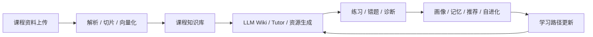

# 智学工坊演示 PPT 大纲

> 文档状态：比赛 PPT 结构稿
>
> 建议页数：12 页 | 演讲时长：6–7 分钟
>
> 事实源：[`../当前实现基线.md`](../当前实现基线.md)、[`智学工坊比赛材料合集.md`](智学工坊比赛材料合集.md) §2、§4

## 使用说明

每页包含：**讲稿要点（30–60 秒）**、**推荐配图/截图**、**数据来源**。队友可直接按页制作 `.pptx`，图表可从对应 Markdown 的 mermaid 导出为 PNG。

---

## 第 1 页：封面

**标题**：智学工坊 — 基于自进化学习智能体与 LLM Wiki 的个性化资源生成学习空间

**副标题**：中国软件杯 A3 赛题 | 2026

**讲稿要点**：一句话定位——面向高校学生的多智能体个性化学习空间，不是普通聊天机器人。

**配图**：品牌首页 `/` 或 `docs/ip-assets/` 知知 IP

**数据来源**：比赛材料合集 §1、§3

---

## 第 2 页：痛点 — 新时代大学生学习需求

**讲稿要点**：高校学生资料分散、AI 问答一次性、推荐缺依据、知识不沉淀、诊断缺证据。

**配图**：需求矩阵表格（8 行）

| 学生需求 | 系统响应 |
|---|---|
| 碎片化学习 | 资料解析、RAG、Wiki |
| 个性化解释 | Tutor、画像、偏好 |
| 练习反馈闭环 | 练习、错题、诊断 |
| 来源可信 | 引用、Review、Wiki 版本 |
| 多模态理解 | 资源、音频、沉浸课堂 |
| 学习路径规划 | 路径、难度、自进化 |
| 长期积累 | LLM Wiki、长期记忆 |
| 过程可见 | Agent 日志、步骤、证据 |

**数据来源**：比赛材料合集 §2

---

## 第 3 页：方案总览 — 学习闭环

**讲稿要点**：从资料上传到策略更新的完整闭环，AI 嵌入每个受控节点。

**配图**：学习闭环 mermaid 流程图

**数据来源**：比赛材料合集 §2

---

## 第 4 页：前沿 AI 技术融合

**讲稿要点**：

1. **统一 LLM Provider**：Mock + OpenAI-compatible，无 Key 可演示
2. **Hybrid RAG**：向量 + 关键词 + metadata + rerank
3. **LangGraph Agent**：MiMo Supervisor 动态选工具、重规划
4. **受控自进化**：策略版本化，不改代码

**配图**：四层 AI 融合示意图（Provider → RAG → Agent → Evolution）

**数据来源**：比赛材料合集 §4–§5

---

## 第 5 页：多智能体设计

**讲稿要点**：14 个职责明确的 Agent，Supervisor 从 Tool Registry 选工具；高风险操作 interrupt 等待确认；全程日志可追溯。

**配图**：Agent 时序图 + Agent 名单

`IntentRouterAgent`、`OrchestratorAgent`、`ProfileAgent`、`MemoryAgent`、`WikiAgent`、`KnowledgeAgent`、`PlannerAgent`、`ResourceAgent`、`QuizAgent`、`TutorAgent`、`DiagnosisAgent`、`RecommendAgent`、`EvolutionAgent`、`ReviewAgent`

**数据来源**：比赛材料合集 §5

---

## 第 6 页：核心演示 1 — 资料到 Wiki

**讲稿要点**：上传 → 解析 → 切片 → 向量化 → 知识点抽取 → Wiki 生成；强调来源追溯与版本管理。

**截图路由**：`/knowledge`（资料列表、Wiki 详情、来源标签）

**数据支撑**：32 份资料、1608 chunks、125 知识点（Phase 1 验收）

**数据来源**：[14_Phase1数据结构知识库阶段验收记录.md](../19_测试方案/14_Phase1数据结构知识库阶段验收记录.md)

---

## 第 7 页：核心演示 2 — AI 助手与多模态资源

**讲稿要点**：`/assistant` React 页支持快速 Tutor 与 LangGraph 智能体；资源侧栏 13 种资源类型；工具 chip 可见执行过程。

**截图路由**：`/assistant`（对话区、步骤时间线、资源侧栏、tool_hints）

**数据支撑**：20/20 Agent 场景通过，工具选择准确率 100%

**数据来源**：[16_Phase3.1LangGraph真正智能体阶段验收记录.md](../19_测试方案/16_Phase3.1LangGraph真正智能体阶段验收记录.md)、[22_智能对话资源生成工具专项验收记录.md](../19_测试方案/22_智能对话资源生成工具专项验收记录.md)

---

## 第 8 页：核心演示 3 — OpenMAIC 沉浸课堂

**讲稿要点**：一句话生成个性化沉浸课堂；基于 RAG、画像、薄弱点；异步导出带配音字幕 MP4；课堂播放 HMAC 签名隔离。

**截图路由**：`/assistant`（课堂卡片、MP4 产物）

**数据支撑**：MP4 导出通过，mime=video/mp4

**数据来源**：[18_OpenMAIC沉浸课堂阶段验收记录.md](../19_测试方案/18_OpenMAIC沉浸课堂阶段验收记录.md)

---

## 第 9 页：三大创新点

**讲稿要点**：

1. **LLM Wiki**：有来源、有版本、有关系，不是普通笔记
2. **受控自进化**：只更新学习策略，有证据、风险等级、回滚
3. **可观察多智能体**：步骤、事件、Review 结果前端可见

**配图**：三栏对比（普通 RAG vs 智学工坊）

**数据来源**：比赛材料合集 §1、§3

---

## 第 10 页：工程与测试

**讲稿要点**：322 pytest、23 步真实 LLM 主链路、权限隔离、Next.js 16 安全升级。

**配图**：测试数字表格

| 验收项 | 结果 |
|---|---|
| 后端全量测试 | 361 passed（2026-06-14） |
| Agent 场景 | 20/20，完成率 95% |
| 真实 LLM | 23 步，mimo-v2.5 |
| 前端 audit | 0 vulnerabilities |

**数据来源**：[证据与截图索引.md](证据与截图索引.md)

---

## 第 11 页：AI Coding 实践

**讲稿要点**：Cursor / Codex 辅助开发；人定验收标准 → AI 分任务实现 → 自动化门禁；Agent 与 AI Coding 都不越权改代码/DB。

**配图**：人机分工流程（需求 → 任务拆分 → 实现 → pytest/build → 验收）

**数据来源**：[比赛材料合集 §13](智学工坊比赛材料合集.md#13-ai-coding-工具说明)

---

## 第 12 页：总结与 Q&A

**讲稿要点**：

- 完整学生端学习闭环已跑通
- 前沿 AI 嵌入 RAG、多 Agent、自进化、多模态
- 工程可落地：本地可运行、Mock 可演示、真实模型已验收

**Q&A 预备**：见 [答辩稿.md](答辩稿.md) 高频问题表

**配图**：主链路一句话 + 二维码（可选，指向 GitHub / 演示地址）
