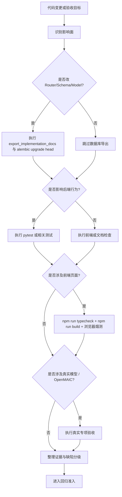
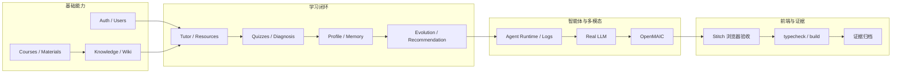

# 软件系统测试说明书

## 目录导读

> 文档状态：**比赛提交材料用测试说明书**
>
> 事实源优先级：当前代码与运行结果 → Alembic migration / SQLAlchemy Model / FastAPI OpenAPI → 当前实现基线与最新验收记录 → 设计文档。
>
> 本说明书只记录“当前已经验收过什么、怎么验收、怎样回归”，不把早期设计蓝图当作已实现事实。

阅读顺序：

- [适用范围与依据](#适用范围与依据)
- [测试策略](#测试策略)
- [测试环境](#测试环境)
- [覆盖矩阵](#覆盖矩阵)
- [权限异常](#权限异常)
- [真实模型、OpenMAIC 与浏览器验收](#真实模型openmaic与浏览器验收)
- [缺陷分级](#缺陷分级)
- [证据归档](#证据归档)
- [回归准入](#回归准入)

## 适用范围与依据

本说明书用于中国软件杯 A3 赛题作品《智学工坊》的软件系统测试、阶段验收和比赛材料归档。当前测试边界以以下事实源为准：

- 当前实现总览：[`../当前实现基线.md`](../当前实现基线.md)
- 当前实现 API 清单：[`../11_API接口设计/16_当前实现API清单.md`](../11_API接口设计/16_当前实现API清单.md)
- 当前实现数据库清单：[`../10_数据库设计/15_当前实现数据库清单.md`](../10_数据库设计/15_当前实现数据库清单.md)
- 阶段运行验收清单：[`../19_测试方案/12_阶段运行验收清单.md`](../19_测试方案/12_阶段运行验收清单.md)
- 真实 LLM 主链路与 Next 安全专项验收：[`../19_测试方案/13_真实LLM主链路与Next安全专项验收记录.md`](../19_测试方案/13_真实LLM主链路与Next安全专项验收记录.md)
- Phase 1 / Phase 3.1 / Phase 4 / OpenMAIC 验收记录：[`../19_测试方案/14_Phase1数据结构知识库阶段验收记录.md`](../19_测试方案/14_Phase1数据结构知识库阶段验收记录.md)、[`../19_测试方案/16_Phase3.1LangGraph真正智能体阶段验收记录.md`](../19_测试方案/16_Phase3.1LangGraph真正智能体阶段验收记录.md)、[`../19_测试方案/17_Phase4对话式画像阶段验收记录.md`](../19_测试方案/17_Phase4对话式画像阶段验收记录.md)、[`../19_测试方案/18_OpenMAIC沉浸课堂阶段验收记录.md`](../19_测试方案/18_OpenMAIC沉浸课堂阶段验收记录.md)

当前实现清单中的事实口径如下：

- API 操作：143
- ORM 表：44
- 后端主链路验收：真实 LLM 主链路、Agent、知识库、画像、自进化、推荐、OpenMAIC 均已分别做过专项验收

## 测试策略

项目采用“本地优先、Mock 兜底、真实专项补证”的测试策略。

### 基本原则

1. 日常开发先跑本地环境，不把 Docker 当成主验证路径。
2. 涉及数据库结构变化时，先做 migration，再做接口与回归检查。
3. 涉及大模型能力时，先保证 Mock Provider 可跑通，再做真实模型专项。
4. 涉及前端页面时，必须验证 `typecheck`、`build` 和浏览器烟测。
5. 涉及比赛展示能力时，必须补齐证据、截图和可复现命令。

### 测试流程



### 测试层级

- 单元与服务测试：覆盖 Service、Repository、Agent 工具、提示词渲染、事件总线。
- API 集成测试：覆盖认证、课程、资料、知识库、Wiki、Tutor、资源、练习、诊断、自进化、推荐。
- 数据库测试：覆盖 migration、约束、外键、幂等写入、权限过滤。
- 前端测试：覆盖 TypeScript、构建、关键页面联动、空状态、错误提示。
- 浏览器验收：覆盖 Stitch 页面真实交互与主链路闭环。
- 真实专项：覆盖真实 LLM、OpenMAIC、Agent 动态执行、浏览器真实账号复验。

## 测试环境

### 本地环境

- 后端：FastAPI + Python，本机 PostgreSQL、本机 Redis
- 前端：Next.js 16.2.7，TypeScript，Stitch 静态页 + 少量脚本联动
- 数据库：PostgreSQL + pgvector
- LLM：Mock Provider / OpenAI-compatible Adapter / Xiaomi MiMo 真实模型
- 多智能体：LangGraph + arq Worker

### 环境约束

1. 默认优先本地运行，Docker 仅在部署专项中强制。
2. 无真实 Key 时必须使用 Mock Provider，不能让主链路断掉。
3. 真实模型专项必须明确记录 provider、model、fallback_used、耗时和产物。
4. OpenMAIC 验收必须同时记录内部鉴权、课堂任务、导出产物与播放隔离。

### 最新验收数字参考

以下数字均来自最新验收记录或当前实现清单，后续若有新验收，以新记录覆盖旧记录，不在本说明书中手工造数。

| 验收项 | 最新可引用数字 | 来源 |
|---|---:|---|
| 后端全量测试 | `304 passed` | [`../19_测试方案/20_全量功能扫描与浏览器验收报告.md`](../19_测试方案/20_全量功能扫描与浏览器验收报告.md) |
| OpenMAIC 后端聚焦测试 | `37 passed` | [`../19_测试方案/18_OpenMAIC沉浸课堂阶段验收记录.md`](../19_测试方案/18_OpenMAIC沉浸课堂阶段验收记录.md) |
| OpenMAIC 后端完整 pytest | `265 passed` | [`../19_测试方案/18_OpenMAIC沉浸课堂阶段验收记录.md`](../19_测试方案/18_OpenMAIC沉浸课堂阶段验收记录.md) |
| 真实 LLM 主链路 | `91 passed` | [`../19_测试方案/13_真实LLM主链路与Next安全专项验收记录.md`](../19_测试方案/13_真实LLM主链路与Next安全专项验收记录.md) |
| Phase 3.1 场景集 | `20/20` 场景通过，任务完成率 `95%` | [`../19_测试方案/16_Phase3.1LangGraph真正智能体阶段验收记录.md`](../19_测试方案/16_Phase3.1LangGraph真正智能体阶段验收记录.md) |
| Phase 1 知识库 | `32` 份资料、`1608` chunks、`125` 知识点 | [`../19_测试方案/14_Phase1数据结构知识库阶段验收记录.md`](../19_测试方案/14_Phase1数据结构知识库阶段验收记录.md) |

## 覆盖矩阵

### 功能覆盖

| 覆盖域 | 主要对象 | 重点验收方式 | 关键证据 |
|---|---|---|---|
| 认证与用户 | 注册、登录、当前用户、密码修改 | API 测试 + 浏览器登录烟测 | 401/404 行为、token 写入、页面跳转 |
| 课程与资料 | 课程 CRUD、上传、解析、切片、向量化 | API 测试 + 数据库检查 | 资料数量、chunk 数、embedding 数 |
| 知识库与 Wiki | 知识点抽取、检索、Wiki CRUD、版本、关系、回滚 | API 测试 + 真实样例 | 来源、版本、图谱、引用率 |
| Tutor 与资源 | 答疑、引用、资源生成、保存到 Wiki | 真实模型专项 + Mock 专项 | provider、citations、personalized_reason |
| 练习与诊断 | Quiz、错题本、Diagnosis、Recommendation | API 测试 + 主链路专项 | 题目数、报告、建议、推荐理由 |
| 画像与记忆 | Profile、Memory、Dialogue ingest | 权限测试 + 浏览器复验 | 证据、版本、归档/恢复 |
| 自进化 | 策略生成、应用、回滚 | 专项测试 + 证据核验 | 风险等级、版本链、回滚记录 |
| Agent 运行时 | AgentTask、AgentRun、事件、会话 | 真实场景集 + 浏览器任务流 | 20 条场景、事件时间线、run 日志 |
| OpenMAIC | 沉浸课堂、视频导出、课堂播放隔离 | OpenMAIC 专项 + 真实文件导出 | 401、HMAC 签名、MP4 产物 |
| 前端联动 | `/home`、`/courses`、`/knowledge`、`/assistant`、`/practice`、`/dashboard`、`/path-profile` | TypeScript + build + 浏览器烟测 | 控制台无 error、真实 API 数据 |

### 覆盖图



## 权限异常

权限异常不是“顺手报错”，而是本项目的核心验收点之一。测试时应覆盖以下场景：

| 场景 | 预期结果 | 说明 |
|---|---|---|
| 未登录访问 JWT API | `401` | 例如用户信息、课程、知识库、Tutor、资源等接口 |
| 学生访问他人数据 | `404` 或当前实现定义的越权错误 | 当前验收记录中，其他学生查询返回 `404` |
| 课程归属不匹配 | `404` | `course_id` 必须校验归属，避免跨学生泄露 |
| 资源访问无授权 | `401` / `404` | 以当前实现和资源类型的校验逻辑为准 |
| 课堂播放无签名 | `401` | OpenMAIC 课堂播放必须绑定课堂 ID 的短期签名 |
| 课堂播放签名不匹配 | `403` / `401` | 不能用同一签名访问其他课堂 |
| 管理员能力未开放接口 | 不应宣称存在 | 当前实现基线明确无 `/api/v1/admin/*` 业务接口 |

### 权限异常最小回归集

1. `GET /api/v1/users/me` 无 token。
2. `GET /api/v1/agent/tasks/{task_id}` 访问非本人任务。
3. `GET /api/v1/knowledge/graph/subgraph` 使用非归属课程。
4. `GET /api/v1/media-assets/{asset_id}/launch` 缺少 `access_token`。
5. `POST /api/v1/multimodal/classrooms/generate` 传入不属于当前用户的课程。
6. `POST /api/v1/student/profile/dialogue-ingest` 仅允许写入当前用户画像。

## 真实模型、OpenMAIC 与浏览器验收

### 真实模型专项

真实模型验收只在明确需要“不是 Mock 结果”的场景执行。验收要求：

1. `provider` 不是 `mock` 或 fallback。
2. `fallback_used=false`。
3. 回答必须带引用或 grounded 依据。
4. 资源、练习、诊断、自进化、Agent 日志都必须落库。
5. 记录模型名、耗时、产物数量和已知限制。

最新真实 LLM 主链路专项记录显示：

- provider：`xiaomi_mimo`
- model：`mimo-v2.5`
- `fallback_used=false`
- 主链路通过，且有 `23` 步执行记录
- 本轮最终耗时约 `463` 秒

### OpenMAIC 专项

OpenMAIC 验收重点不是“页面能不能点”，而是以下四点：

1. 一句话路由到个性化沉浸课堂任务。
2. 课堂任务完成后生成可导出的 MP4。
3. 课堂访问必须通过内部服务令牌和短期签名。
4. 失败时能给出退化路径，不伪装成成功。

最新验收记录中的可引用结果包括：

- 内部鉴权测试：`2 passed`
- OpenMAIC 后端聚焦测试：`37 passed`
- OpenMAIC 后端完整 pytest：`265 passed`
- 真实 MP4 导出：通过，`mime=video/mp4`，文件大于 `1000 bytes`

### 浏览器验收

浏览器验收必须使用真实路由和真实登录态，不能用静态占位页冒充。

重点路径如下：

- `/knowledge`
- `/assistant`
- `/path-profile`
- `/home`
- `/courses`
- `/practice`
- `/dashboard`

每次浏览器验收至少记录：

1. 访问 URL。
2. 当前账号或角色。
3. 页面可见结果。
4. 控制台是否有 error / warning。
5. 是否能完成最短闭环。

最新浏览器验收可引用结果包括：

- 真实 API 注册/登录后写入前端会话。
- `/courses`、`/knowledge`、`/assistant`、`/practice`、`/dashboard`、`/path-profile`、`/evolution` 均加载出真实页面文本。
- 应用控制台错误数 `0`，页面运行时错误数 `0`。
- OpenMAIC 专项通过内部鉴权与生产构建；完整课堂点击链路仍建议在比赛冻结版本录屏补证。

## 缺陷分级

### P0 阻断

会直接阻断比赛展示或造成安全风险的问题。

典型情形：

- 登录、课程、资料、Wiki、Tutor、诊断、自进化、OpenMAIC 主链路不可用
- 401/404/权限校验失效导致跨用户数据泄露
- 真实模型专项回退为 Mock 却被当作真实结果
- 生成结果无来源、无版本、无法追溯
- 构建失败、数据库 migration 失败、页面白屏

### P1 严重

能运行，但核心功能明显不完整或结果错误。

典型情形：

- 资源、练习、诊断或推荐逻辑错误
- 画像与记忆无法落库或证据缺失
- Agent 无法写入日志或事件不完整
- OpenMAIC 课堂可以创建但无法导出

### P2 一般

不影响主流程，但会影响使用体验或材料表达。

典型情形：

- 文案不统一
- 卡片样式错位
- 空状态说明不足
- 轻微性能下降

### P3 提示

仅用于后续优化，不影响当前验收。

典型情形：

- 可接受的 TODO
- 可进一步增强的图表或动效
- 非阻断的文档补充

## 证据归档

每次验收必须保存“可复核证据”，不能只写结论。

### 证据清单

- 命令输出：`pytest`、`alembic upgrade head`、`typecheck`、`build`、`check_docs.py`
- 运行结果：API 返回体、数据库统计、任务日志、Agent 事件、模型调用记录
- 浏览器证据：页面截图、控制台无报错、关键交互录屏
- 真实模型证据：provider、model、fallback 状态、引用、耗时
- OpenMAIC 证据：课堂任务、导出任务、MP4 文件信息、签名校验结果

### 证据记录模板

```text
验收日期：
验收环境：
执行命令：
实际结果：
关键数字：
已知限制：
证据文件：
```

### 证据存放原则

1. 数字必须来自最新验收记录，不得手写夸大。
2. 截图必须能对上页面路由和时间。
3. API 输出必须脱敏，不能包含密钥。
4. 浏览器证据要和接口证据能互相印证。

## 回归准入

### 准入门槛

以下检查通过后，才允许把本次修改视为“可回归”：

1. 代码涉及 Router、Schema、Model 时，必须执行 `python scripts/export_implementation_docs.py`。
2. 数据库变更必须执行 `python -m alembic upgrade head`。
3. 后端变更必须执行 `python -m pytest` 或对应测试文件。
4. 前端变更必须执行 `npm run typecheck` 和 `npm run build`。
5. 涉及真实模型的变更必须补做真实专项，不能只看 Mock。
6. 涉及 OpenMAIC 的变更必须补做 OpenMAIC 专项或对应冒烟。
7. 涉及浏览器页面的变更必须补做页面烟测。
8. 涉及文档的变更必须执行 `python scripts/check_docs.py`。

### 变化类型与必测项

| 变更类型 | 必测项 |
|---|---|
| 认证、权限、用户数据 | 401/404 权限异常、用户隔离、JWT 流程 |
| 课程、资料、知识库 | 迁移、上传、解析、切片、检索 |
| Wiki | 版本、来源、关系、回滚 |
| Tutor、资源、练习、诊断 | 真实主链路或 Mock 主链路、引用、落库 |
| 画像、记忆、自进化 | 证据、版本链、回滚、可解释性 |
| Agent | 任务、事件、日志、恢复、Review |
| OpenMAIC | 课堂、签名、导出、播放隔离 |
| 前端页面 | typecheck、build、浏览器烟测 |
| 文档材料 | `check_docs.py`、链接可达、无占位文档 |

### 结论口径

如果必要检查未完成，只能写：

```text
实现已提交，验收未通过。
```

如果全部门禁通过，才可写：

```text
实现完成，验收通过。
```

## 附录：与比赛材料的关系

本说明书是比赛材料的一部分，负责回答“系统到底测了什么、怎么测、证据在哪里”。配套材料仍以 `22_比赛材料规划.md` 为主文档，答辩稿、演示脚本、部署方案和源代码材料应与本说明书中的测试结果保持一致。
