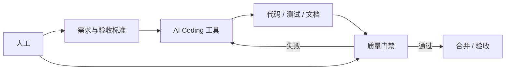

# AI Coding 工具使用说明

> 文档状态：比赛提交材料（赛题第 6 条）
>
> 适用范围：智学工坊项目开发过程说明
>
> 基线日期：2026-06-13

## 1. 文档目的

说明本项目在开发过程中如何使用 AI Coding 工具（Cursor Agent、Codex、Claude Code 等），以及如何通过工程规范保证 AI 辅助开发的质量与边界。本文基于仓库真实实践撰写，不虚构工具能力。

## 2. 使用的 AI Coding 工具

| 工具 | 用途 | 项目约束文件 |
|---|---|---|
| **Cursor Agent** | 日常功能开发、测试补全、文档同步 | [AGENTS.md](../../AGENTS.md)、[CLAUDE.md](../../CLAUDE.md) |
| **Codex / Claude Code** | 分阶段任务执行、接口与 Service 层实现 | [docs/Codex开发任务拆分.md](../_archive/Codex开发任务拆分.md)（归档） |
| **Mock LLM Provider** | 无 API Key 时的 AI 能力演示与测试 | `backend/app/llm/provider.py` |

## 3. 人机分工模式



### 3.1 人工负责

1. 阅读 PRD、架构设计与当前实现基线，明确任务边界
2. 定义验收标准（pytest、build、浏览器烟测、真实 LLM 专项）
3. 审查 AI 产出是否越权（改 DB 结构、权限、部署配置）
4. 运行验收脚本并签字确认阶段通过

### 3.2 AI 工具负责

1. 按任务拆分实现 Router → Service → Model 分层代码
2. 生成 Alembic migration、pytest 用例、前端 TypeScript 类型
3. 同步 API 清单、数据库清单与比赛材料文档
4. 在 Mock Provider 约束下保证主链路可演示

### 3.3 明确禁止 AI 自动执行

与项目「自进化 Agent」边界一致，AI Coding 工具同样不得：

1. 自动修改生产部署配置或提交 `.env` 密钥
2. 绕过 migration 直接改数据库
3. 删除已有功能或扩大未授权任务范围
4. 把 Mock 输出冒充真实模型验收结果

## 4. 质量门禁

每次 AI 辅助开发完成后，必须过以下门禁（详见 [AGENTS.md](../../AGENTS.md) §16）：

| 门禁 | 命令 | 触发条件 |
|---|---|---|
| 后端测试 | `cd backend && python -m pytest -q` | 任何后端变更 |
| 数据库迁移 | `python -m alembic upgrade head` | Model / migration 变更 |
| 前端类型检查 | `cd frontend && npm run typecheck` | 前端变更 |
| 前端构建 | `npm run build` | 前端变更 |
| 事实清单导出 | `python scripts/export_implementation_docs.py` | Router / Schema / Model 变更 |
| 文档断链检查 | `python scripts/check_docs.py` | 文档变更 |
| 组合验收 | `scripts/local_check.ps1 -All` | 阶段收尾 |

## 5. 文档与事实源规则

AI 辅助写文档时必须遵守 [04_文档事实源与状态规则.md](../00_文档规范/04_文档事实源与状态规则.md)：

```text
当前代码与运行结果
  → migration / Model / OpenAPI
  → 当前实现基线与验收记录
  → 设计文档与 PRD
```

设计文档中的目标能力**不得**被 AI 直接写成「已实现」。状态只用四类：已实现且已验收 / 已实现但未通过 / 规划增强 / 冻结未实现。

## 6. 开发成效（可引用数据）

以下数据来自当前验收记录，可在答辩中引用：

| 指标 | 结果 | 证据 |
|---|---|---|
| 后端自动化测试 | **322 passed** | 2026-06-13 `cd backend && python -m pytest -q` |
| 真实 LLM 主链路 | 23 步通过 | [13_真实LLM主链路与Next安全专项验收记录.md](../../19_测试方案/13_真实LLM主链路与Next安全专项验收记录.md) |
| Agent 场景评测 | 20/20，完成率 95% | [16_Phase3.1LangGraph真正智能体阶段验收记录.md](../../19_测试方案/16_Phase3.1LangGraph真正智能体阶段验收记录.md) |
| API 操作数 | 143 | [当前实现API清单.md](../../当前实现API清单.md) |
| ORM 表 | 44 | [当前实现数据库清单.md](../../当前实现数据库清单.md) |

## 7. 与「自进化学习智能体」的叙事关系

本项目强调：**自进化不修改源代码**，只更新学习策略、画像和偏好。AI Coding 工具的使用边界与此一致——AI 辅助写代码，但：

1. 所有变更经人工验收与测试门禁
2. 运行时 Agent 不能自动改代码、DB、权限
3. 策略版本有证据、风险等级和回滚

这一致性可在答辩中作为「受控 AI」的工程体现。

## 8. 推荐答辩表述

> 我们使用 Cursor Agent 等 AI Coding 工具加速实现，但所有产出必须通过 pytest、build 和阶段验收脚本。项目文档采用「事实源优先」规则，AI 不得把设计目标写成已实现。这与系统内「自进化 Agent 只更新学习策略、不改代码」的安全边界一脉相承。

## 9. 相关文件

- [AGENTS.md](../../AGENTS.md) — AI 助手工作边界与禁止事项
- [CLAUDE.md](../../CLAUDE.md) — 项目概述与常用命令
- [00_比赛提交总览.md](../../22_比赛材料规划/00_比赛提交总览.md) — 比赛材料入口
- [智学工坊比赛材料合集.md](../../22_比赛材料规划/智学工坊比赛材料合集.md) §4 — 技术实现详情
