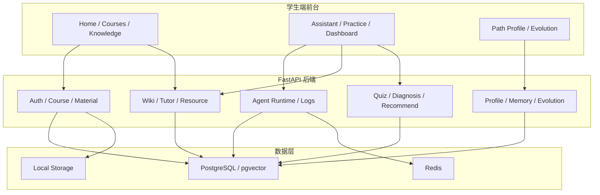

# 智学工坊功能说明书

> 文档状态：比赛材料功能说明书
>
> 事实源优先级：当前代码、OpenAPI、SQLAlchemy Model、Alembic migration、阶段验收记录、`docs/当前实现基线.md`
>
> 说明：本文按“功能模块 - 接口 - 数据 - 页面 - 状态”组织，只写当前可证明的能力与边界

## 目录导读

- 1. 产品定位
- 2. 功能结构图
- 3. 功能模块清单
- 4. 页面与接口映射
- 5. 功能状态分类
- 6. 功能追溯表
- 7. 关键业务流程
- 8. 功能边界与不实现项

## 1. 产品定位

智学工坊是面向高校学生的个性化学习空间，当前已具备“课程资料上传 - 知识库构建 - LLM Wiki - AI Tutor - 练习诊断 - 画像记忆 - 自进化推荐 - Agent 日志”的主链路。

它不是普通聊天机器人，也不是单纯资料管理站点，而是一个围绕课程学习闭环运行的多智能体学习系统。

## 2. 功能结构图



## 3. 功能模块清单

### 3.1 已实现且已验收

| 模块 | 功能点 | 说明 | 状态 |
|---|---|---|---|
| 认证 | 注册、登录、密码修改、用户名检查、当前用户查询 | 统一 JWT 访问 | 已实现且已验收 |
| 课程 | 创建、列表、详情、更新、删除 | 课程是所有业务对象的归属边界 | 已实现且已验收 |
| 资料 | 上传、解析、查看解析状态、切片、下载、向量化 | 课程资料是知识库入口 | 已实现且已验收 |
| 知识库 | 知识点抽取、检索、图谱子图、质量报告 | 支撑教学资料 grounding | 已实现且已验收 |
| Wiki | 页面创建、生成、更新、版本、回滚、汇总 | 个人学习知识空间 | 已实现且已验收 |
| Tutor | 提问、聊天、反馈、保存到 Wiki | 受控答疑与知识沉淀 | 已实现且已验收 |
| 资源 | 资源生成、资源查询、保存到 Wiki | 讲解文档和学习材料输出 | 已实现且已验收 |
| 练习 | 题目生成、题目提交、错题列表 | 形成练习闭环 | 已实现且已验收 |
| 诊断 | 学习诊断、掌握度、历史报告 | 输出薄弱点与建议动作 | 已实现且已验收 |
| 画像 | 全局画像、课程画像、对话式画像写入、重建 | 支撑个性化生成 | 已实现且已验收 |
| 记忆 | 反思、查看、删除、恢复、健康检查 | 长期学习记忆沉淀 | 已实现且已验收 |
| 推荐 | 列表、刷新、反馈、状态更新 | 与诊断和策略联动 | 已实现且已验收 |
| 自进化 | 分析、策略列表、策略应用、回滚、事件 | 策略版本化与风险控制 | 已实现且已验收 |
| Agent | 会话、消息、任务、步骤、事件、运行日志 | 多智能体学习执行链 | 已实现且已验收 |
| 多模态 | 图片、课件、分镜、视频、沉浸课堂、音频 | 作为学习产物输出入口 | 已实现且已验收 |
| 学习分析 | session heartbeat、summary、end | 为首页和路径提供行为汇总 | 已实现且已验收 |
| 个性化闭环 | 记忆 stable key、策略物化、双层画像 | 诊断→画像→策略→推荐闭环 | 已实现且已验收 |
| 资源工具矩阵 | 13 种直接资源类型、tool_hints、侧栏 | Agent 对话式资源生成 | 已实现且已验收 |

| 桌宠 | 通知、偏好、跳转 | API + `pet-companion.test.mjs` | `/student/pet/*` |
| A/B 实验 | 分组、指标 | `test_ab_tests.py` | `/ab-tests/*` |

### 3.1.3 `/assistant` React 页能力清单

| 能力 | 组件/服务 | 后端接口 |
|---|---|---|
| 快速 Tutor SSE | `streamTutorChat` | `POST /api/v1/tutor/chat/stream` |
| 智能体任务 | `agentService` SSE | `POST /api/v1/agent/conversations/*/messages` |
| 资源侧栏 13 类 | `ResourceSidePanel` | `POST /api/v1/resources/generate` |
| 步骤时间线 | `AgentStepTimeline` | Agent task events |
| 媒体进度 | `MediaJobProgressCard` | `multimodal_progress` 事件 |
| 沉浸课堂卡片 | `ImmersiveClassroomCard` | OpenMAIC job + manifest |
| 学习心跳 | `learningAnalyticsService` | `POST /learning-analytics/sessions/heartbeat` |
| 工具选择 | `ToolSelector` | `tool_hints` → Supervisor |

#### 3.1.1 智能对话资源工具矩阵（13 种）

与 [`frontend/lib/resourceTypes.ts`](../../frontend/lib/resourceTypes.ts) 一致：

| 类型键 | 中文标签 |
|---|---|
| explanation | 讲解 |
| summary | 总结 |
| example | 例题 |
| flashcard | 复习卡 |
| review | 错题解析 |
| mindmap | 思维导图 |
| diagram | 图解 |
| image | 教学插图 |
| video | 讲解视频 |
| animation | 动画演示 |
| interactive_courseware | 互动课件 |
| code_project | 代码实操 |
| reading_pack | 拓展阅读 |

Agent 还可经工具生成 OpenMAIC 沉浸课堂、TTS 语音等产物；侧栏通过别名归一化展示。

#### 3.1.2 学习分析 API

| 接口 | 说明 |
|---|---|
| `POST /api/v1/learning-analytics/sessions/heartbeat` | 页面可见时累计学习时长 |
| `POST /api/v1/learning-analytics/sessions/{id}/end` | 结束会话 |
| `GET /api/v1/learning-analytics/summary` | 本周/本月汇总（`/home` 使用） |

### 3.2 已实现但未通过或未完成

| 功能点 | 当前事实 | 说明 |
|---|---|---|
| 全站浏览器自动化 E2E | 有局部浏览器烟测与单页验证 | 尚未形成比赛级全站自动化验收 |
| 一键演示数据初始化 | 有知识库种子、演示脚本和阶段性检查 | 尚未统一成一键比赛演示入口 |
| Docker 全栈验收 | 具备容器化方向 | 仍未作为当前主验证结果对外宣称 |
| Redis Stream 实时事件 | 当前兼容模式是数据库追加事件 + Redis Pub/Sub | 不是最终目标态 |
| 完整会话历史 UI | 后端会话、消息、步骤、事件都存了 | 前端历史侧栏仍不完整 |
| OpenMAIC 真实课堂效果 | 已有课堂生成与 MP4 导出链路 | 真实质量和耗时仍需继续回归 |

### 3.3 规划增强

| 功能点 | 规划方向 | 说明 |
|---|---|---|
| Markdown 统一渲染 | 所有 AI 文本统一走 MarkdownRenderer | 提升解释型内容可读性 |
| ArtifactCard 统一卡片 | 将资源、课堂、题目、推荐等统一卡片化 | 便于前端可视化展示 |
| 现代 AI 事件协议 | token、step、artifact、citation、review、done、error | 提升进度与错误展示一致性 |
| 图谱增强 | 更复杂的图布局、筛选、路径推理 | 作为展示增强项 |
| 检索增强 | cross-encoder / LLM rerank | 用于后续质量提升 |
| 数据部署增强 | MinIO、完整演示数据一键初始化 | 用于部署与比赛包装 |

### 3.4 冻结未实现

| 功能点 | 冻结状态 | 说明 |
|---|---|---|
| 教师端 | 不实现 | 当前比赛主线聚焦学生端闭环 |
| 管理员后台 | 不实现 | 当前无对应 API 与页面 |
| 自动改代码、数据库结构、权限规则、部署配置 | 严格禁止 | 与项目安全边界冲突 |
| 全站 React 重写 | 不做 | 仅局部增强或 island 化 |

## 4. 页面与接口映射

| 页面 | 核心功能 | 主要接口 | 承载方式 |
|---|---|---|---|
| `/` | 品牌首页、登录注册弹窗 | `/api/v1/auth/*` | React `LandingPage` |
| `/home` | 学习总览 | 学习分析、推荐、Agent 摘要 | 已实现且已验收 |
| `/courses` | 课程创建和管理 | `/api/v1/courses/*` | 已实现且已验收 |
| `/knowledge` | 资料、知识库、Wiki、质量报告 | `/api/v1/materials/*`、`/api/v1/knowledge/*`、`/api/v1/wiki/*` | 已实现且已验收 |
| `/assistant` | Tutor、Agent 任务、资源、课堂入口 | `/api/v1/tutor/*`、`/api/v1/agents/*`、`/api/v1/agent/*`、`/api/v1/resources/*` | 已实现且已验收 |
| `/practice` | 练习、错题、诊断 | `/api/v1/quizzes/*`、`/api/v1/diagnosis/*` | 已实现且已验收 |
| `/dashboard` | 学习概览、推荐、Agent 状态 | `/api/v1/recommendations/*`、`/api/v1/learning-analytics/*` | 已实现且已验收 |
| `/path-profile` | 画像、记忆、路径、自进化 | `/api/v1/student/profile/*`、`/api/v1/student/memory/*`、`/api/v1/learning-paths/*`、`/api/v1/evolution/*` | 已实现且已验收 |
| `/evolution` | 策略列表与回滚 | `/api/v1/evolution/*` | React 策略仪表盘 |
| 全站 | 桌宠「知知」 | `/api/v1/student/pet/*` | `PetCompanion` 跨 Stitch 常驻 |

## 5. 功能状态分类

### 5.1 已实现且已验收

这些功能满足“当前代码存在 + 可运行 + 有验收记录”的条件：

1. 课程资料上传与知识库构建。
2. LLM Wiki 生成、版本与回滚。
3. Tutor 问答、资源生成、练习提交和诊断。
4. 学生画像、长期记忆、推荐与自进化策略。
5. LangGraph Agent 运行时、会话、任务、步骤和事件。
6. 真实 LLM 主链路与 Phase 1、Phase 3.1 阶段验收。

### 5.2 已实现但未通过或未完成

这些功能已具备工程基础，但当前不能作为“已完成”对外宣称：

1. 全站浏览器级自动化 E2E 仍未完成。
2. Docker 全栈正式验收未完成。
3. 一键演示数据初始化尚未统一为比赛级入口。
4. 完整会话历史 UI 尚未完全闭环。
5. Redis Stream 终态升级尚未完成。
6. OpenMAIC 真实课堂质量与稳定性仍在回归。

### 5.3 规划增强

这些能力适合作为比赛加分项或后续迭代，不应冒充当前事实：

1. GraphRAG community summaries、Global/Local/DRIFT。
2. cross-encoder 和更强 rerank。
3. 更统一的 Markdown / ArtifactCard / Timeline 交互层。
4. 更复杂的图谱可视化和路径推理。
5. MinIO、PWA、完整响应式优化。

### 5.4 冻结未实现

这些内容属于当前项目边界之外：

1. 教师端业务。
2. 管理员后台业务。
3. Agent 自动修改代码、数据库、权限或部署配置。
4. 全站 React 推倒重写。

## 6. 功能追溯表

| 功能编号 | 功能名称 | 输入 | 输出 | 数据落点 | 关联 AI | 状态 | 证据 |
|---|---|---|---|---|---|---|---|
| FUNC-01 | 课程与资料入口 | 登录用户、课程信息、资料文件 | 课程、资料、解析状态 | `courses`、`course_materials` | 无/辅助 | 已实现且已验收 | API 清单、DB 清单 |
| FUNC-02 | 文档切片与检索 | 资料文本、课程 id | chunks、embedding、检索结果 | `document_chunks` | RAG | 已实现且已验收 | Phase 1 验收 |
| FUNC-03 | Wiki 生成与回滚 | 资料、知识点、用户输入 | Wiki 页面、版本链 | `wiki_pages`、`wiki_page_versions`、`wiki_sources` | LLM / Review | 已实现且已验收 | API 清单 |
| FUNC-04 | Tutor 答疑 | 问题、课程、画像、记忆 | 答案、引用、反馈入口 | `agent_messages`、`llm_call_logs`、`user_feedback` | Tutor Agent | 已实现且已验收 | 真实主链路验收 |
| FUNC-05 | 资源生成 | 知识点、画像、课程上下文 | 资源内容、引用、理由 | `generated_resources`、`media_assets` | Resource Agent | 已实现且已验收 | 真实主链路验收 |
| FUNC-06 | 练习与诊断 | 课程、知识点、答题记录 | 题目、错题、诊断报告 | `quizzes`、`questions`、`answer_records`、`mistake_books`、`diagnosis_reports` | Quiz / Diagnosis Agent | 已实现且已验收 | 真实主链路验收 |
| FUNC-07 | 画像与记忆 | 对话、答题、学习行为 | 画像、记忆、偏好 | `student_profiles`、`student_course_profiles`、`student_memories` | Profile / Memory Agent | 已实现且已验收 | 当前基线、验收记录 |
| FUNC-08 | 自进化策略 | 诊断、反馈、画像 | 策略版本、风险、回滚点 | `evolution_strategies`、`evolution_events` | Evolution Agent | 已实现且已验收 | 当前基线、验收记录 |
| FUNC-09 | 学习路径与推荐 | 画像、诊断、策略 | 路径、推荐项 | `learning_paths`、`learning_path_items`、`recommendations` | Planner / Recommend Agent | 已实现且已验收 | 当前基线 |
| FUNC-10 | Agent 任务执行 | 自然语言任务 | 任务、步骤、事件、日志 | `agent_tasks`、`agent_task_steps`、`agent_task_events`、`agent_runs` | LangGraph / MiMo | 已实现且已验收 | Phase 3.1 验收 |
| FUNC-11 | 多模态产物 | 学习任务、课程上下文 | 图片、课件、分镜、视频、课堂 | `media_assets`、`media_jobs` | Multimodal Tools | 已实现且已验收 | 当前基线 |
| FUNC-12 | 学习分析 | 页面心跳、课程 id | 时长汇总、掌握度趋势 | `learning_sessions` | 无/规则 | 已实现且已验收 | 17_个性化闭环验收 |
| FUNC-13 | 资源工具矩阵 | 自然语言 + tool_hints | 13 类资源 + 侧栏产物 | `generated_resources` | Resource Agent | 已实现且已验收 | 22_资源工具验收 |
| FUNC-14 | 浏览器全站 E2E | 端到端用户流程 | 全链路自动化报告 | 依赖前端与测试脚本 | 需要继续增强 | 已实现但未通过 | 当前完成度清单 |

## 7. 关键业务流程

### 7.1 学生从上传资料到生成 Wiki

1. 学生在 `/knowledge` 上传课程资料。
2. 后端完成解析、切片和向量化。
3. 知识点抽取后形成课程知识库。
4. 生成 Wiki 页面并记录来源与版本。
5. 学生可以在页面查看详情、来源和历史版本。

### 7.2 学生通过 `/assistant` 发起学习任务

1. 学生输入自然语言需求。
2. 系统创建或恢复 Agent 会话。
3. LangGraph Supervisor 按工具与风险边界拆分任务。
4. 任务执行过程中持续输出步骤、事件和结果。
5. 最终结果落入消息、日志与相关业务表。

### 7.3 学生做题后形成诊断与推荐

1. 学生在 `/practice` 生成并提交题目。
2. 系统写入答题记录和错题。
3. 诊断服务形成薄弱点、错误模式和建议动作。
4. 推荐与学习路径根据策略版本刷新。
5. 画像和记忆同步更新。

### 7.4 个性化学习闭环

```mermaid
flowchart LR
  A[问答 / 练习 / 诊断] --> B[EventBus 后置信号]
  B --> C[课程画像 / 全局画像]
  B --> D[长期记忆反思]
  C --> E[自进化策略分析]
  E --> F[策略物化到偏好与 Prompt]
  F --> G[推荐 / 路径 / Tutor 个性化]
  H[页面心跳] --> I[learning_sessions]
  I --> J[/home 学习分析]
  D --> G
  C --> G
```

1. 答题与诊断完成后，EventBus 触发画像信号提取（消息 ID 幂等）。
2. 掌握度写入课程画像，不覆盖其他课程快照。
3. 自进化策略应用物化到 `learning_preferences` 与 Prompt 参数。
4. 页面可见时发送 heartbeat，首页展示真实学习时长与掌握度。

## 8. 功能边界与不实现项

### 8.1 功能边界

1. 所有 AI 结果必须可追溯，不允许无来源输出冒充真实结论。
2. 学生数据必须做用户隔离，不能跨用户访问。
3. 自进化只更新策略和画像，不修改底层代码与权限。
4. 当前前端沿用 Stitch 视觉体系，不做整站重构。

### 8.2 不实现项

1. 教师端完整产品化。
2. 管理员后台完整产品化。
3. 用假数据伪造真实模型效果。
4. 用截图替代运行证据。
5. 让 Agent 自动执行 migration 或改写系统配置。

## 9. 备注

如果后续修改 Router、Schema 或 SQLAlchemy Model，仍需同步执行 `python scripts/export_implementation_docs.py`，并保持本说明书与当前实现清单一致。文档校验通过后，再用于比赛材料整理与答辩口径。

