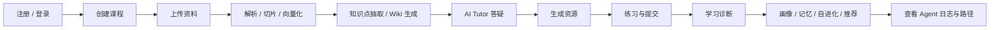

# 智学工坊用户使用说明书

> 适用对象：学生端用户、演示讲解人员、答辩展示人员
>
> 使用边界：当前版本以学生端主链路为主，教师端和管理员端未作为完整业务功能开放。

## 1. 你会看到什么

智学工坊是一个面向高校课程学习的个性化学习空间。它不是普通资料仓库，也不是单纯聊天机器人，而是围绕“上传资料、生成 Wiki、AI 答疑、资源生成、练习诊断、画像更新、自进化推荐”形成闭环的学生端系统。

当前前端以 Next.js 路由承载学生端页面，其中 `/`、`/assistant`、`/evolution` 是 React 页面，其余核心学生端页面主要保留 Stitch 静态视觉原型。你在浏览器里看到的核心入口通常是：

```text
/
/home
/courses
/knowledge
/assistant
/practice
/dashboard
/path-profile
/evolution
```

## 2. 第一次打开怎么用

### 2.1 打开方式

如果本地前端运行在默认端口，直接访问首页即可。若后端换了端口，可以在登录或注册页使用 `api_base` 参数指定后端地址。

示例：

```text
http://127.0.0.1:3000/register?api_base=http%3A%2F%2F127.0.0.1%3A8010%2Fapi%2Fv1
```

### 2.2 登录或注册

1. 先进入 `/register` 注册学生账号，或进入 `/login` 使用已有账号登录。
2. 登录后系统会保存当前会话 Token。
3. 之后你进入课程、知识库、助手、练习和画像页面时，都会沿用同一个后端地址。

## 3. 学生端主流程



## 4. 真实使用步骤

### 4.1 创建课程

1. 打开 `/courses`。
2. 新建一门课程，例如“数据结构”。
3. 保存后进入该课程空间。

课程是后续所有资料、Wiki、答疑、练习、诊断和推荐的归属单元，所以后续操作都要选对课程。

### 4.2 上传资料

1. 打开 `/knowledge`。
2. 上传课程资料，支持常见文档上传入口。
3. 上传后执行解析。
4. 继续执行切片。
5. 继续执行向量化。

当前系统的知识检索、Wiki 生成和 Tutor 回答都依赖这些步骤产生的课程资料。

### 4.3 生成知识点和 Wiki

1. 在 `/knowledge` 中查看资料处理结果。
2. 触发知识点抽取。
3. 生成 LLM Wiki 页面。
4. 打开 Wiki 页面查看摘要、正文、来源和版本。

你应该重点看三件事：

1. 内容是否来自课程资料。
2. 页面是否有版本历史。
3. 页面是否能追溯到来源。

### 4.4 使用 AI Tutor 与智能体

1. 打开 `/assistant`（React 页面，非 Stitch 静态页）。
2. 选择模式：
   - **快速模式**：轻量 Tutor SSE 流式问答，适合单轮答疑。
   - **智能体模式**：LangGraph 动态规划，可展开步骤时间线、工具 chip、Review 结果。
3. 输入问题，例如“请解释栈和队列的区别，并引用课程资料”。
4. 智能体模式下可：
   - 暂停接收 / 恢复查看 SSE
   - 取消后台 Agent 任务
   - 新建并行会话
   - 在右侧**资源侧栏**查看生成的资源产物
5. 你可以继续追问，或者把回答保存为 Wiki 资料。

`/assistant` 会按课程恢复已有 Agent 会话，回放历史消息与事件时间线。

### 4.5 生成学习资源与多模态产物

1. 在 `/assistant` 中通过自然语言或 `tool_hints` 发起资源生成。
2. 系统支持 13 种直接资源类型（讲解文档、思维导图、闪卡、题目、图片、课件、分镜、视频、语音等）。
3. 资源侧栏持久化展示产物，支持预览与内联语音播放。
4. 如果资源适合长期保存，可以整理进 Wiki。

### 4.6 生成 OpenMAIC 沉浸课堂

1. 在 `/assistant` 智能体模式下输入，例如：

```text
为广度优先搜索生成一个个性化沉浸课堂
```

2. 系统创建后台任务，基于课程 RAG、画像和薄弱点生成个性化 brief。
3. 完成后展示可启动的课堂卡片。
4. 可继续异步导出带配音与烧录字幕的 MP4 视频。

### 4.7 做练习和看诊断

1. 打开 `/practice`。
2. 生成或查看练习题。
3. 提交答案。
4. 查看系统批改结果、错题和诊断建议。

诊断结果会继续影响你的画像、记忆和推荐内容。

### 4.8 查看学习总览与首页分析

1. 打开 `/home` 或 `/dashboard`。
2. 在 `/home` 查看**真实**学习分析：本周/本月学习时长、掌握度、按日时长柱状图（非静态占位值）。
3. 在 `/dashboard` 查看课程学习状态、推荐、任务和最近动态。

页面在可见且有交互时会发送学习 session 心跳，服务端累计学习时长。

### 4.9 查看画像、记忆和路径

1. 打开 `/path-profile`。
2. 查看个人画像、长期记忆、学习路径、自进化策略和 Agent 日志。
3. 区分**全局画像**与**当前课程画像**。
4. 记忆支持活跃/归档/全部切换，课程作用域最多 20 条活跃记忆。
5. 你可以把这里理解为“系统为什么这样推荐我”的解释页。
6. 可跳转 `/evolution` 查看策略列表、详情与回滚。

### 4.10 桌宠「知知」与自进化页

**桌宠**：登录后除 `/`、`/login`、`/register` 外，各页面右下角出现「知知」；可拖拽、跨 Stitch iframe 常驻；点击打开提醒箱（Agent 任务完成、刷题催学等）；可设置提醒间隔与免打扰。

**自进化页 `/evolution`**：查看策略列表（类型、风险、证据）、详情 before/after 快照；确认后应用 medium/high 策略；支持回滚。

## 5. 各页面分别做什么

| 页面 | 作用 |
|---|---|
| `/home` | 学习首页、真实学习分析（时长、掌握度、柱状图） |
| `/courses` | 管理课程，作为所有资料和学习行为的归属空间 |
| `/knowledge` | 上传资料、解析、切片、向量化、知识点抽取、Wiki 生成 |
| `/assistant` | AI 答疑（快速/智能体）、资源侧栏、Agent 步骤、OpenMAIC 课堂 |
| `/practice` | 练习、提交答案、错题和诊断 |
| `/dashboard` | 学习总览、推荐和任务 |
| `/path-profile` | 画像、记忆、路径、自进化证据 |
| `/evolution` | 自进化策略列表、详情、回滚 |

## 6. Mock 和真实 LLM 的区别

### 6.1 没有真实 Key 时

如果当前环境没有配置真实模型 Key，系统会走 Mock Provider。此时你仍然可以完成：

1. Wiki 生成。
2. AI 答疑。
3. 资源生成。
4. 练习题生成。
5. 学习诊断。
6. 画像和记忆更新。
7. 自进化策略分析。

Mock 输出不是最终比赛效果，但会保持结构化、可读、可演示，避免主链路因为 Key 缺失而中断。

### 6.2 有真实模型时

如果部署环境配置了真实 OpenAI-compatible 或其他受支持 Provider，系统会按真实模型执行。

你需要记住两点：

1. 真实结果和 Mock 结果不能混着讲。
2. 答辩或演示时应明确当前用的是哪种模式。

## 7. 教师端和管理员端说明

当前版本没有完整开放教师端和管理员端业务功能。

你在使用时不要期待下面这些页面已经开放：

1. 教师端课程维护后台。
2. 管理员用户管理后台。
3. 管理员策略总控制台。

当前产品重心是学生端学习闭环，不是通用管理后台。

## 8. 用户体验你会看到什么

智学工坊的界面目标不是传统表格后台，而是“学习空间感”：

1. 你会看到课程、Wiki、答疑、诊断和推荐被放在一起。
2. AI 回答会尽量给出来源、理由和相关知识点。
3. 资源和策略会有版本、证据或解释。
4. 系统会让你看见它正在做什么，而不是只在最后给结果。

## 9. 常见问题

### 9.1 为什么上传资料后没有结果

通常是因为你还没有按顺序完成：

```text
上传资料 → 解析 → 切片 → 向量化 → 知识点抽取 → Wiki 生成
```

请回到 `/knowledge` 继续执行后续步骤。

### 9.2 为什么答疑没有引用

可能有两种情况：

1. 当前课程资料还不够。
2. 当前问题超出了已有资料覆盖范围。

这时系统会尽量给出提示，但你应优先回到课程资料和 Wiki 继续补充内容。

### 9.3 为什么页面地址不对

如果前端连错后端，可以重新在注册页打开时指定 `api_base` 参数，然后重新登录。

### 9.4 为什么看起来像静态页

当前学生端大部分页面仍保留 Stitch 视觉原型，这是当前实现事实，不是错误。

## 10. 推荐使用顺序

如果你是第一次演示，建议按下面顺序走：

1. 注册并登录。
2. 创建课程。
3. 上传课程资料。
4. 解析、切片、向量化。
5. 生成知识点和 Wiki。
6. 去 `/assistant` 提问（可演示智能体模式与资源侧栏）。
7. 去 `/practice` 做题和看诊断。
8. 去 `/path-profile` 看画像、记忆和推荐；可选跳转 `/evolution`。
9. 回 `/home` 展示真实学习分析（时长、掌握度）。

这样能最完整地展示智学工坊的学习闭环。
