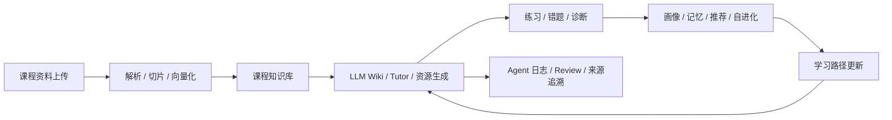

# 智学工坊软件需求规格说明书

> 文档状态：比赛材料规格说明书
>
> 事实源优先级：`docs/当前实现基线.md`、`docs/功能完成度与待完善清单.md`、`docs/当前实现API清单.md`、`docs/当前实现数据库清单.md`、真实验收记录与当前代码
>
> 约束：本文只描述当前实现、已验收事实、明确未完成项与规划增强项，不虚构测试数字、不使用截图占位冒充证据

## 目录导读

- 1. 文档目的与适用范围
- 2. 赛题背景与新时代大学生需求
- 3. 现状分层与状态定义
- 4. 学生学习闭环与 AI 结合点
- 5. 功能需求总览
- 6. 当前实现状态矩阵
- 7. 可追溯表
- 8. 功能边界与冻结范围
- 9. 验收依据

## 1. 文档目的与适用范围

本规格说明书用于比赛材料表达，面向评委、答辩老师和项目开发者，回答三个问题：

1. 项目要解决什么学生学习问题。
2. 当前代码和验收记录已经真实实现了什么。
3. 还有哪些属于规划增强、阶段未通过或冻结未实现。

本文只依据当前分支代码、OpenAPI、SQLAlchemy Model、Alembic migration、前端页面与验收记录归纳当前能力，不把设计文档中的目标能力当作已完成事实。

## 2. 赛题背景与新时代大学生需求

智学工坊面向高校学生，核心对象不是普通问答用户，而是在课程学习中存在以下典型需求的新时代大学生：

| 学生需求 | 具体表现 | 系统响应 |
|---|---|---|
| 碎片化学习 | 课后时间零散，希望快速定位知识点 | 课程资料解析、切片、RAG 检索、Wiki 生成 |
| 个性化解释 | 同一概念需要不同深度或风格 | Tutor、画像、学习偏好、Prompt 参数 |
| 练习与反馈闭环 | 不只想“看懂”，还想“做会” | 练习题、错题本、诊断报告、推荐更新 |
| 来源可信 | 担心 AI 编造 | 引用、来源追溯、Review、Wiki 版本 |
| 多模态理解 | 需要图解、卡片、课堂、语音辅助 | 资源生成、多模态接口、音频/课堂产物 |
| 学习路径规划 | 想知道先学什么、后学什么 | 学习路径、自适应难度、自进化策略 |
| 长期积累 | 希望知识沉淀到个人空间 | LLM Wiki、长期记忆、学生画像 |
| 过程可见 | 希望知道系统为什么这么做 | Agent 日志、步骤、证据、风险等级 |
| 学习进度可视化 | 希望看到真实学习时长与掌握度变化 | `learning_sessions` 心跳、首页/仪表盘学习分析 API |

## 3. 现状分层与状态定义

本文采用四类状态，不混用“设计目标”和“实现事实”。

| 状态 | 含义 | 判定依据 |
|---|---|---|
| 已实现且已验收 | 当前代码可运行，且有对应阶段验收或真实主链路验证 | 代码 + API/Model + 验收记录一致 |
| 已实现但未通过 | 已有代码或局部链路，但尚未完成正式专项验收，或验收结果不足以对外宣称完成 | 有实现基础，但不宣称完整通过 |
| 规划增强 | 当前实现之外的增强目标，适合作为后续比赛叙事或加分项 | 属于 roadmap，不写成当前事实 |
| 冻结未实现 | 当前阶段明确不做或禁止做的范围 | 由项目边界冻结，不进入当前比赛口径 |

### 3.1 学生学习闭环

## 4. 学生学习闭环与 AI 结合点

智学工坊的 AI 不是单点聊天，而是嵌入学习闭环中的多个受控结合点：

1. 资料进入时，AI 负责知识点抽取、页面生成与切片辅助理解。
2. 学习中，AI Tutor 负责个性化答疑、引用返回与讲解风格适配。
3. 练习后，AI 负责错题归因、薄弱点识别和诊断建议生成。
4. 诊断后，AI 负责推荐、路径规划和自进化策略建议。
5. 每次关键输出都通过 Review、来源和版本机制留痕。

## 5. 功能需求总览

### 5.1 核心功能

| 功能域 | 用户可见能力 | 当前状态 |
|---|---|---|
| 认证与课程 | 注册、登录、课程 CRUD | 已实现且已验收 |
| 资料与知识库 | 上传、解析、切片、向量化、检索、质量报告 | 已实现且已验收 |
| LLM Wiki | 页面生成、详情、来源、版本、回滚 | 已实现且已验收 |
| AI Tutor | 问答、引用、反馈、保存到 Wiki | 已实现且已验收 |
| 资源生成 | 个性化资源、Markdown 产物、多模态产物入口 | 已实现且已验收 |
| 练习与诊断 | 出题、提交、错题、诊断、推荐 | 已实现且已验收 |
| 画像与记忆 | 画像查看、对话式更新、长期记忆反思 | 已实现且已验收 |
| 自进化与路径 | 策略分析、应用、回滚、学习路径生成 | 已实现且已验收 |
| Agent 运行时 | 对话任务、步骤、事件、日志、SSE 进度 | 已实现且已验收 |
| 学习分析 | 页面心跳、时长汇总、掌握度趋势 | 已实现且已验收 |
| OpenMAIC 沉浸课堂 | 一句话生成课堂、MP4 导出、签名播放 | 已实现且已验收 |
| 个性化闭环 | 记忆合并、策略物化、双层画像 | 已实现且已验收 |

### 5.2 AI 结合点

| 结合点 | AI 作用 | 受控边界 |
|---|---|---|
| 课程知识库 | 辅助抽取知识点、整理页面、生成质量报告 | 结果必须绑定来源 |
| Tutor | 个性化解释与引用回答 | 必须经过 Provider 和 Review 约束 |
| 资源生成 | 生成讲解文档、卡片、思维导图、题目等 | 必须带 review_result |
| 诊断 | 分析薄弱点、错误模式、建议动作 | 不得冒充绝对结论 |
| 自进化 | 形成策略版本、证据和风险等级 | 不得自动改代码、DB、权限、部署 |
| 推荐与路径 | 结合画像、诊断、Wiki 与策略输出建议 | 必须可追溯到证据 |

## 6. 当前实现状态矩阵

### 6.1 已实现且已验收

| 模块 | 当前事实 | 证据 |
|---|---|---|
| 真实 LLM 主链路 | 注册登录到推荐与 Agent 日志的主链路已跑通，真实 Provider 参与验证 | `docs/19_测试方案/13_真实LLM主链路与Next安全专项验收记录.md` |
| Phase 1 数据结构知识库 | 公有《数据结构》知识库已真实入库并完成阶段验收 | `docs/19_测试方案/14_Phase1数据结构知识库阶段验收记录.md` |
| Phase 3.1 LangGraph Agent | 动态规划、执行、观察、重规划、Review、记忆反思已完成验收 | `docs/19_测试方案/16_Phase3.1LangGraph真正智能体阶段验收记录.md` |
| `/assistant` | 已 React 化，支持快速 Tutor SSE 与智能体任务链路 | 当前实现基线、页面代码 |
| 个性化学习闭环 | 记忆 stable key 合并、策略物化、双层画像、真实学习分析 | `docs/19_测试方案/17_个性化学习闭环专项验收记录.md` |
| 智能对话资源工具 | 13 种直接资源类型、资源侧栏、Agent 工具矩阵 | `docs/19_测试方案/22_智能对话资源生成工具专项验收记录.md` |
| OpenMAIC 沉浸课堂 | 一句话路由、RAG/画像个性化 brief、MP4 导出 | `docs/19_测试方案/18_OpenMAIC沉浸课堂阶段验收记录.md` |
| 后端自动化测试 | **322 passed**（2026-06-13 全量回归） | `backend/tests/` 共 49 个测试文件 |
| API / Model / DB | 143 个 HTTP 操作、44 张 ORM 表、14 个核心 Agent | `docs/当前实现API清单.md`、`docs/当前实现数据库清单.md` |

### 6.2 已实现但未通过或未完成

| 模块 | 当前事实 | 状态说明 |
|---|---|---|
| Docker 全栈 | 有容器化配置与部署目标，但当前阶段不作为日常主验证路径 | 已有基础，未做正式全栈验收 |
| 全站浏览器 E2E | 有局部烟测和单页验证，但未形成完整浏览器自动化验收 | 已有局部验证，未完成全站覆盖 |
| 一键演示数据初始化 | 已有种子知识库和演示脚本基础，但未形成统一的一键比赛级初始化 | 基础存在，未完成闭环 |
| Redis Stream 升级 | 当前运行时兼容 Pub/Sub + 数据库追加事件 | 当前事实是兼容模式，非 Stream 终态 |
| 完整会话历史管理 UI | 后端会话/消息持久化存在，但完整历史侧栏仍不足 | 后端先行，前端未完全闭环 |
| OpenMAIC 真实课堂性能 | 已有沉浸课堂与导出链路，但真实 MiMo 课堂质量、耗时、成本仍需回归 | 可演示，不宣称完全稳定 |

### 6.3 规划增强

| 模块 | 规划增强方向 | 说明 |
|---|---|---|
| GraphRAG | community summaries、Global/Local/DRIFT 查询 | 属于后续增强，不写成当前标配 |
| 检索增强 | cross-encoder、LLM rerank | 作为检索质量升级方向 |
| 数据同步 | MinIO、完整演示数据一键初始化 | 适合部署与比赛包装阶段补强 |
| 交互层 | 统一 Markdown、ArtifactCard、Timeline、错误/空状态协议 | 适合提升比赛观感和可解释性 |
| 图谱展示 | 更复杂的布局、筛选、路径推理 | 作为可视化增强项 |
| 端侧体验 | PWA、完整响应式优化 | 作为工程增强项 |

### 6.4 冻结未实现

| 范围 | 冻结原因 | 说明 |
|---|---|---|
| 教师端 | 当前比赛主线聚焦学生端闭环 | 不作为当前实现承诺 |
| 管理员后台 | 当前无 `/api/v1/admin/*`，也无对应页面 | 不应宣称已实现 |
| 自动改代码 / DB / 权限 / 部署 | 违反项目安全边界 | Agent 严禁越权 |
| 全站 React 重写 | 与当前 Stitch 静态页保留策略冲突 | 仅局部增强，不整站推倒重来 |

## 7. 可追溯表

| 需求编号 | 需求描述 | 关键 AI 结合点 | 当前实现 | 状态 | 证据 |
|---|---|---|---|---|---|
| SRS-01 | 资料上传后快速进入可用知识库 | 资料解析、切片、embedding、RAG | `materials`、`document_chunks`、`knowledge_points`、`knowledge/search` | 已实现且已验收 | 真实主链路、Phase 1 验收 |
| SRS-02 | 学生可获得有来源的 AI 答疑 | Tutor + 引用 + Review | `/api/v1/tutor/ask`、`/assistant` | 已实现且已验收 | 真实 LLM 主链路验收 |
| SRS-03 | 学生可以把 AI 产物沉淀为 Wiki | Wiki 生成、版本、回滚、来源 | `wiki_pages`、`wiki_page_versions`、`wiki_sources` | 已实现且已验收 | API 清单、数据库清单 |
| SRS-04 | 学生能做题并得到诊断 | Quiz、Mistake、Diagnosis | `/api/v1/quizzes/*`、`/api/v1/diagnosis/*` | 已实现且已验收 | 当前实现基线 |
| SRS-05 | 系统能更新画像、记忆、推荐 | Profile、Memory、Recommend、Evolution | `student_profiles`、`student_memories`、`recommendations`、`evolution_strategies` | 已实现且已验收 | 真实主链路验收、当前基线 |
| SRS-06 | 系统能记录 Agent 调用链 | Agent Run、Step、Event、Conversation | `agent_runs`、`agent_tasks`、`agent_task_steps`、`agent_task_events` | 已实现且已验收 | Phase 3.1 验收 |
| SRS-07 | 系统能支持比赛演示的稳定性 | 演示脚本、局部烟测、SSE | `scripts/start_phase31_demo.ps1`、`scripts/agent_demo_check.py` | 已实现但未通过 | 仅局部稳定演示，未完成全站 E2E |
| SRS-08 | 系统具备比赛部署可交付性 | Docker Compose、部署说明 | 现有容器化配置 | 已实现但未通过 | 未完成正式全栈验收 |
| SRS-09 | 系统具备更强图谱与检索增强 | GraphRAG 增强、rerank | 当前已到 hybrid 层 | 规划增强 | 当前基线与规划文档 |
| SRS-10 | 系统支持教师端/管理员端 | 教师端、管理员端 | 当前未建设 | 冻结未实现 | 当前基线明确缺口 |
| SRS-11 | 首页展示真实学习时长与掌握度 | learning_sessions、汇总 API | `/home`、`/api/v1/learning-analytics/*` | 已实现且已验收 | 17_个性化学习闭环专项验收 |
| SRS-12 | 一句话生成个性化沉浸课堂 | OpenMAIC、RAG、画像 brief | `generate_immersive_classroom`、MP4 导出 | 已实现且已验收 | 18_OpenMAIC 验收 |
| SRS-13 | 智能体资源工具矩阵可演示 | Resource Agent、tool_hints | 13 种资源类型、资源侧栏 | 已实现且已验收 | 22_资源工具专项验收 |
| SRS-14 | 全站桌宠与学习提醒 | Pet 通知、偏好、Agent 任务跳转 | `/api/v1/student/pet/*`、`PetCompanion` | 已实现且已验收 | 当前基线、pet 测试 |

## 10. 非功能需求（代码对齐）

| 编号 | 需求 | 当前实现 | 代码/配置位置 |
|---|---|---|---|
| NFR-01 | 统一 API 响应 | `{ code, message, data, request_id }` | `backend/app/core/exceptions.py`、各 Router |
| NFR-02 | JWT 用户隔离 | 学生只能访问本人数据 | `backend/app/core/deps.py`、Service 层 `user_id` 过滤 |
| NFR-03 | Mock 可演示 | 无 Key 时主链路不断 | `backend/app/llm/provider.py` Mock Provider |
| NFR-04 | LLM 调用可追溯 | provider、model、latency、status | `llm_call_logs` 表、`llm_log_service.py` |
| NFR-05 | Agent 可追溯 | 任务、步骤、事件、运行日志 | `agent_tasks`、`agent_task_events`、`agent_runs` |
| NFR-06 | 策略可回滚 | 版本链、before/after 快照 | `evolution_strategies`、`evolution_service.py` |
| NFR-07 | 向量检索 | pgvector + HybridRetriever | `knowledge_search_service.py`、`document_chunks` |
| NFR-08 | 后台任务 | arq Worker + Redis 队列 | `agent_worker.py`、`agent_queue_service.py` |
| NFR-09 | 事件驱动后置 | 诊断→自进化、答题→记忆 | `core/event_bus.py`、`core/event_handlers.py` |
| NFR-10 | 前端类型安全 | TypeScript strict + 服务层封装 | `frontend/services/*`、`frontend/lib/request.ts` |

## 11. 技术栈与规模（2026-06-13 代码统计）

| 层级 | 技术 | 规模/说明 |
|---|---|---|
| 前端 | Next.js 16.2.7、TypeScript、Tailwind、Framer Motion | 11 个 `page.tsx` 路由；3 个原生 React 页（`/`、`/assistant`、`/evolution`）；6 个 StitchFrame 页 |
| 后端 | FastAPI、SQLAlchemy 2、Alembic、Pydantic v2 | 25 个 API 路由模块；58 个 Service 文件；143 个 HTTP 操作 |
| 数据 | PostgreSQL 15+、pgvector、Redis | 44 张 ORM 表；HNSW 索引自动创建 |
| AI | LangGraph 1.x、统一 LLM Provider、BGE/Mock Embedding | 14 核心 Agent + MiMo Supervisor；Tool Registry **22** 个工具 |
| 队列 | arq | 5 个 Worker 作业：Agent、多模态、OpenMAIC、课堂导出、知识图谱 |
| 测试 | pytest | **322 passed**；含 OpenMAIC、个性化闭环、Agent 运行时等专项 |

## 12. 功能边界与冻结范围

### 12.1 必须保留的边界

1. 学生只能访问自己的画像、记忆、Wiki、资源、诊断与推荐。
2. 所有查询必须带当前用户过滤，涉及课程必须校验课程归属。
3. AI 输出必须尽量基于课程资料与 Wiki，缺依据时必须提示推断风险。
4. 自进化只允许更新策略、画像、偏好和推荐相关对象。
5. Agent 不得自动修改代码、迁移、权限或部署配置。

### 12.2 不应写入当前比赛承诺的内容

1. 教师端和管理员端全功能后台。
2. 全站 React 重写替代当前 Stitch 路线。
3. 无来源内容冒充真实结论。
4. 无真实验证的测试数字。
5. 截图占位式“验收证据”。

## 13. 验收依据

当前比赛规格的主证据来自以下文件与实现：

| 证据类别 | 文件 |
|---|---|
| 当前实现事实源 | `docs/当前实现基线.md` |
| API 清单 | `docs/当前实现API清单.md` |
| 数据库清单 | `docs/当前实现数据库清单.md` |
| 主链路验收 | `docs/19_测试方案/13_真实LLM主链路与Next安全专项验收记录.md` |
| 知识库阶段验收 | `docs/19_测试方案/14_Phase1数据结构知识库阶段验收记录.md` |
| Agent 阶段验收 | `docs/19_测试方案/16_Phase3.1LangGraph真正智能体阶段验收记录.md` |
| 个性化闭环验收 | `docs/19_测试方案/17_个性化学习闭环专项验收记录.md` |
| OpenMAIC 验收 | `docs/19_测试方案/18_OpenMAIC沉浸课堂阶段验收记录.md` |
| 全量扫描验收 | `docs/19_测试方案/20_全量功能扫描与浏览器验收报告.md` |
| 缺陷闭环 | `docs/19_测试方案/21_缺陷清单与修复闭环记录.md` |
| 资源工具验收 | `docs/19_测试方案/22_智能对话资源生成工具专项验收记录.md` |
| 完成度清单 | `docs/功能完成度与待完善清单.md` |

