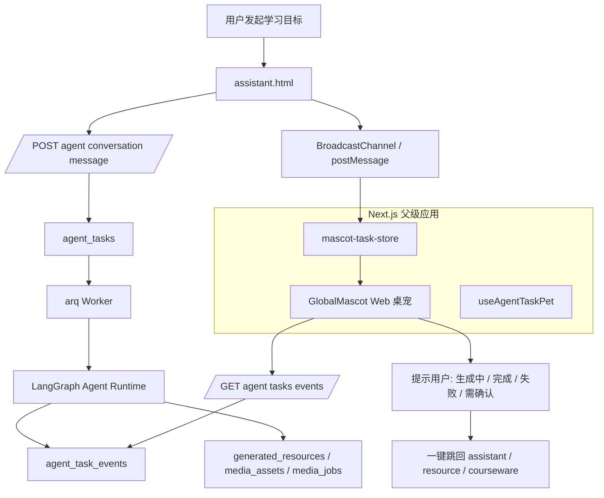

# 智学工坊 V3 网页端悬浮桌宠落地方案 - Part 1

> 版本：V3 Web Mascot Edition  
> 适用分支：`change_3`  
> 范围：只做网页端悬浮学习伙伴，不做桌面端，不做 Electron，不做系统级悬浮窗。  
> 目标：在 V2 多模态 Agent 方案基础上，补齐长耗时资源生成时的跨页面提醒、进度感和返回入口。

---

## 0. 一句话结论

`change_3` 已经具备 LangGraph 动态学习智能体、Agent 事件流、SSE 实时通知、Stitch 页面壳层、IP 贴纸体系和多角色 Agent 设计。V3 不推翻现有方案，而是在 V2 多模态资源生成基础上新增一个 **网页端全局悬浮桌宠 GlobalMascot**。

这个桌宠不是装饰物，而是一个学习任务状态层：

```text
用户发起长任务
  → Agent / 多模态 Worker 后台执行
  → 用户切到其他页面或新对话
  → 网页右下角桌宠持续显示进度、状态、提醒
  → 完成后主动提示并可一键跳回对应任务/资源/对话
```

它解决的问题是：文生图、文生视频、互动课件、个性化学习包都可能需要几十秒到几分钟；如果页面只有 loading，用户会以为卡住。网页端桌宠让后台智能体变得可感知、可等待、可返回。

---

## 1. 对 V2 方案的二次审查

### 1.1 V2 中继续保留的正确方向

1. 不重写现有架构，沿用 `LangGraph + ToolRegistry + Agent Event + ResourceService`。
2. 文生图、文生视频、互动课件不做孤立 API，而是做成 Agent 可调用工具。
3. 多模态任务异步化，避免阻塞 Agent 主循环。
4. Agnes/Sapiens API 作为 Demo Provider，后续可替换为 Seedance、讯飞、OpenAI-compatible 或其他高级模型。
5. 互动课件不直接暴露 LLM 生成的任意 HTML/JS，而是采用 JSON Spec + 服务端模板渲染。
6. 多模态资源必须落到 `media_assets / media_jobs`，不要全部塞进 `generated_resources.content`。

### 1.2 V2 仍缺的体验层

多模态任务的耗时明显更长：

| 任务 | 可能耗时 | 用户感知风险 |
|---|---:|---|
| 讲解文档 | 5～30 秒 | 可接受 |
| 思维导图 / 图解 | 5～30 秒 | 可接受 |
| 文生图 | 10～60 秒 | 需要进度感 |
| TTS | 5～30 秒 | 需要进度感 |
| 教学短视频 | 1～5 分钟 | 必须后台化 |
| 互动课件 | 30～120 秒 | 必须后台化 |
| 个性化学习包 | 1～5 分钟 | 必须跨页面提醒 |

所以 V3 新增：

```text
GlobalMascot：网页端全局悬浮学习伙伴
```

它挂在 Next.js `app/layout.tsx`，不是桌面端应用，也不进入系统级权限。

---

## 2. 当前项目可复用能力

### 2.1 现有 Agent Runtime

当前 Agent Runtime 已经是状态图：

```text
load_context
  → supervisor
  → execute_tool
  → observe
  → replan / review
  → memory_reflect
  → finalize
```

桌宠只读取任务状态，不参与决策，不篡改 Agent 运行。

### 2.2 现有 SSE 事件流

后端已有：

```text
GET /api/v1/agent/tasks/{task_id}/events
```

前端已有 `fetch + ReadableStream + Authorization` 的 SSE 消费方式。桌宠复用该机制：

```text
GlobalMascot 监听 active task
  → 找到 task_id
  → 连接 /agent/tasks/{task_id}/events
  → 根据事件切换 mascot 状态与提示
```

### 2.3 现有 IP 资产

| Mascot | 中文名 | 角色定位 |
|---|---|---|
| `zhizhi` | 知知 | LLM Wiki、课程知识、资料检索、AI Tutor |
| `lulu` | 露露 | 学习路径、任务提醒、状态追踪 |
| `diandian` | 点点 | 练习、诊断、错题复盘 |

已有贴纸状态：

```text
01_happy_greeting
02_thinking
05_sleepy_idle
06_encouraging
07_reminder
08_searching
09_updated
11_unsure
12_completed
```

推荐默认使用 `lulu` 作为全局任务提醒角色；知识类任务切到 `zhizhi`；练习诊断类任务切到 `diandian`。

### 2.4 现有前端架构

当前前端是：

```text
Next.js App Router
  → StitchFrame
  → iframe 承载 Stitch 静态页面
```

所以桌宠应挂到父级 `frontend/app/layout.tsx`，而不是重复插入 8 个 Stitch HTML 页面。

---

## 3. V3 总体架构



---

## 4. V3 新增能力

| 能力 | 描述 |
|---|---|
| 全局悬浮桌宠 | 右下角常驻，可折叠、可关闭，后续可拖动 |
| 长任务进度提醒 | 资源生成、视频生成、课件生成、学习包生成时持续显示 |
| 跨页面任务追踪 | 用户离开 `/assistant` 后仍能看到任务状态 |
| 新对话不丢任务 | 用户开新对话时，旧任务仍在桌宠里显示 |
| 完成通知 | 任务完成后显示“学习资源已生成，点击查看” |
| 需确认提醒 | Agent 高风险 interrupt 时提醒用户回到任务确认 |
| IP 状态映射 | idle / focus / remind / done / unsure |
| 多任务队列 | 同时有多个后台任务时，显示优先级最高任务，展开可看列表 |
| 与多模态 V2 合并 | `media_jobs` 进度也能推送到桌宠 |

---

## 5. 明确不做什么

1. 不做 Electron。
2. 不做桌面系统悬浮窗。
3. 不请求系统通知权限作为主功能。
4. 不让桌宠调用模型直接生成内容。
5. 不让桌宠修改任务状态。
6. 不把桌宠做成新的 Agent 编排器。
7. 不重写 Stitch 页面。
8. 不强制改 8 个 HTML 主布局。

桌宠只是：

```text
状态展示 + 提醒 + 入口 + 轻量交互
```

---

## 6. 桌宠状态设计

```ts
export type MascotState =
  | "idle"
  | "focus"
  | "remind"
  | "done"
  | "unsure"
  | "waiting_confirmation"
  | "failed";
```

| 状态 | 场景 | 显示 |
|---|---|---|
| `idle` | 无后台任务 | “今天想学点什么？” |
| `focus` | 有任务运行中 | “我正在帮你生成资源…” |
| `remind` | 有 queued / pending 任务 | “任务已排队，我会提醒你” |
| `done` | 任务完成 | “学习资源生成好了！” |
| `unsure` | 信息不足、暂无来源 | “需要补充资料或核对来源” |
| `waiting_confirmation` | 高风险操作等待确认 | “这个操作需要你确认” |
| `failed` | 任务失败 | “生成遇到问题，点我查看原因” |

事件映射：

```ts
const eventToMascotState: Record<string, MascotState> = {
  queued: "remind",
  planning: "focus",
  plan_created: "focus",
  tool_started: "focus",
  tool_completed: "focus",
  observation: "focus",
  replanned: "focus",
  waiting_confirmation: "waiting_confirmation",
  reviewed: "focus",
  memory_reflected: "focus",
  completed: "done",
  failed: "failed",
  cancelled: "idle",
};
```

任务类型到 mascot 角色映射：

```ts
function pickMascotByTask(taskType: string, goal: string): MascotName {
  const text = `${taskType} ${goal}`.toLowerCase();

  if (text.includes("quiz") || text.includes("练习") || text.includes("错题") || text.includes("诊断")) {
    return "diandian";
  }

  if (text.includes("path") || text.includes("计划") || text.includes("路径") || text.includes("推荐")) {
    return "lulu";
  }

  if (text.includes("wiki") || text.includes("资料") || text.includes("讲解") || text.includes("视频") || text.includes("课件")) {
    return "zhizhi";
  }

  return "lulu";
}
```

---

## 7. IP 形象优化建议

当前三角色设定很适合比赛表达：

```text
知知负责“懂知识”
露露负责“陪你走学习路径”
点点负责“帮你练会”
```

优化建议：

| 问题 | 优化建议 |
|---|---|
| IP 可能只作为装饰 | 让 IP 状态绑定真实任务事件 |
| 页面各自使用，缺乏全局记忆 | 增加 GlobalMascot 常驻 |
| 状态图命名偏桌面端 | Web 端统一成 idle / focus / remind / done |
| 用户不知道它能做什么 | 初次出现加一句“我会提醒你后台生成结果” |
| 长任务完成后反馈弱 | done 状态停留 20 秒并显示 CTA |
| 失败状态可能沮丧 | 用“我遇到了一点问题，点我看看怎么修复” |
| IP 与学习画像未结合 | 根据学习偏好调整话术 |

推荐文案风格：

```text
生成中：我正在整理课程资料和你的画像，先去看看别的页面也没关系。
视频生成中：视频需要一点时间，我会在这里提醒你进度。
完成：资源生成好了，已包含引用和审核结果，点我查看。
失败：这次生成没有完成，我已经保留了错误信息，点我看看怎么处理。
等待确认：这个操作会修改你的学习策略，需要你确认后我再继续。
```

---

## 8. 文件改动清单

后端：

```text
backend/app/repositories/agent_task_repository.py
backend/app/services/agent_conversation_service.py
backend/app/api/v1/agent.py
backend/app/schemas/agent_task.py
```

前端：

```text
frontend/types/mascot.ts
frontend/lib/zhixue-web-api.ts
frontend/lib/mascot-task-store.ts
frontend/hooks/useAgentTaskPet.ts
frontend/components/GlobalMascot.tsx
frontend/app/layout.tsx
frontend/public/stitch-pages/zhixue-static-api.js
frontend/public/stitch-pages/assistant.html
frontend/styles/globals.css
scripts/sync_ip_pet_assets.ps1
```

资产同步：

```text
docs/ip-assets/hyperframes-pet-preview/assets/pets/
  → frontend/public/pets/
```

目标结构：

```text
frontend/public/pets/
  zhizhi/idle.png remind.png focus.png done.png
  lulu/idle.png remind.png focus.png done.png
  diandian/idle.png remind.png focus.png done.png
```

如果 `/pets` 缺失，桌宠自动回退到：

```text
frontend/public/stickers/<mascot>/<scene>.png
```
