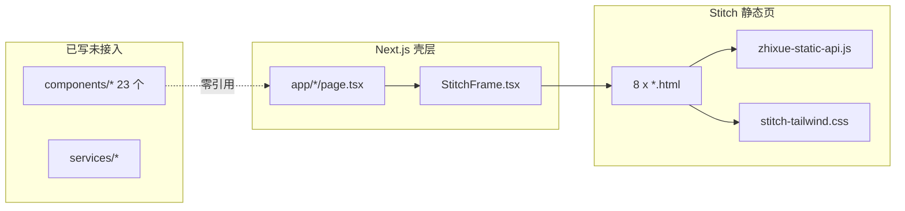
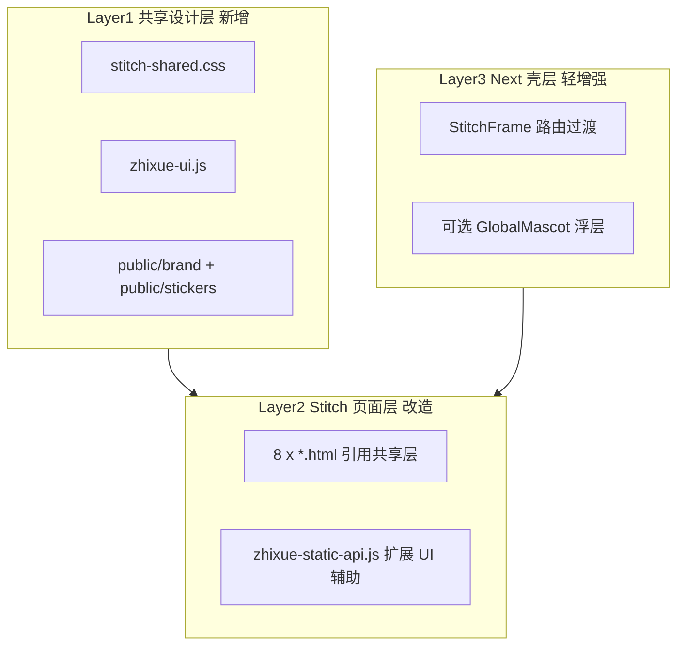
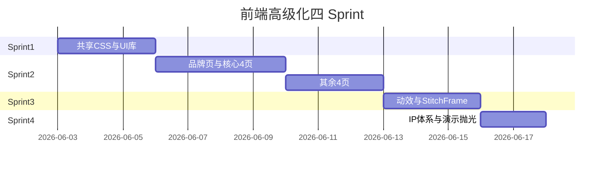

# 智学工坊前端高级化升级方案

> 文档状态：**已执行方案与历史决策记录**
> Sprint 1-4 已完成。当前前端事实请读取 `docs/12_前端页面设计/01_前端页面总览.md` 和 `docs/change_1-任务进度.md`；本文中的未完成描述可能是执行前快照。

> **概述**：在保留 Stitch 静态页 + StitchFrame 架构的前提下，通过共享设计层、全站视觉统一、轻量动效与 IP 吉祥物融入，将 8 个页面从「可用原型」升级为「高级教育科技风演示级 UI」，对齐 Luminous Warmth 设计系统与第 19 阶段目标。  
> **关联任务**：第 19 阶段（T19-01 ~ T19-04）、`docs/DESIGN.md`、`AGENTS.md` §8.1.1

---

## 任务清单（Sprint）

| Sprint | 内容 | 状态 |
|--------|------|------|
| Sprint 1 | 新建 `stitch-shared.css` + `zhixue-ui.js`，迁移 IP 贴纸到 `public/stickers`，8 页引用共享层并删除重复 style | 已完成 |
| Sprint 2 | P0 真实 API 联动优先：Wiki 详情、诊断历史、课程编辑、401/错误态、真实空状态 | 已完成 |
| Sprint 3 | CSS 微动效 + scrollReveal；StitchFrame 路由淡入视时间后置；AI/Agent 状态动效 | 待实施 |
| Sprint 4 | 吉祥物页面映射、贴纸场景规范、brand-home IP 海报；演示抛光与验收 | 待实施 |

---

## 现状诊断

当前前端是 **Next.js 薄壳 + Stitch iframe** 双轨结构：



**优势**：7 个学生页已接真实 API；Luminous Warmth 玻璃拟态基础良好；IP 资产（三吉祥物 + 12 表情贴纸）已就绪。

**主要短板**（阻碍「高级感」）：

| 问题 | 影响 |
|------|------|
| 每页重复定义 `.glass-card` / `.mesh-gradient`（blur 16–40px 不等） | 视觉不统一、维护成本高 |
| `StitchFrame.tsx` 仅为裸 iframe，无过渡/全局装饰 | 路由切换生硬 |
| 未安装动效库；交互以 hover transition 为主 | 缺少进入动画、状态反馈层次 |
| IP 资产未进入页面（`brand-home.html` 仍用外链占位图） | 品牌辨识度不足 |
| 空状态/加载态/错误态样式各页自写 | 演示时易露「原型感」 |
| React 组件层（`CoursePageShell` 等）与 Stitch 完全脱节 | 重复建设 |

**约束**（必须遵守）：按 `AGENTS.md` 与 `docs/Codex开发任务拆分.md` §1.2，**默认不 React 重做页面**；升级主战场是 `frontend/public/stitch-pages/` + 共享资源；Next 层仅增强壳层与全局能力。

---

## 目标定义（「高级」的验收标准）

1. **视觉**：全站 glass token 一致；背景 `#fcf9f8` 统一；标题/正文/标签严格遵循 `docs/DESIGN.md` 字号阶梯
2. **交互**：页面进入、卡片 hover、AI 生成/Agent 运行有克制动效（无霓虹、无大幅跳动）
3. **品牌**：三吉祥物按场景出现；空状态/Toast/AI 思考态使用贴纸而非 Material 图标
4. **演示**：创新点可见——Wiki 来源、Agent 链、自进化证据、推荐理由在 UI 上有专门视觉区块
5. **工程**：`npm run typecheck && npm run build` 通过；390px / 768px / 1024px 三档可用

---

## 总体架构：三层升级



---

## 分阶段实施（建议 4 个 Sprint）

### Sprint 1：设计基座统一（对应 T19-01，全站前置）

**新建共享文件**（`frontend/public/stitch-pages/`）：

- **`stitch-shared.css`** — 从 8 页抽取并统一：
  - `.mesh-gradient`、`.glass-card` / `.glass-panel` / `.glass-button-primary`
  - 统一值：`blur(30px)`、`rgba(255,255,255,0.52)` 填充、金棕 tint 阴影（对齐 `frontend/styles/globals.css` `.glass-card`）
  - 排版 utility：`.section-header`、`.stat-value`、`.label-chip`
  - 状态色：success / warning / ai-running / agent-pending（用 DESIGN.md 的 `primary-container`、`error-container`、`tertiary-fixed`，替换文档中残留的 indigo/cyan）
  - 动效 token：`--motion-fast: 160ms`、`--motion-normal: 280ms`；`.animate-fade-up`、`.animate-shimmer`（骨架屏）

- **`zhixue-ui.js`** — 纯 DOM 辅助（Stitch 页 `<script>` 引入）：
  - `ZhixueUI.showSkeleton(container)` / `hideSkeleton`
  - `ZhixueUI.emptyState({ mascot, title, action })` — 渲染带贴纸的空状态
  - `ZhixueUI.toast(message, variant)` — 统一 Toast（替代各页零散 alert）
  - `ZhixueUI.scrollReveal()` — Intersection Observer 段落淡入

**资产迁移**：

- 将 `docs/ip-assets/stickers/` 复制到 `frontend/public/stickers/{zhizhi,lulu,diandian}/`
- 品牌图已有：`frontend/public/brand/zhixue-ip-mascot-v1.png`

**同步 React 侧 token**（小改）：`frontend/tailwind.config.ts` 补充 spacing token（gutter、card-gap），与 DESIGN.md frontmatter 对齐

**改造方式**：8 个 HTML 删除重复 `<style>` 块，改为：

```html
<link href="/stitch-pages/stitch-shared.css" rel="stylesheet"/>
<script src="/stitch-pages/zhixue-ui.js"></script>
```

**验收**：任意两页并排对比，glass 卡片 blur/边框/阴影一致；空状态组件调用方式统一。

---

### Sprint 2：P0 API 联动与真实状态优先

Sprint 2 不再扩大为“全站视觉重做”，而是先修复最影响比赛演示闭环的真实功能缺口。原则是：后端已有接口必须在对应 Stitch 页面可见；静态占位不能冒充真实 AI/学习数据；错误、空状态和 401 必须有统一反馈。

**优先级顺序**：

| 优先级 | 页面 | 文件 | 目标 |
|------|------|------|------|
| P0-1 | LLM Wiki | `knowledge.html`、`zhixue-static-api.js` | Wiki 列表点击后调用 `GET /wiki/pages/{id}` 渲染真实正文、来源、版本号和 AI 推断提示 |
| P0-2 | 练习诊断 | `practice.html` | 诊断报告 Tab 优先调用 `GET /diagnosis/reports` 展示历史报告，无历史时再提示可运行分析 |
| P0-3 | 课程空间 | `courses.html`、`zhixue-static-api.js` | 课程卡片提供编辑入口，提交 `PUT /courses/{id}`，公共课程保持只读 |
| P0-4 | 共享 API | `zhixue-static-api.js` | 补齐 `getPageMascot`、`getWikiPage`、`updateCourse`，401 跳转品牌登录态并优先使用 `ZhixueUI.toast` |
| P1 | 视觉细化 | 相关 Stitch HTML | 只对已接真实数据的区域做局部层级优化，不单独做大范围动效 |

**本 Sprint 暂缓**：

1. `StitchFrame` 安装 `framer-motion`，除非 P0 联动已通过浏览器点检；
2. brand-home 外链图替换和 IP 海报，后移到 Sprint 4；
3. 8 页整体视觉重排，避免影响已经能演示的主链路。

**原全站视觉升级顺序保留为 Sprint 4 抛光参考**：

| 顺序 | 页面 | 文件 | 吉祥物 | 重点升级项 |
|------|------|------|--------|------------|
| 1 | 品牌首页 | `brand-home.html` | 三角色合影 | Hero 换 IP 海报；功能区块加 mascot 分区；auth modal 视觉对齐 shared CSS |
| 2 | 学习仪表盘 | `dashboard.html` | 露露 LuLu | 统计卡片数字 typography；推荐区块加「依据标签」；任务列表状态 chip |
| 3 | LLM Wiki | `knowledge.html` | 知知 ZhiZhi | 三栏来源侧栏强化；版本/来源 badge；资料上传区视觉对齐 |
| 4 | AI Tutor | `assistant.html` | 知知 | 消息气泡层级；引用卡片；流式输出光标/思考态贴纸 |
| 5 | 练习诊断 | `practice.html` | 点点 DianDian | 答题进度环；错题卡片；诊断结果「证据链」区块 |
| 6 | 画像/自进化 | `path-profile.html` | 露露 | Agent 时间线节点样式；策略版本 diff 卡片；风险等级色 |
| 7 | 课程 | `courses.html` | — | 课程卡片统一；创建 dialog 对齐 glass 规范 |
| 8 | 学生首页 | `home.html` | 三角色轮播 | 快捷入口卡片；今日学习概览 |

**每页统一 checklist**：

- [ ] 移除静态占位文案，接入真实 API 或规范 emptyState
- [ ] Section 标题使用 `.section-header` + 副标题说明
- [ ] 主 CTA 使用 `.glass-button-primary`
- [ ] 数据卡片 hover：`translateY(-2px)` + 边框变亮（CSS only）
- [ ] 移动端：侧栏折叠、Wiki 三栏→单栏、表格→卡片（T19-04）

**`zhixue-static-api.js` 扩展**：

- API 请求前后自动 skeleton / error toast
- 401 统一跳转 `/?auth=login`
- 导出 `getPageMascot()` 供各页读取默认 mascot

---

### Sprint 3：交互与动效（对应 T19-03，Stitch 优先）

**原则**：Stitch 页用 **CSS + 少量 vanilla JS**；Framer Motion 仅用于 Next 壳层（可选）。

**Stitch 层动效**（写入 `stitch-shared.css` + `zhixue-ui.js`）：

| 场景 | 实现 | 克制标准 |
|------|------|----------|
| 页面区块进入 | `.animate-fade-up` + scrollReveal | 位移 ≤ 12px，opacity 0→1，280ms |
| 卡片 hover | transform + box-shadow transition | 无 scale > 1.02 |
| AI 生成中 | 知知 `02_thinking` 贴纸 + shimmer 骨架 | 无旋转/脉冲强光 |
| Agent 节点运行 | path-profile 时间线 active 节点 glow | 使用 primary-container ambient shadow |
| 路由切换 | Next 层 StitchFrame fade（见下） | 200ms opacity |

**Next 壳层**（`frontend/components/StitchFrame.tsx`）：

- 安装 `framer-motion`（仅此一处）
- iframe `key={src}` + `AnimatePresence` 做 200ms 淡入淡出
- 可选：顶部 2px 进度条（路由变化时）

**不建议**：全站 React 组件化、recharts 大改（`MasteryChart.tsx` 已是 SVG，可在 Stitch 用 inline SVG 或 shared snippet 复刻）

---

### Sprint 4：IP 品牌体系与演示抛光

**吉祥物映射规范**（建议写入 `docs/ip-assets/UI集成规范.md`）：

| 页面 | 主 mascot | 四态映射 |
|------|-----------|----------|
| `/knowledge` | 知知 | focus=检索中, idle=浏览, done=保存成功 |
| `/assistant` | 知知 | focus=回答中, thinking=02_thinking 贴纸 |
| `/dashboard`, `/path-profile` | 露露 | remind=待办, done=任务完成 |
| `/practice` | 点点 | focus=答题, done=提交成功 |
| `/` brand-home | 三角色 | 分区展示各职责 |

**贴纸使用场景**（来自 `stickers/*/01–12`）：

- 空状态：`05_sleepy_idle`
- 加载/思考：`02_thinking`、`08_searching`
- 成功：`12_completed`、`09_updated`
- 提醒：`07_reminder`
- 错误/不确定：`11_unsure`

**可选高级特性**（P2，时间允许）：

- Next 层 `GlobalMascot` 浮窗：读取 iframe `postMessage` 状态切换四态 PNG（来自 `docs/ip-assets/hyperframes-pet-preview/assets/pets/`）
- 品牌页嵌入 HyperFrames 预览 iframe（仅宣传区块，深色 pet 风格与主站浅色隔离）

**演示抛光**：

- 清除 Google 外链占位图
- 统一 favicon / OG meta（brand-home）
- 各页「AI 推断内容，建议核对资料」来源免责声明样式一致

---

## 关键文件改动清单

| 操作 | 路径 |
|------|------|
| 新建 | `frontend/public/stitch-pages/stitch-shared.css` |
| 新建 | `frontend/public/stitch-pages/zhixue-ui.js` |
| 新建 | `frontend/public/stickers/**`（从 docs 复制） |
| 改造 | `frontend/public/stitch-pages/*.html`（8 个） |
| 扩展 | `frontend/public/stitch-pages/zhixue-static-api.js` |
| 轻改 | `frontend/components/StitchFrame.tsx` |
| 轻改 | `frontend/tailwind.config.ts`、`frontend/package.json`（framer-motion） |
| 可选文档 | `docs/ip-assets/UI集成规范.md` |

**明确不改**（除非后续单独确认）：

- 不删除 Stitch 导航/侧栏布局
- 不把 `/courses` 等路由改为 React 页面
- 不引入 recharts / 新 UI 框架

---

## 风险与缓解

| 风险 | 缓解 |
|------|------|
| 8 页同时改导致 regression | Sprint 1 先统一 shared 层；每页改完在本地逐页点检 API 链路 |
| iframe 内动效与父页不同步 | 动效主要在 Stitch 内；Next 层只做壳过渡 |
| IP 资产体积大 | 贴纸按需引用；pet 四态 PNG 仅 GlobalMascot 可选特性加载 |
| 文档色彩规范冲突（indigo vs 金棕） | 以 `docs/DESIGN.md` 为唯一真相源 |

---

## 验证方式

每 Sprint 结束执行：

```powershell
cd frontend
npm run typecheck
npm run build
```

手动验收（对照 `docs/19_测试方案/12_阶段运行验收清单.md` UI 项）：

- Chrome 390 / 768 / 1024 三档截图对比
- 登录 → 课程 → Wiki → Tutor → 练习 → 画像 全链路无 console error
- 无 API 时 emptyState 与 error toast 表现专业（非 alert）

---

## 建议执行顺序总结



**预估工作量**：约 2–3 周（按单开发者、含联调 API），Sprint 1 是基础必须先做，否则后续 8 页会重复劳动。
